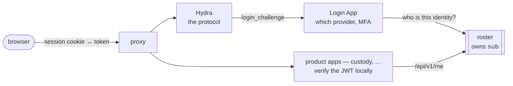
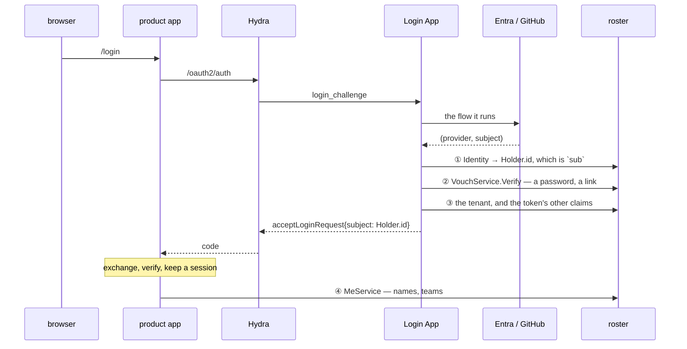

# roster — plan and decision log

roster is the store that answers **who somebody is**: people, the external
identities they sign in with, the addresses they use, and the organisations,
sites and teams they belong to.

It is one layer of an identity system and not the whole of one. The protocol is
Ory Hydra's and the login flow is a Login App's; roster owns the records they
both ask about, and owns `sub`.

It is also the second app payday is tried against, and the more demanding one.

---

## Why it exists, twice

**As a product.** An identity provider can be replaced; the directory behind it
should not have to be. The metadata is ours, the schema is ours, and a customer
IdP's `/userinfo` has only what that customer put in it.

**As a proving ground.** [custody](https://github.com/lesomnus/custody) exercises
payday's domain half — the wall, entities, a public projection. It leaves four
things untouched, and they are roster's whole subject:

| | custody | roster |
| --- | --- | --- |
| the second axis (field 3) | unused | **Site is the isolation boundary** |
| `TokenStore` / `Bearer` | unused | **API keys** |
| `Outbox` / `Drain` | wired, never consumed | **the sync channel** |
| one-to-many edges | none | `Identity`, `Email`, memberships |

### The rule that makes it a proving ground

> **When payday is in the way, stop and fix payday. Do not work around it here.**

roster is a product as well, so the temptation to route around the framework is
real in a way it is not in custody. Every workaround written here is a defect
left in payday for its next user. This is repeated in `CLAUDE.md` because it is
the one rule an agent or a hurried afternoon will break first.

---

## Where roster sits

roster is called by machines: the Login App and admin consoles. Not by end
users, and not by browsers. Its own authentication is therefore mTLS or an API
key — **not** `authoidc`, which is for the product apps that consume its
tokens.

### Not roster

Hydra, the Login App, the login UI, the session proxy, and the flows that run
over them — which provider to offer, when to ask for a second factor, whether to
remember a browser. Devices, certificate authorities, ownership transfer — those
belong to the product.

This list said `AuthProvider` implementations and MFA flows for a while, and
that was one word too wide: roster verifies a password and will verify a TOTP
code, and both read like implementing a provider. What is not roster's is the
**flow**, not the check. D19 is the line stated so that it can be applied rather
than remembered.

### Where roster sits when Hydra is in front

The diagram above is the shape, and it is worth writing out as steps, because
"Hydra does single sign-on" reads as though roster gets smaller. It does not:
Hydra's central design decision is that **it has no user database and does not
authenticate anybody**. It hands a `login_challenge` to a Login App and waits to
be told a `subject`. Where that string comes from is the hole, and the hole is
roster-shaped.

- **① is the one that cannot be moved.** Use Entra's `oid` as `sub` and the same
  human arriving through GitHub is a second person to every system downstream.
  D1 exists for this and this is where it is spent.
- **② only if this deployment has a password or a magic link at all.** A
  provider-only deployment does not call it.
- **③** because Hydra does not know what a tenant is either.
- **④** is not sign-in. It is the ordinary reading login.md already describes —
  a product app anchors a row and reads names when there is a screen to draw.

**roster is in the flow once, at sign-in, and beside it afterwards. It is not in
the per-request path.** No session check and no token check reaches it. That is
the property somebody wants when they ask for "accepted everywhere without
another call to roster", and it is had without roster signing anything.

The caller list is unchanged by any of this, which is the sign it is the right
shape: the Login App and admin consoles. A browser never sees roster.

---

## Scope

**Phase 1 — the schema.** The irreversible part, and therefore first.

**Phase 2 — whatever payday gets wrong.** Fixed upstream, not here.

**Phase 3 — the app layer.** `/api/v1/me`, the identity-linking rules, a policy
over memberships, credential verification.

**Phase 4 — later.** API keys, the sync channel, the admin console.

---

## Decisions

Recorded as they are made, with the reason, so that a later disagreement argues
with the reason rather than rediscovering the question.

Condensed on 2026-08-28: this list had grown to four and a half thousand lines,
most of it the story of work that is finished. Each entry now keeps its number,
what was decided, and the why that must not be lost -- with a pointer to where
that why lives on in the tree, which is the copy that stays true. The full
accounts are in this file's history: `git log -p --follow PLAN.md`, or the tree
as of `b150194`. An entry still being decided is kept whole.

### D36 · A first factor is its kind's only one, except the one being enrolled

An unset name in a CredentialRefByKind is name = "" (the unnamed row), not
"any", and confirming a just-enrolled factor is a first-factor call because a
continuation is minted only when something is left to prove. Without a name on
Verify, a named first factor was unreachable by any call: the deployment
believed it had a second factor and never asked for one. Delegate's no-name
comment stays correct about signing in; it just never covered enrolment.

Lives on in proto/app/vouch.proto — VouchVerifyRequest.name comment ('Why a
first factor takes one at all', lines ~349-366) carries the whole argument,
including D29's unconfirmed-factor half.

### D41 · Everything that had to be refused, asked as one question

Every way one person becomes another falls into five enumerable families, and
the rule that closed most of them — nobody writes a way into an account wider
than their own — covers identities, mailboxes, and API keys minted on someone
else's holder alike; an address must be stored exactly as it is looked up or the
unique index compares strings the lookup never does; and a hand-written service
reading the unwalled server is one line away from minting a spendable way into
another tenant.

Lives on in server/core/escalate.go:63-100 (grant list, Granted vs Holding
direction) and :285-330 (mayWriteAWayIn); docs/position.md:163-166
(Link/unwalled) and :229-247 (both rules, why 'held' reads differently).

### D40 · The third way round escalation prevention, and the shape they share

A grant is any write that changes what the gate will answer for somebody — not
any write that names a role. policy.of reads three sets (bindings by holder,
bindings by group, roles held in a team), so every write adding a row to any of
them hands out whatever that row reaches: GroupMembership.Add names no role and
grants as much as Binding.Add. The test for a new write is whether policy.of
reads differently afterwards, which is also why SiteMembership.Add is not a
grant.

Lives on in server/core/escalate.go:78-82 (the applied list) and the Joining
comment; docs/position.md:229-235.

### D39 · The grace is the process's, not each listener's

ShutdownGrace is chosen against docker stop's ten-second SIGKILL budget, and
that budget belongs to the process: five listeners stopped by serial defers ran
five graces end to end, twenty-five seconds, arriving at the kill the grace
exists to avoid. Listeners have nothing to say to each other during a drain, so
all stops run together and the budget is the grace whatever a deployment opened.

Lives on in cmd/serve.go:948-951 (wiring comment), :1007-1014 (shutdown type),
:1037-1058 (ShutdownGrace); cmd/shutdown_test.go:13-24 — including why the test
is against the loop rather than a served deployment.

### D38 · Closing a deployment closed one of its two planes

Build is recursive — a deployment naming a control: plane is two servers with a
database pool each — so Close must give back both. The leak is invisible in
production (the caller exits anyway) and surfaces only as a test suite
exhausting PostgreSQL's hundred connections, which reads exactly like a flaky
suite; the test asks the database whether both pools were released, because only
the database knows.

Lives on in cmd/close_test.go:14-31 (TestClosingADeploymentClosesBothOfIts
comment carries the full argument, including why the assertion asks the
database).

### F16 · The redactor was written for one of three recorders — fixed upstream

Three recorders sit behind every write and read the same bare.Change, so secret
redaction fixed at one recorder (the trail, F15) left watchRecorder and
outboxRecorder marshalling the patch raw — latent only because of properties of
the two brokers that happen to exist, not of those lines: the first broker that
carries a patch off the box would carry verifiers and nothing would say so.
Fixed in payday@7ff5e8f; it is a property of the pinned payday, so roster pins
it with its own test.

Lives on in cmd/outboxsecret_test.go:17-33 (why the queue is asked the trail's
question, and why roster tests a pinned-payday property); upstream
internal/apptest/cmd/outboxsecret_test.go in payday.

### F20 · Two things a generator was letting through quietly

An overlay may only add: protobuf-merge matches rpcs by name and emits the
overlay's, so a redeclared rpc silently replaced the generated one — wall, trail
and narrowing gone while everything compiled — and an overlay matching no
contract was silently never merged; payday@15a0e47 and @a06360f now refuse both.
Beside it, a stamp is a fact a request may not assert: payday.field.stamped
(added @1c2b63e for Email.date_verified) refuses the field in the generated
gate's Add, the opposite direction from immutable, which removes a field from
Patch and leaves it in Add. The buf-module half moves separately from the Go pin
— the option did not compile here until someone ran buf push.

Lives on in proto/app/email.proto:65-94 (the stamped rationale, including why a
declaration beats the retired `notVouchedForByTheCaller` layer) and
proto/ext/roster/payday/holder_svc.ext.proto (the overlay rule, post-fix).

### F19 · An edge is a read, and the gate was not asking about most of them -- fixed upstream

An edge is a read: a nested select walks any edge a caller chooses, so the gate
must scope every edge whose target is behind the wall, not only the first hop of
the path to the tenant. The assertion lives in roster (cmd/foreignedge_test.go)
even though the fix is payday's, because a property that holds only because of
how somebody else emits a layer stops holding without anything in this
repository changing.

Lives on in cmd/foreignedge_test.go:17-44 (full account in the test's doc
comment); server/pd/pd.g.go:6578 and :7116 (the generated gate's own comment
states 'an edge is a read').

### F18 · Three sentences that were false, and one asymmetry nobody had written down

Each correction was written into the artifact it corrects, so the record travels
with the code: an overlay redeclaring a generated rpc silently replaced it and
the fix is payday's checkOverlayRpcs rather than a warning comment; the foreign
keys into holder are not uniform (binding_holder_holder alone is SET NULL) which
only matters the day a hard erase of a person is built, and server/forget
removes those rows and says so.

Lives on in cmd/erasetrail_test.go:20-23 (the corrected `hard:` claim) and in
each artifact the corrections were written into.

### D58 · Everything from a terminal, for everybody

The CLI is not an operator's tool with a remote mode bolted on. It is a client,
and one of its two modes is a shell on the box.

	local     no client.addr. Opens the database and writes through
	          `Ungated`: no wall, no gate, no rules.
	remote    client.addr set. An ordinary caller -- walled, gated, and
	          resolved from whatever credential it carries.

A **customer's own person** runs the same binary in the second mode with their
own `rt_`, against a configuration that has no `db:` block at all, and gets
exactly what their role allows:

	roster holder ls        the people in their tenant, and no others
	roster tenant ls        PermissionDenied, if their role does not say so

That was true before this was written down and the documentation said otherwise:
`docs/usage/` called the CLI an operator's tool and put the remote mode in a
footnote about pointing commands at a server. A reader would have concluded that
a person inside a tenant needs a browser.

#### So the goal is every RPC

Not soon, and not in one go. But *what can be done without a console* is a
question with one correct answer, and the answer is everything. A gap that stays
a gap becomes an argument that the console is required, and then a feature that
only exists there.

Twenty-six RPCs have no command today, and they are two different kinds of work:

**Six are overlay methods on an entity service** -- `HolderService`'s `Update`,
`Disable`, `Enable`, `Invalidate`, `SignsIn` and `RevokeKey`. `pdcmd` builds
commands by matching a **fixed list of six verb names** against the service
descriptor, so a method an app added in an overlay gets nothing, however
ordinary its shape. Every piece is already there -- `pdcmd.verbs` is a table of
`{name, method, stream, build}` and `cmdGet` is thirty lines -- so what is
missing is a way for an app to add a row to it. That is payday's, and it is the
one change that closes six of these at once and every future overlay method for
free.

**Nineteen are hand-written services.** `MeService` entire, most of
`VouchService`, `FrontService`, `AuthService`, `IssueService.IssuePassword`, and
`SyncService.Watch`. These are roster's, one at a time, and D57 had already done
`vouch set|reset|unlock` and `key add` for both planes.

`roster me` is done here, which leaves thirteen. It was the one to do first for
the reason this decision exists: it is what a person asks about **themselves**,
no request in it carries a subject, and the console had it while a terminal did
not. `pdcmd.Tree.Add` and `Tree.WithConn` are the seam payday put there for
exactly this, so it reaches the same connection the generated commands do rather
than opening a second socket with a second credential to get right.

It is remote-only, and that is not an omission: every method answers from the
frame, and a local run has no caller because it opens the database. Being told
to name `client.addr` is the useful answer; `Unimplemented` would be true and
useless.

#### And a third thing, which was neither -- done

Three entities could not be named `@tenant/alias` on a command line at all --
**`Role`, `Group` and `ApiKey`** -- so `roster role get @newco/support` was an
error and only an identifier worked. Two of those are the entities a permission
question is mostly about.

It was not a rule anybody chose. `pdcmd` fills a reference by looking for a
field called **`slug`**, and the name of that field is the name of the **index**
the entity declares: `holder.proto` called its index `slug` and `role.proto`
called its `alias`, so one got `HolderRefBySlug` and the other
`RoleRefByAlias`. Same fields, same meaning, different name, and the CLI
recognised one of them.

The three also declared their `refs` in the other order -- parent first, then
alias, where payday's `Holder` and roster's own `Site` and `Team` all put the
alias first. That one changed nothing today: `pd gen` normalises fields before
edges when it emits the ent index, so the SQL is `(alias, tenant)` either way
and the generated diff shows no migration. What it did change is the field order
of the generated ref message, and *nothing today* is a poor reason to keep two
conventions.

So both, in one go, for all three: `name: "slug"` and the alias first.

##### What it broke, exactly

	proto/app/apikey_svc.g.proto  message "ApiKeyRefByAlias" was deleted
	                              field "2" name "alias" on "ApiKeyRef" was deleted
	proto/app/group_svc.g.proto   message "GroupRefByAlias" was deleted
	                              field "2" name "alias" on "GroupRef" was deleted
	proto/app/role_svc.g.proto    message "RoleRefByAlias" was deleted
	                              field "2" name "alias" on "RoleRef" was deleted

Six, all of them the rename, and no field number moved. Anything already
calling these protos migrates `RoleRef{alias:}` to `RoleRef{slug:}`, and the
message it holds is `RoleRefBySlug`. Taken deliberately and now, while that is
one caller under the same roof, because the shape of a reference is the last
thing worth having two of.

`buf breaking` in CI compares against `origin/main`, which on a push **is** the
commit being pushed -- so it would have passed this without looking. The output
above is from running it by hand against the commit before. A check that cannot
see a break is not a reason to pretend there was none.

#### `Apply` is not on that list

Twenty-two entity services have it and none of them will get a command.
`pdcmd/verb.go` states the reason and it is roster's as well: it is one of the
two general writes, closed unless a deployment opts in, and roster does not opt
in. A command for it would fail on every deployment that took the default.

#### What this does not change

The local mode stays outside every rule. That is what `roster init` needs, what
the first role in a tenant needs, and what `roster forget` needs -- and it is
why *a command succeeded* proves the write is possible and proves nothing about
whether a caller could make it. Both modes being the same binary is what makes
that worth stating rather than obvious.

### D57 · The terminal can finish what it starts

Nothing is only in the terminal and nothing is only in the console: both reach
the same services over the same rows, so which one an operator uses is about
whether they have a shell, not about what they may do. The boundary is who can
read roster.yaml and open what it names — the earlier refusal was a missing
feature with a principle attached.

Lives on in docs/operating.md:230-232 ('Nothing is only there and nothing is
only here...'); cmd/key.go:40-47 (why the refusal was wrong) and :94-108 (plane
said by flags, prefix follows).

### D56 · A customer is an operator's act, not a seed

What makes an unseeded first customer possible is that Core.mayGrant compares
methods and site, never tenants, so the operator's tenant-wide binding in the
control plane reaches a tenant created a moment ago — asserted end to end by
cmd/newcustomer_test.go. And it stays four writes, not a fifth composite RPC,
because a grant is any write that changes what the gate answers, which is easier
to hold to the rules on four writes than inside one.

Lives on in docs/operating.md:223-248 (console path, mayGrant site-not-tenant
reasoning, no-fifth-RPC, not-a-transaction); cmd/admin.go:30-48 (why core is
built from the control plane's Ent).

### D55 · A control plane is not a thing to add later

A deployment that names a control plane later does not acquire a control plane,
it acquires credentials: every key minted under auth.Plain — when
MeService.IssueKey believed whoever asked — becomes a working credential the
moment auth.Bearer is wired, unexpiring and indistinguishable from operator-
issued rows, with nothing to revoke from. That is why init alone insists on
control.db while Build/Seed stay unasked (tests and the Wasm sandbox are where
Plain belongs).

Lives on in cmd/init.go:74-133 (the full argument in comments plus the error
text a user sees); docs/operating.md:49 (IssueKey works perfectly under Plain).

### D54 · A key somebody mints for themselves

MeService.IssueKey and RevokeKey take no subject — the row hangs off the frame's
actor and no field can redirect it — so a role naming them means exactly 'may
mint a key that acts as you', where the smallest IssueService role would mean
'for anybody in this tenant'. The width cap is not in MeService: it writes
through the walled stack so server/core's ApiKey.Add refuses methods the caller
does not hold; a version reaching for the database would be a self-service page
that hands out permissions.

Lives on in proto/app/me.proto:126-143 (IssueKey: 'a which with no whose'),
:27-28 and :304 (no-subject principle); docs/operating.md:878 (grant table row)
and :1174-1177 (not waived by aboutYourself).

### D53 · The sync channel, which is state and not a signal

The request is empty because the wall is the only narrowing — a field naming
whose events to send would be a second answer to *what may this caller see*,
which is the shape of the bug. The event is the three Holder timestamps as
state, not a delta, so duplicates are no-ops and reconnects converge; there is
no snapshot because that read is the unfiltered watch the design refuses, and
payday.TokenService/Introspect is the synchronous truth this stream only
optimises.

Lives on in proto/app/sync.proto — SyncService, SyncWatchRequest and SyncEvent
comments carry every part of it; docs/operating.md ~714 and ~1115-1142.

### D52 · WebAuthn, which D20 had already designed

A public key is not a secret so D14's it-must-not-travel rule does not apply;
what keeps verification in roster is the signature counter — state that must
advance exactly once per assertion, and state belongs to whoever holds the row.
The relying-party id, origins and challenge are the browser's half, so they
arrive inside the presented bytes rather than as fields every other kind would
have to explain. Zero-on-both-sides is allowed because many authenticators
report no counter forever; only a counter that failed to move on a device that
reports one is refused.

Lives on in server/vouch/webauthn.go:18-46 (KindWebAuthn header) and :212-225
(Compare); docs/position.md 'Second factors' ~120.

### D51 · The screen a key is minted from, and the read it needed first

ApiKeyService is unregistered everywhere because its generated Get answers with
the verifier, so HolderService.SignsIn is the only served road to one person's
key rows — verifier absent by shape rather than deselected by a Select somebody
could get wrong. RevokeKey is its own method because a role is a list of
methods: *may see how somebody signs in* is a different grant from *may take a
way in away*.

Lives on in proto/ext/roster/payday/holder_svc.ext.proto:68-107 (SignsIn and
RevokeKey comments); docs/operating.md ~1010 and ~1098.

### D50 · Adding a way in, and the half of §4 nobody had drawn

The link cookie must not carry who the linking is for — that is the session,
read when the callback runs — because a browser that could say whose account is
being attached could attach one to somebody else while looking exactly like this
flow. MeService.Link needs a role because aboutYourself waives only what
somebody must be able to do with no role at all, and Link is itself the narrow
grant: it writes to the frame's actor and no field can redirect it.

Lives on in proto/app/me.proto Link comment (~80-124);
examples/sso/sso.go:351-362 (linkCookie) and :522-586 (link, and the deployment-
grants-it refusal).

### D49 · roster accepts that somebody else did the checking

Verifying an id_token means being the relying party, which D19 and
connection.proto already ruled out, so the front door checks and roster accepts
— Vouch.Accept verifies nothing, and the grant is the entire control. That is
why it is its own method rather than a field on Delegate: a password-checking
front door and an OIDC one become two separately grantable, separately visible
trusts instead of one key.

Lives on in proto/app/vouch.proto:200-244 (Accept comment carries the whole
argument, including what it keeps and what it costs).

### D48 · Minting an rt_ over the wire, which was P5's one loose end

The key prefix is not in the request and cannot be — a caller that could name
one could ask the customer-facing port for a key of the deployment's own kind —
so rk_ versus rt_ is a fact about which server answered. Minting goes through
the walled core so both key rules run, and the second — nobody writes a way into
an account wider than their own — is the whole reason this can be offered to
customers at all; the two planes name a holder differently because creating one
by mentioning them is right on a one-tenant plane and a cross-tenant write-by-
typo on the other.

Lives on in proto/app/issue.proto:12-110 (service and IssueKeyRequest comments);
server/core/apikey.go:63 (the administrator's-row finding).

### D47 · The trail gets no new RPC, and the reason is not the one I gave

cmd/policy.go matches methods by pattern through frame.Covers, so a role or key
holding /roster.*/* — which roster init writes — picks up a new method the
moment it is generated, with nobody deciding; adding AuditService.Prune would
grant erasing the trail retroactively to every wildcard already issued, so the
shell on the box stays the only door. The generated layer's refusal is not the
protection: an overlay method below Audit in the stack reaches the hard delete
without meeting it.

Lives on in docs/operating.md 'There is no RPC for any of it' (~605-618) — both
the trail principle and the wildcard mechanism.

### F17 · A deployment key reads every tenant's whole history -- by design, and now written down

An rk_ key is deliberately unwalled -- the deployment is every tenant, and what
narrows a key is its methods, not its tenants -- so a key whose methods reach
AuditService holds the single widest read in the app: every table's contents, in
every tenant, across all time. That is not a defect, so narrowing it must be a
deliberate act: cmd/trailkey_test.go asserts the reach in both directions, and
`roster key add` warns when a key's methods reach the trail.

Lives on in docs/operating.md section 'A key that can read the trail can read
everything' (line 579); cmd/trailkey_test.go header comment (lines 16-30).

### D46 · An erase makes somebody unreachable; forgetting them destroys something

Erase and forget are two different obligations: erase makes somebody unreachable
and destroys nothing, while `roster forget` destroys -- but the Holder row stays
blank (twelve foreign keys and Audit.actor_id point at it, and blanked it is a
pseudonym that resolves to nothing), and the trail keeps its events while losing
its contents, because destroying the events would let somebody erase the
evidence of what was done to them by asking to be forgotten. `restore` is what
makes the 30-day window a grace rather than a delay, and it goes through the
database because no server may carry a path that un-erases.

Lives on in docs/operating.md section 'Destroying somebody, which an erase does
not' (lines 617-680) -- covers the two triggers, restore, the blank Holder row,
events-stay-contents-go, and the archive; docs/roadmap.md:504.

### D45 · The retention is payday's, and it is per kind of thing

The Audit entity, recorder and refuse-writes layer are payday's, so retention
built in roster would leave every other payday app with a forever-growing table
-- the mechanism moved upstream and roster keeps only the values. And it is two
clocks per kind, not per table, because obligations pull opposite ways: a
person's record must eventually stop existing while a machine's operating record
usually must never be lost, and one clock forces the shorter onto everything --
which is what the indexed Audit.domain column exists to query.

Lives on in docs/operating.md sections 'Two clocks, per kind of thing' (line
474) and 'The profiles carry their arithmetic' (line 501); docs/roadmap.md:505.

### D44 · The trail's retention is two clocks, and neither of them is an RPC

Retention is two clocks because one number gets the obligation backwards --
`retain` is the operational window in the database, `destroy` is how long the
record exists at all, the archive holds the difference -- with forever as the
default (an upgrade must not decide how long evidence lasts) and `retain`
without an archive refused at startup because that configuration works while
silently destroying the trail. And none of it is an RPC: the credential that
lets somebody act must never be the credential that erases the record of having
acted, so both doors need the database.

Lives on in docs/operating.md sections 'How long the trail is kept' (line 461),
'A window with nowhere to put what leaves it is refused' (line 525), 'By hand'
(line 543, write-sync-then-delete-by-identifier, per-run files), and 'There is
no RPC for any of it' (line 605); docs/roadmap.md:506.

### D43 · A second factor is not a way in

A second factor cannot begin a sign-in -- it is what is asked after a first
factor, and six digits alone are six digits -- and the rule is one sentence,
`vouch.Begins`, asked by both sides that had silently answered yes: `Verify`'s
completion check (where D21's fail-closed absence-of-work shape made the
emptiest account look the most signed-in) and `server/core`'s last-way-in count.
It is a property of the kind and not a column, because a column is a second
answer that every row written before the question gets wrong.

Lives on in server/vouch/kind.go:81-135 (`Begins` comment: the rule, both holes,
why kind not column) and kind.go:146-151 (`errAlone`); docs/upgrading.md:50.

### D42 · An optimistic lock is a write, and the last way in is closed

An optimistic lock is a write: the generated `Patch` with a version precondition
and no fields compiles to an existence check and no write (D34's finding in a
second place), so two callers contend for nothing -- it passes on SQLite, which
serialises writers anyway, and loses thirty-nine of forty on PostgreSQL. Closing
the last-way-in race took a real write on the person's version row inside the
same transaction as the count and the erase, which is why `Core` carries a
driver and a `Lock` and why the lock write goes around the recorder.

Lives on in server/core/only.go:40-70 (the lesson, the failed first attempt, the
cost); cmd/policy.go:352-385 (`Locking` comment: why the write is in cmd against
ent).

### F15 · secret list

The trail holds every write twice -- `value`, the row as the write left it, and
`patch`, the document it was compiled from -- and the `secret:` redaction
cleared only `value`, so `Vouch.Set` wrote the argon2id hash into `Audit.patch`
in a served table nothing erases: D13's forbidden read arriving by the other
road. A redaction claim must be asserted against both columns and against the
encoded shape, which is what cmd/trailsecret_test.go does here and payday's
reference app does for the generated code.

Lives on in cmd/trailsecret_test.go header (lines 11-31: two records, the hole,
the D13 connection); docs/operating.md section 'Verifiers are not in either
trail' (line 409).

### F14 · A select reached a parent that had been erased -- fixed upstream

A wall is a predicate on the child's path to a tenant and says nothing about
whether the row at the other end of an edge is still there, so erased-parent
filtering belongs to the generator, not the wall. That sentence was then over-
read: a caller's scope is also reachable through an edge, which the wall never
narrowed either — that half is F19, found two months later by the same shape.

Lives on in cmd/asreading_test.go (comment on
TestNothingOfAnErasedHolderIsReadableThroughARowThatOutlivedThem, ~lines 60-83);
docs/roadmap.md F14 row (~line 510) and F19 row (~line 495, 'F14's shape with
scope where liveness was').

### F13 · The record of an erase was filed where the erased side could not read it -- fixed upstream

The trail is filed under the tenant of the thing that changed so whoever holds
the row can read what was done to it — the whole reason the recorder pays a read
on the write path. A soft erase makes that read NotFound unless the recorder
reads past the erased filter on the same transaction; the fallback filed the
record under the actor's tenant with an empty value, hidden from exactly the
party with the strongest claim to see it.

Lives on in cmd/erasetrail_test.go (comment on
TestTheRecordOfAnEraseBelongsToWhoseRowItWas, lines 12-41, states the full why
and notes the test pins a property of the payday pin).

### D37 · What a review of every document against the code turned up

A listener that builds its own interceptor chain silently re-decides every
deployment-wide rule, so an omission there (the breached-password corpus, the
recorded verbs, an unread limit) un-enforces what the docs call deployment-wide
with nothing visible. Two companions: one rate limiter must be built once and
handed to both unary and stream chains, and a credential introspected by a
product app never reaches cmd.Resolver, so suspension must be read where the key
itself is found. The one finding left unfixed (concurrent last-identity unlink)
was fixed later by D42.

Lives on in cmd/admin.go (writes() ~line 176 names the writes not the verbs;
shared limiter ~line 273.

### D35 · Escalation prevention is a set of rows, and three readers disagreed about it

What somebody holds must be one query shared by the gate and the escalation
rules (bindingsReaching) — two readers of the same rows drift, and the drift is
asymmetric: in mayGrant a missed path only refuses a permissible grant, but in
mayReach it reads a group-provisioned administrator as holding nothing, so
anybody may reset them and sign in as them. And attaching a team role is
granting its methods, because the gate deliberately unions team-held roles
(D17), so TeamMembership.Add must ask mayGrant at the team's site.

Lives on in server/core/escalate.go (file comment: 'attaching a role is granting
its methods' ~lines 55-62, '# What counts as held, and why the direction
matters' ~lines 63-75); cmd/escalate_test.go asks the question in both
directions.

### D34 · Single-use is what the row says, and the row has to be able to say it

Single-use can only be decided by the database: the spend is one UPDATE narrowed
by date_erased IS NULL, which matches once, so Erase must report whether this
call erased the row — any compare above the row lets N concurrent presenters of
one proof all mint independently revocable credentials. It cannot be said by
failing, because erasing what is already gone has to succeed (keys.Undelegate
and every idempotent cancel depend on it). SQLite serializes the race that
Postgres reproduces, so the default suite could never show it.

Lives on in server/vouch/step.go spend() comment (~lines 364-393: the whole
history, why the answer comes from the row, and why losers/expired/never-there
are one answer); server/vouch/link.go ~lines 176-197 (same rule for links).

### D33 · roster is stateless, and the one exception now has an answer

Everything durable is a row re-read on request; the only per-process authority
is the watch broker, so Watch crosses replicas only when a broker is named — and
the name must be a read line of configuration, never a literal, so that scaling
out is a decision somebody sees. The two planes keep two brokers because one
publishing into the other would make a key issuance indistinguishable from a
person changing; and an outbox is durability, not fan-out, so it does not
substitute for a cross-process broker.

Lives on in docs/operating.md 'Running more than one' (~lines 1200-1250:
statelessness, no-default broker, watchpg via LISTEN/NOTIFY, two planes scoped
apart, broker: none refuses, outbox composition) and the console/broker trap at
~lines 454-458.

### D32 · A screen somebody draws about themselves takes no subject

A self-service write takes no subject, and that absence is what makes waiving
the binding safe — the alternative is a role, which leaks tenant-wide because
Identity narrows by tenant ('remove your own' would have to be granted as
'remove anybody's') and which the newest account holder does not yet have at the
moment they most need to sign out. The admin port serves VouchService without
D28's reach rule deliberately: the session's holder and bindings live in the
control-plane database, so the rule would refuse every reset by an accident of
which database the actor is in.

Lives on in proto/app/me.proto ('# It takes nothing' ~line 25, Unlink 'a which
and never a whose' ~line 167, 'takes no subject, so there is nothing to point at
somebody else' ~line 304); cmd/serve.go MeService registration comment (~lines
736-742).

### D31 · A link is a way in, and it goes where a password goes

A link is machine-made and machine-read, so it gets ApiKey's fast-hash machinery
while a transcribed recovery code gets Credential's argon2-and-lockout — they
are two mechanisms because the kind selects the cost. Redeeming one is a first
factor that stands where the password stands (never a bypass of a second factor,
never a third factor beside the password), minting one answers identically for a
stranger so the form is not an account-existence oracle, and an operator Reset
invalidates everything issued before it.

Lives on in proto/app/link.proto:13-90 (two mechanisms, first-factor-not-bypass,
single-use-is-erase); proto/app/vouch.proto:115-143 (no-oracle minting, Redeem).

### D30 · The attempt is roster's, and one new RPC is what it costs

`ok` and a continuation are mutually exclusive because every caller reads `ok`
as signed-in — set on a passed first factor it would sign people in on one
factor silently, and exclusivity is what makes pre-2FA apps fail closed. The
lockout is one count across the steps: a failed second factor is metered on the
row the first step used (Continuation.metered_by) and the counter clears only
when the sign-in finishes, or the second factor is an unmetered guessing surface
reached by passing the first.

Lives on in proto/app/vouch.proto:145-165 (Continue not Begin), :389-435
(ok/continuation exclusivity); proto/app/continuation.proto:42-123 (the lifetime is
roster's, not D25's, to answer).

### D29 · A kind is checked its own way, and one of them roster must read back

Each kind must burn what its own comparison costs — a flat argon2 burn against a
microsecond TOTP compare inverts D14's timing defence into a cleaner has-a-
second-factor oracle than the one D14 closed. And a TOTP seed is the first
secret roster reads back, so the row is the secret: it is wrapped with a key
kept off the database, nothing re-wraps in the background, and a lost key is
unrecoverable by design — a wrapped seed recoverable without its key was never
wrapped.

Lives on in server/vouch/kind.go:16-56 (per-kind burn; Unimplemented-before-read
for an uncheckable kind).

### D28 · You may write the credential of somebody no wider than you

You may only write the credential of somebody whose permissions are a subset of
yours — resetting a password is a way to become somebody, so the escalation
comparison runs in the other direction from mayGrant. What the target holds must
be read by every path (bindings, group bindings, team roles), because in this
direction a missed path allows instead of refuses: an administrator provisioned
through a team would read as holding nothing and be resettable by anybody.

Lives on in server/core/escalate.go:525-580 (mayReach: the rule, the defensible
alternative, the Disable gap, self-exemption) and :125-147 (Holding vs Granted
asymmetry); proto/app/vouch.proto:78-113 (Reset/Unlock, air-gap surface).

### D27 · A name is a row, and the tenant it names is what F7 was missing

A name that has to be looked up is a row, and Host and MailDomain are two rows
because they answer different questions with different uniqueness (a deployment-
wide public claim vs one operator's tenant-scoped routing hint). An address
lookup must always arrive with a tenant the form did not type — Email's stamped,
immutable tenant_id and the (tenant, address) unique index are what let one
address name one person within a tenant without breaking D3's cross-tenant
consultant.

Lives on in proto/app/host.proto:13-98 (row-not-field, two entities, deployment-
unique oracle trade, stored-as-compared refusal) and MailDomain section;
proto/app/front.proto (unwalled read answers one identifier, NotFound vs empty).

### D26 · Two timestamps on a Holder, and the refusals are the feature

Both facts are monotonic timestamps rather than flags because the value travels:
a duplicate is a no-op, a stale one cannot un-revoke, and a missed message costs
latency rather than correctness. date_disabled must be read wherever a
credential resolves — including keys.findKey, which the resolver never sees
because product apps ask Introspect — while date_invalidated can only be read at
the credential's own lookup, and the epoch voids delegations but deliberately
not ApiKeys.

Lives on in proto/ext/payday/holder.ext.proto:73-118 (timestamp-not-flag, what
the epoch voids and does not, disabled reaches past sign-in);
proto/ext/roster/payday/holder_svc.ext.proto:43-67 (own methods so a role can
grant them apart).

### D25 · A delegation is its own row, and the prefix is what reaches it

A delegation never travels in authorization: a bearer arrives alone with nothing
to compare a binding against, so the app keeps authenticating as itself and
names who it acts for in roster-as — an attenuation of the app's own call, worth
nothing without the key it was minted for. The issuer names the key row rather
than its holder, so rotating an app's key invalidates the delegations it issued
— chosen because delegations live minutes, a caller whose credential was
replaced is not obviously the same caller, and resolving to the holder would
cost a read on every request and make a rotation invisible where invalidation is
the honest answer.

Lives on in proto/app/delegation.proto:13-141 (own entity vs ApiKey, issuer
column not edge, never-in-authorization, expiry on read not sweep);
proto/app/continuation.proto:33-40 (not one table).

### D19 · The line is issuance, not authentication

roster stores facts and verifies claims about them; it never issues anything a
third party verifies, and the test is one question: who checks this? Verifying
is a question answered in one place, now; issuing is a credential that outlives
the answer and must be believed by people who cannot ask. The boundary must be
stated as this rule and never as a list of features roster does not implement —
the list version was already false (VouchService checks a password) and made
every new feature arguable from scratch.

Lives on in docs/position.md §'The line, in one sentence' (lines 12-38): the
rule, the who-checks-this test, the inside/outside table, and why the list
version was replaced; restated in /workspace/CLAUDE.md 'The other rule'.

### D20 · A second factor is roster's; the flow over it is not

The factor is a Credential row and roster verifies it, because the comparison,
the attempt counter, the lockout and the replay record must live with the row or
they sit in two places that will disagree; WebAuthn verification stays here too
because the signature counter is state that must advance exactly once per
assertion. Whether a second factor is required, who is exempt, prompt order and
amr/acr are the flow's — where the browser is.

Lives on in docs/position.md §'Second factors' (lines 110-151, including the
WebAuthn signature-counter argument); docs/login.md §'A second factor, and whose
it is' (lines 167-199).

### D21 · What was proven is roster's; which browser proved it is not

What has been proven so far about a person is bound to an attempt only roster
can attest, so roster holds it as an opaque, short-lived, single-use
continuation — the app never carries a half-proven identity and roster still
never sees a browser. roster answers only facts (satisfied, available, pending)
and never sufficiency or presentation, and `available` is answered only once
something is satisfied, structurally, so it cannot become an account-enumeration
oracle.

Lives on in docs/position.md lines 138-151 (the split and the three-
answers/three-refusals rule, citing D21); docs/login.md lines 167-199.

### D22 · The login flow ships as a package, and never as a service

The login flow ships as something an app imports — running in the app's process,
on the app's domain, cookie and CSRF — never as a hosted service: a multi-tenant
login page lives on each operator's own domain, so roster serving it means
roster serving browsers and many domains, and everything resting on 'roster
never sees a browser' (D13, D14, D19) has to be re-argued. The failure mode to
refuse forever is 'one endpoint' or one field that describes what to render.

Lives on in frontdoor/frontdoor.go lines 1-41 (package comment quoting the
decision verbatim: package-not-service, the second-name argument, the render-
field refusal); docs/login.md §'A second factor, and whose it is'.

### D23 · A product app calls roster as one of its users

A screen showing a person their own record must not be drawn with the app's
deployment-wide rk_ key nor by filtering in app code — both leak, and roster
answers every read correctly while they do. So Verify's yes rides back with a
short-lived opaque delegation and roster applies that person's own wall and
bindings: never a bearer on its own (roster-as beside the caller's key), never
wider than the person, revoked by signing out.

Lives on in proto/app/delegation.proto lines 13-48 (the full why, quoting D23,
including why it is not an ApiKey); docs/login.md §'Asking roster as the person
who just signed in' (lines 280-316).

### D24 · A reference app, and it is to roster what roster is to payday

The reference app exists to specify, not demonstrate — a package with no
consumer is guesswork about what a consumer needs — and the rule that keeps it
an instrument is roster's own rule one layer down: when roster is in the way,
stop and fix roster, never work around it in examples/sso, or the finding is
lost. Hosting it as a service for other people's customers is 'roster serves
browsers' under another name, and D22's refusal applies to it in full.

Lives on in examples/sso/sso.go (the package comment carries the standing role
and the fix-roster-not-here rule); frontdoor/frontdoor.go quotes §6's
extract-last reason.

### D1 · sub is Holder.id

roster issues the identifier the whole system knows a person by: sub is
Holder.id, because a provider's own subject as sub makes one person look like
two the first time they sign in by a second route — the exact failure the design
exists to avoid. Consequence: payday's Holder is the user record, with no
parallel users table.

Lives on in docs/position.md line 44 ('its identifier is the sub every product
knows them by, which is why it is roster's and not a provider's') and §'Single
sign-on does not make roster bigger' (lines 77-108, the one-human-two argument);
docs/entity.md §Holder (lines 104-124).

### D2 · Identity is an entity, not a column on Holder

One human arrives through several providers and must land on one Holder, so
identity is a row keyed by the provider's immutable subject — never a username
or email, which get changed and reassigned. The tenant is in the unique key so
the same provider account can name a person at two operators without the second
signup being refused by a tenant they cannot see.

Lives on in docs/entity.md "Identity — a subject at a provider" (lines 326-340);
docs/login.md "A person who uses two operators' services" (lines 231-250).

### D3 · Email is an entity, and is not unique

An address is not an identifier — people change them and organisations reassign
a leaver's address — and verification state needs a row of its own. Uniqueness
is (holder, address) only: a consultant may legitimately hold one address in two
tenants, and a deployment-wide constraint would make the second an error nobody
can resolve.

Lives on in proto/app/email.proto "Unique twice, and neither of them across the
deployment" (lines 29-33, index comments at 143-175); docs/entity.md "Email — an
address somebody uses" (lines 342-352).

### D4 · Site is field 3, and only where a row belongs to exactly one

payday's field 3 narrows only rows that belong to exactly one site; a Holder can
be in several, so it carries no site edge and is narrowed by tenant alone, with
SiteMembership as the many-to-many row. This is a real limit of the second axis,
not a modelling mistake to fix.

Lives on in proto/app/team.proto lines 22-27 ("A team belongs to exactly one
site... a Holder does not"); proto/app/membership.proto line 39.

### D5 · Credential is separate from Holder

Most holders have no local secret and a credential rotates, locks and expires on
its own clock, so it is its own row rather than a column empty on nearly every
Holder. roster verifies and never returns the hash: a comparison done elsewhere
is a hash that has left the store, and it puts timing-safe comparison, attempt
counting and lockout in two places that will disagree.

Lives on in proto/app/credential.proto lines 30-31 and the field comments below;
docs/entity.md "Credential — a secret somebody proves themselves with here"
(lines 309-323).

### D8 · A membership is a row on the second axis, and a role hangs off a team

TeamMembership carries the role and deliberately no site of its own — the site
is the team's, and saying it twice is two facts that can disagree. That is what
lets a role mean something in a site: operator in Seoul and reader in Frankfurt,
one person. Its original team.site.tenant tenancy path was later reversed by D18
to holder.tenant.

Lives on in proto/app/membership.proto lines 112-126 ("the site is the team's,
and saying it twice is two facts that can disagree"); docs/entity.md "Team" and
"TeamMembership" sections (lines 269-292).

### D18 · The wall goes through field 2, and field 3 only narrows

The wall reaches a tenant by exactly one path per entity, so a row naming two
things reaches two tenants and one of them is invisible to it — a cross-tenant
row was written and accepted. No schema can state that the references agree, so
server/core refuses it at the write, and the check is written out per entity so
a new entity fails uncovered rather than being quietly covered wrong.

Lives on in server/core/tenant.go head comment (lines 14-45: what was wrong, why
the schema cannot say it, why not the wall); server/core/agree.go head comment
(lines 15-22: per-entity, not derived).

### D17 · Roles, bound at a scope, in the shape Kubernetes settled on

gate.Policy answers "may this actor call this method" and never sees what a call
is about, so object-scoped rules split by design: reads narrow through the Site
axis, writes are refused in server/core, which reads the request. The line the
design stops at is transitivity — a question that needs a graph is Zanzibar's,
one that needs a list is roster's. Its one schema conclusion that did not
survive is Team.site becoming required: D18 made it optional again.

Lives on in docs/position.md "Authorization: what roster does", "Where roster
stops, exactly", and the deliberately-not-have table (lines 154-233, incl. the
gate.Policy seam row at 220); docs/entity.md Role/Binding/Group/TeamMembership
sections (lines 160-292).

### D15 · roster's own access control is a second roster

The control plane is the same schema on a second database in the same process:
in-process because the auth interceptor consults it on every request, so the
innermost lookup must be a Go call against Ungated rather than an RPC that would
need its own credential checked somewhere; a separate database because a key
must not live in the tables it protects — separate, a fault in the wall cannot
reach the keys since no query crosses. A Holder means a person in one instance
and a caller in the other; the instance changes meaning, not the schema.

Lives on in docs/position.md § 'Two planes, one schema' (line 249);
docs/login.md § 'What a calling machine is, and where it lives' (line 318).

### D16 · An ApiKey is its own entity, and carries the grant

A credential proves who; a key grants what — (holder, kind) uniqueness is fatal
for zero-downtime rotation, there is nowhere on a credential to write a grant,
and the kind selects the cost (argon2id defends a dictionary that 256 random
bits do not have). The actor differs by plane on purpose: an rk_ is served as
the key row (trail names the key, revoking is a delete, no person-row grants
anything), while an rt_ resolves to its holder so it is never wider than the
person — stating either answer as the rule makes the other look like a bug.

Lives on in proto/app/apikey.proto:26-48 (§ 'Why it is not a Credential', § 'The
actor is the key'); docs/entity.md § '🔑 ApiKey' (line 359).

### D13 · A credential never travels, and it is registration that says so

The generated Get answers with whatever columns it is asked for, verifier
included, and a batch arrives as one method carrying many so 'not registered'
never reaches it — the same closed function must be given to both the
interceptor chain and batch.Guard or they disagree. The hand-written register
list fails in the right direction: a new entity is unserved until somebody adds
a line, instead of a secret published silently.

Lives on in cmd/serve.go:790-857 (register and closed comments, at length);
cmd/serve.go:762-775 (batch guard given the same function).

### D14 · roster hashes, because roster compares

Whoever compares must also hash: a caller that hashes has chosen the parameters
and a store cannot tell a good choice from bad, since what arrives is bytes
either way. Storing the PHC string makes the cost changeable without locking out
old hashes, and every refusal must cost the same (Burn) or response time answers
'does this account exist'. The lockout counts sustained guessing only — the
burst is grpcx.Limit's — and locking by name means a stranger can still hold an
account closed, which is deliberately left to mechanisms roster cannot own
alone.

Lives on in server/vouch/vouch.go:1-42 (package comment), :58-70
(MaxFailures/LockFor), :451-466 (failed(): two mechanisms for two attacks);
server/vouch/hash.go:17,56,91-102 (OWASP params, PHC string, Burn).

### D10 · The generated messages are package rstr, in rstr/

roster's messages are meant to be imported by other apps, and 'api' is what
every app names its own generated package — a product importing roster's would
be aliasing one of the two on every file, while 'rstr' collides with nothing.
Inside roster the import keeps the alias 'app', the template's convention, so
the package name does its work at the other end.

Lives on in README.md § 'Built with payday' — the mechanics, and now the naming
why beside them.

### D9 · The linking rules are a layer, and they apply without the wall too

A subject containing @ is a username or address written by mistake — nothing
fails at link time; it fails months later when the address is reassigned and the
new joiner is served as the person who left. A second identity at a provider
somebody already has one at is what a link to the wrong row looks like. And the
layer stacks on both servers: Ungated is a way around the wall, not around what
the app means.

Lives on in server/core/identity.go:25-120 (subjectIsStable and
oneAccountPerProvider, at length); cmd/serve.go:325-333 ('Going around the wall
is not going around what this app means').

### D6 · A timestamp that means or-never says nullable

A message field has presence in the generated API — HasDateVerified exists — and
a NOT NULL column cannot keep that promise: an address nobody ever verified
reads back as verified at the zero time, and Has says yes. nullable: true is the
honest declaration, not a workaround.

Lives on in proto/app/email.proto:65-74 ('Nullable, and it has to be said out
loud', verbatim the same argument); docs/entity.md § '📧 Email' (line 346,
nullable timestamp not a flag).

### D7 · Two databases from the first day

SQLite keeps the fast loop serverless while PostgreSQL is what anybody deploys
on, and the two disagree exactly where mistakes hide: SQLite kills a second
concurrent writer with `database is locked`, which makes a missing once-only
guarantee look like a working one (what hid D34). So the suite runs SQLite by
default and CI's other half runs the same command with PDTEST_POSTGRES set.

Lives on in docs/operating.md:1250-1262 'Testing against the database you
actually run' (states the disagree-where-mistakes-hide point and cites D34);
CLAUDE.md 'Before pushing'.

### F1 · pd new wrote a scaffold that was not gofmt-clean

Nothing survives roster-side: the template was fixed and payday's CI now runs
gofmt over a fresh scaffold, so formatting is a property an app inherits rather
than remembers.

Lives on upstream: payday@0e78d88 and payday CI's gofmt-over-fresh-scaffold
check. Nothing in roster records it and nothing needs to.

### F2 · pdtest.DB answered a driver an app could not open

A config.DbConfig can only name a registered driver, so an app must blank-import
every engine it runs on — and an incidental import in the framework's own test
app can mask a helper's defect from the framework, which is why the masking
dbpgx import was removed upstream along with the fix.

Lives on in cmd/config.go:28-37 (comment on why roster blank-imports both
engines itself, including the `unknown driver "pgx"` failure mode);
docs/operating.md:1276.

### F4 · A via path whose first hop was absent failed the write

A field-3 via edge must be nullable (a schema gains one after it has rows), so a
row can genuinely reach no tenant; the trail now files such a row under uuid.Nil
instead of aborting the caller's write with an Internal from a layer they never
asked for. The wall is unchanged and asserted separately: a row that reaches no
tenant is behind none, seen only by whole-tenant reads.

Lives on in docs/entity.md 'Team' section (lines 267-275: site is nullable, and
a siteless team is seen by a read of the whole tenant rather than every scoped
one); upstream fix is payday e09af48.

### F5 · go get @main silently kept an old pin — operational

The module proxy caches what @main resolves to, so go get payday@main right
after a push reports success and moves nothing; pins move by commit sha, with
GOPROXY=direct. Already stated verbatim where it is acted on.

Lives on in CLAUDE.md, 'The one rule' section — the 'Move the pin with the
commit, not with @main' paragraph, including the GOPROXY=direct incantation.

### F3 · A non-nullable message field lied about presence — fixed

A message field with no nullable, no default and no marker generated a NOT NULL
column beside a Has… API, and the two cannot both be true; payday now refuses
the combination (pdgen.checkPresence) rather than choosing, because nullable and
a default mean different things and a generator picking one would be deciding
what an app meant. The exemption is stated as the three server-stamped
declarations (default/version/erased), never as field names, so a differently
spelled version field is still exempt and edges stay out.

Lives on upstream, mechanically: pdgen.checkPresence, surfaced through both
`pd gen` and `pd doctor` (F12), and the refusal itself names the field, the
lying `Has`, and both fixes. roster's honest-declaration half is D6.

### F6 · A schema cannot say written-never-read — fixed, and adopted

(payday.field).secret is declared beside the field, so any app storing a
verifier inherits the argument instead of rediscovering it — and it is what
keeps the value out of the trail, whose recorder sits behind every layer.
roster's registration-level statement (D13) stays beside it either way: a
service that is not on the wire cannot answer at all, which is a stronger
statement than a cleared field.

Lives on in proto/app/credential.proto:82-91 and proto/app/apikey.proto:94-103
(per-field comments: the trail, the deliberate unwalled read);
cmd/serve.go:~800-820, the register() comment (registration as the stronger
control, citing D13 and F6).

### F7 · Signing in by address has no answer yet — closed, by D27

An address is unique per holder, deliberately, so a consultant can be one person
in two tenants under one address — therefore nothing may resolve anybody by
address alone. Sign-in takes tenant AND address, the tenant coming from
FrontService.WhoseHost (the name the browser arrived at) rather than the form,
and unique (tenant, address) then yields exactly one row while D3's cross-tenant
consultant case stays legal.

Lives on in proto/app/vouch.proto ~264-296 (VouchWho.address comment: 'This used
to be empty, and F7 is why' + 'It is the tenant and the address, always');
proto/app/email.proto:150-168 (unique-index comment with the D3 consultant case
and migration cost).

### F9 · A reference through an edge reached rows that were erased — fixed

A guarantee that holds only because of how somebody else composes a predicate
stops holding without anything here changing — so server/vouch keeps its own
erased-holder refusal even though protoc-gen-orm-ent's <Entity>Pick now narrows
references to live rows. One residual is accepted: an <Entity>Id reference
carries a bare key with no query, so an Add can still point an edge at an erased
row, and closing that costs a read on every write that names an edge.

Lives on in server/vouch/vouch.go:235-252 (the deliberate-redundancy comment);
cmd/erased_test.go:14-28 and cmd/vouch_test.go:473 (regression tests pinning
both symptoms).

### F8 · Two payday apps could not be linked into one process — fixed

payday's registries (the protobuf file registry, pdid domains) are per process,
so two payday apps can share one process only when their proto packages differ —
which is why every schema file here says `package roster;` instead of pd new's
`package app;`, and why payday's copied entities import roster/payday/*. Two
instances of the same app always could share a process, which is what D15 relies
on.

Lives on in README.md § 'Built with payday' (the per-process registries and the
`package roster;` consequence); docs/position.md:251 (the same-app-twice case
D15 relies on).

### F10 · pd.Secret did not cover Watch, and nothing closed could be a stream — fixed

watch: plus secret: is hidden, not refused: the first real subject of a sync
channel is 'this person's credentials changed, stop trusting what you were
told', and the row that changed is exactly the one holding a verifier — refusing
would make the one thing worth watching unwatchable, and a stream that omits the
column is consistent with Get, not a surprise. And ClosedUnary/ClosedStream must
be installed as a pair, or `closed` cannot shut a streaming method.

Lives on in cmd/watch_test.go (`TestACredentialHashIsNotStreamed`: the gap, the
fix, the pin), the ClosedUnary/ClosedStream pair in cmd/serve.go and
cmd/admin.go, and proto/app/delegation.proto's no-`watch:` comment, rewritten to
the post-F10 truth.

### F11 · A secret field with no list generated code that did not compile — fixed

A secret: field with no list: made the generated Secret layer name a List that
did not exist — pd gen succeeded, go build failed inside a generated file; fixed
in payday@b57f9a1 with a compile-only regression test in payday's reference app.

Lives on in docs/roadmap.md:485 (status row); the guard and its compile-only
regression (Seal) live in payday@b57f9a1, upstream.

### F12 · pd doctor did not read the schema — fixed

doctor was fixed by making its sentence true rather than deleting it — it now
takes the generator's own path (one buf build for a descriptor set, then
protogen, the orm graph, pdgen.Read) rather than parsing files, so its exit code
can be trusted; it stays quiet only where a finding would be noise (no buf.lock
means never generated, and a schema that does not compile is buf's to report).

Lives on in docs/roadmap.md:486 (status row); the mechanism and its rationale
live upstream in payday@9a252e5. CLAUDE.md and docs/upgrading.md:156 state the
promise the fix made true.

---

## Progress

How it was built: five phases -- the schema, payday fixes, the app layer, then
keys, sync and the console, then the line written down -- all done, and the
twelve subjects D19's line put on roster's side of it, all done, each with a
`D` of its own. Half of them became something other than what the entry
predicted: item 4 wanted an outbox and is a stream an app dials (D53), item 3
was one feature and is two (D29-D31), item 6 was a registry of sessions and is
one timestamp (D26). The order, the dependencies and every increment's state
are [docs/roadmap.md](docs/roadmap.md); a change to roster is a new decision
here and a new row there, not the next line of a plan.

The twelve subjects, kept because code and docs cite them by number
("PLAN.md's list, item 10"):

1. **A tenant from a hostname.** D27 — `Host`, and `FrontService.WhoseHost`.
2. **Home-realm discovery, by domain.** D27 — `MailDomain` and `FrontService.WhereFrom`.
3. **Recovery.** D28 and D31 — an operator's `Vouch.Reset`/`Unlock`, and the magic link.
4. **The sync channel, as an invalidation signal.** D53 — `SyncService`, state and not a signal.
5. **A breached-password check.** `vouch.Breached`, refused at set-time against a local corpus.
6. **"Sign out everywhere", as a fact rather than a list.** D26 — `Holder.date_invalidated`, one monotonic timestamp.
7. **A read that answers which methods somebody has.** `MeService.Get`, and `MeSaysWhatTheGateSays` holds it to the gate.
8. **Refusing to remove a last login method.** `server/core`'s last-way-in count, D42 for the race, D43 for what counts.
9. **Per-tenant provider connections.** D27's neighbour — `Connection`, config and never a token check.
10. **A write surface for `Credential`.** D28 — `Vouch.Reset`/`Set`/`Unlock`, an operator's, on the admin port.
11. **Escalation prevention over credential writes.** D28, D35, D40, D41 — both rules, every path.
12. **A disabled state, which is neither a lockout nor an erasure.** D26 — `Holder.date_disabled`, read wherever a credential resolves.

What a normal user may rely on, and the tests that hold each promise, is
[docs/baseline.md](docs/baseline.md) -- kept honest mechanically, by
`TestBaselineNamesRealTests`.

### Open questions for whoever reads this next

- **A product app should not have to write a login endpoint.** The seam is a
  `Verify`, and roster is already meant to be imported (D10). An exported
  `authsession.Verify` backed by `VouchService` would make a product's whole
  sign-in one line, with no new service and no new network surface -- a
  package, not an endpoint. payday's side of the fence, and not started.
- **Nineteen RPCs still have no command.** D58 is the goal and the list;
  `HolderService`'s `Disable`, `Enable` and `Invalidate`, and most of
  `VouchService`, are the notable ones.

### What "after it says yes" means, since it came up

roster answers whether a secret is somebody's; the session belongs to whatever
the browser talks to. So the boundary is not id/pw versus OIDC -- it is **one
relying party versus many**:

| | needs Hydra? |
| --- | --- |
| one app, its own login | **no.** The app calls `Vouch.Verify`, sets its own cookie, and its `auth.Resolver` reads it back |
| several apps, one sign-in | **yes.** App A's cookie means nothing to app B, and a signed credential with an issuer, a JWKS, expiry and revocation *is* OIDC |

The no-Hydra half is payday's `auth/authsession` -- an opaque cookie, a
`Session` row the serving app owns, revocation as a delete, two clocks -- and
roster's own console runs on it, over a table (`server/session`, D33). An
opaque session key is worth nothing to a second app **by construction**; that
is not a shortcoming to fix here, it is the reason the table above ends in
Hydra, and D19 is why roster does not go there instead.
