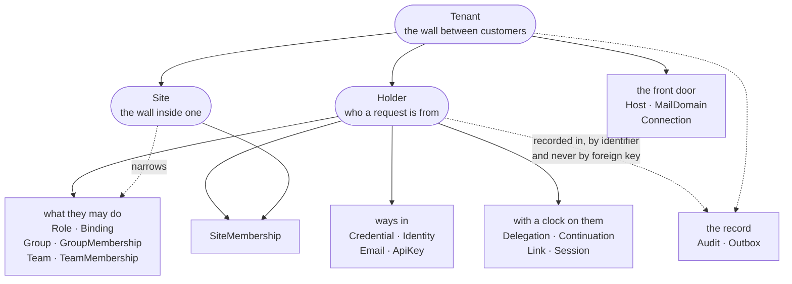
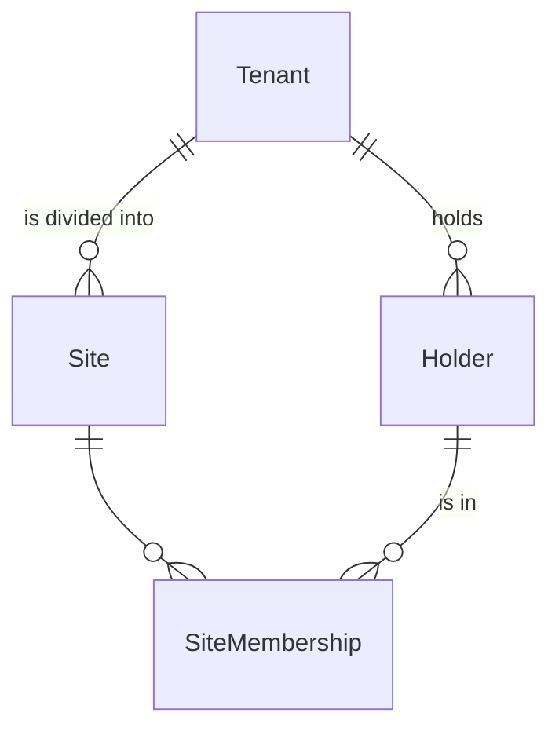
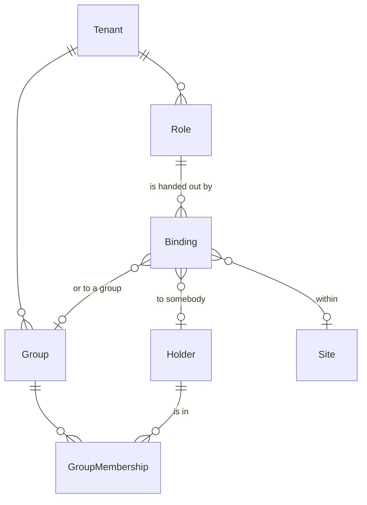
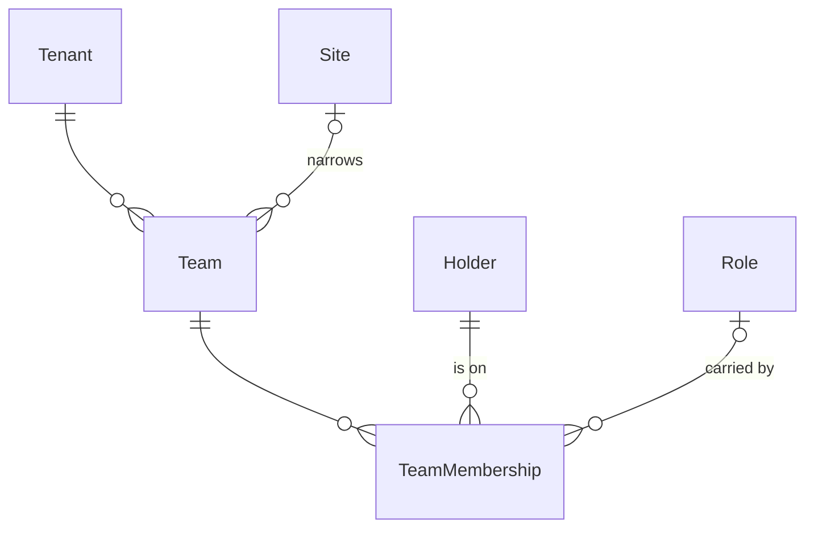
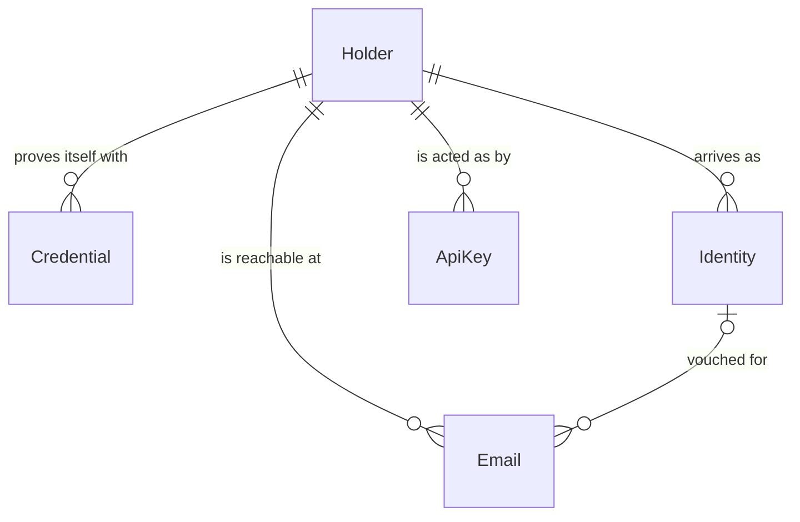
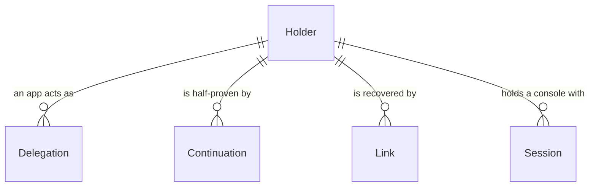
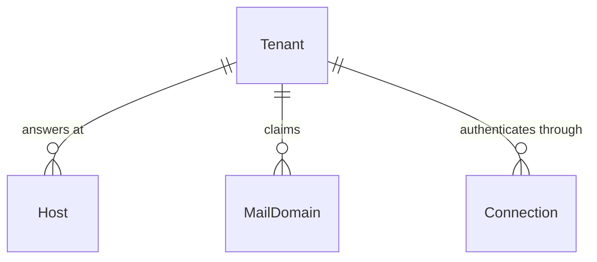

# The entities

roster is twenty-three tables and the arguments for why each is a table. This
file is the map: the shape they make, and a paragraph on each.

It is **not** where the reasoning lives. Every entity is declared in a `.proto`
under `proto/`, and those carry the argument at length -- why a row rather than
a column, why a timestamp rather than a flag, what was tried first. What is here
is short enough to read in one sitting and points at them.

`PLAN.md` is what roster is for and every decision taken. `docs/ROADMAP.md` is
the order they were built in.

## The shape

Three rows are load-bearing and everything else hangs off one of them.

**`Tenant` is the wall.** Every read is narrowed by it, and no row may open it:
there is no binding that makes somebody see another customer.

**`Holder` is who.** A credential resolves to one, the trail names one on every
line, and twelve foreign keys point at one.

**`Site` is the second axis.** A tenant is the wall between customers and a site
is the wall inside one -- a factory, a region, an environment. An entity that
names a site at field 3 is narrowed by both.

The dashed arrows are the exception worth knowing about. `Audit` and `Outbox`
hold `tenant_id`, `actor_id` and `object_id` as **plain columns and not foreign
keys**, because the trail has to outlive the rows it names -- a foreign key
would mean either that a tenant can never be erased, or that erasing one erases
the record of what was done in it.

## Tenancy

### `Tenant` — the wall an app is divided by

payday's rather than each app's, because everything that reads a request reads
it: the wall narrows every query by it, the trail stamps it, a rate limit counts
against it. Its `alias` is unique across the whole deployment, so `@acme/arm-01`
says which tenant before it says which row. Unlike `Holder` it is erased
**hard** -- nothing names a tenant the way every trail row names the holder that
acted, so there is nothing for its row to outlive.

### `Holder` — who a request is from

The row `server/auth` turns a credential into, and the row the trail names on
every line it writes. Its `tenant` edge is immutable: moving somebody between
tenants is not a field write, since their whole trail was stamped with where
they were. Erased **softly**, because a deleted holder would leave the trail
saying who while nobody could find out who.

It carries the two facts an app has to hear about. `date_invalidated` is *sign
out everywhere* as a fact rather than as a list of sessions, and `date_disabled`
is *this person is not to sign in, and their rows stay* -- neither a lockout,
which is temporary and belongs to `Credential`, nor an erasure. Both are
timestamps rather than flags because the value travels and is monotonic: a
duplicate is a no-op and a stale one cannot un-revoke.

### `Site` — where a deployment of the product runs

payday's **second axis**: a caller who may see a tenant does not thereby see
every site in it. A row rather than a label because things point at it and
because it has a name people say -- `alias` is unique within the tenant, which
is what makes `@acme/seoul` something somebody types into a configuration file.
`labels` is what an administrative grant matches on: *every site in Asia* is a
selector over these, resolved to a set of sites by roster.

### `SiteMembership` — somebody being in a site, and not a grant

Many-to-many, which is why `Holder` carries no site of its own: a person works
at one factory and audits another. Writing one changes what somebody may **see**
and not what they may do -- nothing the gate reads consults this row. Both edges
are immutable, because moving somebody between sites is leaving one and joining
another, and the trail should say both happened.

## What somebody may do

There are **two** paths from a role to a person, and the gate reads both.

A role handed out by a binding, to somebody or to a group they are in:

And a role carried by being on a team, which is how the same person is an
operator in Seoul and a reader in Frankfurt:

`Role` and `Group` each carry a nullable site of their own as well, at field 3
and for `Team`'s reason: one that names a site may only be bound in that site,
and one that names none is the tenant's.

> **A grant is any write that changes what the gate will answer for somebody**,
> which is wider than the writes that name a role. `cmd/policy.go` answers from
> three sets -- bindings to a person, bindings to a group they are in, and roles
> held in a team -- so a row added to any of the three hands out whatever it
> reaches. `GroupMembership.Add` names no role and grants as much as
> `Binding.Add` does.

### `Role` — a named set of gRPC methods

Whole method names or patterns -- `/roster.HolderService/Get`,
`/roster.HolderService/*`, `/roster.*/*` -- because a method name is already a
resource and a verb, and a table of resource kinds is a second schema that has
to agree with the first. Empty allows nothing, which is `frame.Grant`'s zero
value and the right way round. A pattern rather than a list because a list is a
snapshot of something that grows. There are no deny rules: permissions are a
union, so read order cannot matter.

### `Binding` — a role granted to somebody, somewhere

Two nullable subject edges rather than one required subject table, because a
group of one is ceremony people resent -- and since a schema cannot say *exactly
one of these*, both-or-neither is refused in `server/core`. The scope is empty
for the whole tenant or one site. It does not name a team: *the administrator of
a team manages its members* is a product invariant rather than something to
configure, and what carries a role for a team is `TeamMembership`.

### `Group` — a named set of people, and nothing else

The row grants nothing by itself, which is not the same as a group granting
nothing: a binding written to one is held by everybody in it, so **joining is
where the grant lands**. A group that carried permissions would be a role
wearing a membership's clothes, and the two change for different reasons -- who
is in marketing changes weekly, what marketing may do changes when somebody
decides it does.

### `GroupMembership` — somebody being in a group

Refused on the same terms `Binding.Add` is, and for the same reason: putting
somebody in a group hands them every binding that names it. Each binding is
checked at the scope it was made in, so a site administrator may add somebody to
a group bound inside their own site and not to one bound across the tenant.

### `Team` — a group of people within one site

Roles are derived from team membership within a site: the same person can be an
operator in Seoul and a reader in Frankfurt, and a role that meant the same
thing everywhere could not say that. The site sits at field 3 -- payday's number
for a set smaller than a tenant -- and a read narrowed to the sites a caller may
see is generated from that one number. `site` is nullable, and a team with no
site is seen by a read of the whole tenant rather than turning up in every
scoped one.

### `TeamMembership` — somebody on a team, and the role it carries

The gate is outermost and never sees which team a call is about, so `policy.of`
unions the methods of a role held in a team into what somebody may **ever**
call, and `server/core` refuses the wrong team per call. Attaching a role here
therefore hands out its methods, and `Add` and `Patch` are both refused when
they name one the caller does not hold. `role` is a nullable edge and empty is a
plain member -- it used to be a string, and a string is a role nothing reads.

## Ways in

> **Nobody writes a way into an account wider than their own.** All four of
> these are ways to sign in as whoever the row is about, so all four are refused
> unless that person's permissions are a subset of the caller's.
> `server/core/escalate.go`, PLAN.md D40 and D41.

### `Credential` — a secret somebody proves themselves with **here**

Most people arrive through an external provider and have no row here. This is
the local account: the deployment with no IdP in front of it, and the
break-glass administrator who signs in when everything else is down. Nothing
reads `secret` back: a comparison done anywhere else is a hash that has left the
store, and it puts timing-safe comparison, attempt counting and lockout in two
places that will disagree. `failures` and `date_locked` are on the row because
counting attempts anywhere else counts them per process. The unique index is
`(holder, kind, name)` and not `(holder, kind)`, because registering a second
security key is the standard WebAuthn recovery advice.

### `Identity` — a subject at a provider, pointing at a holder

A row and not a column because one person has several: the same human arrives
through Entra on Monday and through GitHub on Saturday, and both have to land on
one `Holder` or they are two people to everything downstream. `subject` must be
what the provider treats as immutable -- a numeric ID, an `oid` -- never a
username or an email, because both get changed and an email gets reassigned.
Unique on `(tenant_id, provider, subject)`: keeping the tenant in the key is
what lets one human sign up to two operators with one Google account.

### `Email` — an address somebody uses, and whether anybody checked

A row rather than a key, for three reasons that compound: a person has several,
whether an address is verified has to live somewhere, and an address is not an
identifier -- organisations reassign a leaver's address to a new joiner.
`date_verified` is a nullable timestamp and not a flag, because *when* is the
question asked afterwards. `vouched_by` names the `Identity` that vouched for
it, since an address from a provider's claims is only as good as that provider's
own check.

### `ApiKey` — what one service may call this deployment for

These live in the **control plane** -- a second roster in the same process on
its own database, whose one tenant is the deployment's owner and whose holders
are that owner's services -- two databases, because a key must not live in the
same tables as the data it protects. It is not a `Credential`: a credential
proves *who* and a key grants *what*, and there is nowhere on a credential to
write the second; nor would argon2id at 19 MiB earn what every call from every
service would pay for it, against a dictionary that does not exist for 256
random bits. `methods` is written out in full rather than a role name, and empty
allows nothing. A deployment key (`rk_`) is served **as this row** so the trail
names which key asked; a tenant key (`rt_`) resolves to its holder instead,
which is why writing one onto somebody is refused on the same terms their
password is.

## Credentials with a clock on them

Four tables that look alike -- opaque, short-lived, bound to who they were
issued to -- and are deliberately not one table with a `kind`. D16 is why: what
is proved is not what is granted, and **the kind selects the cost**. A
delegation carries `methods` that an interceptor reads; a continuation must
grant nothing at all.

### `Delegation` — an app acting **as** the person it just signed in

Minted once `VouchService.Verify` has proved somebody, valid for minutes, and
carried in `roster-as` beside the app's own key in `authorization` -- never
instead of it. A delegation presented alone is nobody: it says who a call is
*about* while the caller still has to say who it is. `methods` is an attenuation
and never a widening; what it may do is the intersection with what that person
may do.

### `Continuation` — what has been proved part way through, spendable once

D21 splits a half-finished sign-in in one place: *which browser* is mid-sign-in
is the app's, and *holder H satisfied `password`* is roster's. This is the
second half, and it never makes roster see a browser -- an opaque string in a
request body, no cookie. It carries no `methods` and must grant nothing, because
it names an identity that is only half proved. Spending is an **erase**, which
is the whole of single use: one UPDATE narrowed by `date_erased IS NULL`, so two
concurrent spends resolve to one winner in the database.

### `Link` — a way in that roster mints and somebody else delivers

A magic link, and the machine behind a recovery. Ask *who checks this?* and only
roster can -- it resolves nowhere else and revoking it is a delete. Delivery is
deliberately outside roster, and that separation is what makes the air-gapped
case work: with no mail the somebody else is a person, and what they hand over
is a password from `Vouch.Reset`. Redeeming one proves the person and nothing
more; any second factor is still asked for.

### `Session` — a console's cookie, in a table

`authsession`'s shipped store is right for one replica and **silently wrong**
for two, because a cookie minted on one is unknown to the other -- a failure
that arrives on the day somebody scales up, per request, with nothing in any log
saying why. payday ships the seam and roster ships the table. What is stored is
a **digest** of the cookie value and not the value: a backup of the map it
replaces would be a set of signed-in browsers.

## The front door

Three lookups a front door makes **before anybody has been resolved to a
tenant**, which is why each is a row rather than a map in every app's
configuration.

### `Host` — a name a front door answers at

Turns the name a browser arrived at -- `acme.example.com`, lowercased and
without a port -- into a tenant. A row rather than a repeated field on `Tenant`
because it has to be looked up, and a repeated field is one value to the
database with no index. `name` is unique **across the deployment**, one of the
few constraints that crosses the wall: two operators cannot both own the same
hostname. The read a front door makes happens before anybody has been resolved
to a tenant, so the method that answers it is `FrontService.WhoseHost`, on the
server the wall was never installed on, with a tenant identifier and nothing
else. The generated `HostService` stays behind the wall, for an operator
managing their own names.

### `MailDomain` — where the people at an address authenticate

*Addresses at `@acme.com` go to Entra* -- identifier-first routing, which every
multi-tenant front door otherwise rewrites. It hangs off the domain rather than
off a person on purpose: answered per person it is an account-enumeration
oracle, while the answer for `nobody@acme.com` is the answer for everybody at
acme. Keyed `(tenant, name)` and not deployment-wide, because this is a hint one
operator holds about their own domains -- two may both say something about
`@gmail.com`.

### `Connection` — which provider one operator's people arrive through

Everything about a connection that varies per tenant is public -- `issuer`,
`client_id`, `scopes` -- so roster stores it. The client secret is not here, and
that is the decision: `secret_ref` is only *where the deployment keeps it*
(`env:ACME_ENTRA_SECRET`), a string roster stores and answers with but never
reads. roster could not use it anyway -- using it means doing the OIDC exchange,
which is being the relying party, and D19 says roster is not.

## The record

Neither of these has a foreign key, which is the one place in payday's own
schema that is true: `tenant_id`, `actor_id` and `object_id` are plain columns,
because a record has to outlive what it names. A foreign key would mean either
that a tenant can never be erased, or that erasing one erases the record of what
was done in it.

### `Audit` — one write that happened, and who made it

Written for every request that changed something, **inside the transaction that
changed it**, so the trail and the data it is about hold or fall together.
Nothing writes one by hand: a deployment refuses the RPCs that write, since a
trail somebody can edit is evidence of nothing. It is filed under the tenant of
the **object** and not the actor -- `object_id` is what a history is asked with,
and filing it under the actor would hide from a tenant what was done to it.

The wall is the OR of three columns (`tenant_id`, `actor_tenant_id`,
`counterpart_tenant_id`), so both parties to a cross-tenant write can read the
record without either holding a scope wide enough to see the other. `value` is
the row as the event left it, erase included, so a softly erased row's contents
live on here -- which is what the retention policy in `docs/OPERATING.md` is
for, and what `roster forget` destroys per person.

### `Outbox` — a write that has to be published even if this process dies

`payday/watch` publishes in-process once the handler has answered **without an
error**, which leaves a gap: the commit and the publish are two steps, and a
process that stops between them loses the event with nothing to say so. A broker
does not close it -- putting Kafka behind the seam moves the publish, not the
commit. The only thing that closes it is writing the event **in the
transaction**, as a row.

It is normally a project because a stream of deltas needs exactly-once delivery.
payday sends **state**, so a row published twice says the same thing the second
time, at-least-once is correct, and what is left is a table, a recorder and a
loop. Rows are deleted once published, which is the whole difference from
`Audit`: a trail is kept forever, a queue is empty when everything is working.

## Every entity at a glance

**Domain** is the number written into the ninth byte of every identifier of that
entity, and the key a per-kind retention policy is written against. It is chosen
once and never reused -- an identifier outlives the row it named, so handing a
retired number to something else makes old trail rows say the wrong word. 5 and
6 are a gap payday keeps for itself, which is why an app's own entities start at
7.

**Wall** is how the tenant a row belongs to is reached. **Watch** is whether the
entity streams its changes. **Erase** is soft (stamped, and the row stays) or
hard (gone).

| entity | domain | wall | watch | erase | columns of its own |
| --- | --- | --- | --- | --- | --- |
| `Tenant` | 1 | the wall itself | -- | hard | `alias`, `name`, `desc`, `labels` |
| `Holder` | 2 | `tenant` edge | yes | soft | `alias`, `name`, `desc`, `labels`, `idp_subject`, `profile`, `data`, `date_invalidated`, `date_disabled` |
| `Audit` | 3 | `tenant_id` OR `actor_tenant_id` OR `counterpart_tenant_id` | -- | hard | `actor_id`, `trace_id`, `action`, `object_id`, `patch`, `value`, `domain` |
| `Outbox` | 4 | `global:` — served to nobody | -- | hard | `actor_id`, `method`, `by`, `object_id`, `patch` |
| `Site` | 7 | `tenant` edge | yes | soft | `alias`, `name`, `desc`, `labels` |
| `Identity` | 8 | via `holder.tenant`, stamped | yes | soft | `provider`, `subject` |
| `Email` | 9 | via `holder.tenant`, stamped | yes | soft | `address`, `date_verified`, `vouched_by` |
| `Team` | 10 | `tenant` edge | yes | soft | `alias`, `name`, `desc`, `site` |
| `SiteMembership` | 11 | via `holder.tenant` | yes | soft | `holder`, `site` |
| `TeamMembership` | 12 | via `holder.tenant` | yes | soft | `holder`, `team`, `role` |
| `Credential` | 13 | via `holder.tenant` | yes | soft | `name`, `kind`, `secret`, `failures`, `date_locked`, `date_rotated`, `last_step` |
| `ApiKey` | 14 | via `holder.tenant` | -- | soft | `alias`, `desc`, `methods`, `secret`, `date_used`, `date_expires` |
| `Role` | 15 | `tenant` edge | -- | soft | `alias`, `name`, `desc`, `methods`, `site` |
| `Group` | 16 | `tenant` edge | -- | soft | `alias`, `name`, `desc`, `site` |
| `GroupMembership` | 17 | via `holder.tenant` | -- | soft | `holder`, `group` |
| `Binding` | 18 | via `role.tenant` | -- | soft | `role`, `site`, `holder`, `group` |
| `Delegation` | 19 | via `holder.tenant` | -- | soft | `methods`, `secret`, `issuer`, `date_expires` |
| `Host` | 20 | `tenant` edge | -- | soft | `name`, `desc` |
| `MailDomain` | 21 | `tenant` edge | -- | soft | `name`, `provider`, `desc` |
| `Continuation` | 22 | via `holder.tenant` | -- | soft | `satisfied`, `secret`, `issuer`, `metered_by`, `date_expires` |
| `Link` | 23 | via `holder.tenant` | -- | soft | `secret`, `issuer`, `date_expires` |
| `Session` | 24 | via `holder.tenant` | -- | soft | `grant`, `secret`, `date_expires`, `date_idle` |
| `Connection` | 25 | `tenant` edge | -- | soft | `name`, `desc`, `issuer`, `client_id`, `scopes`, `secret_ref` |

`id`, `date_created`, `date_updated` and `date_erased` are on everything and are
left out above. `date_updated` is the version a `Patch` compares against, and
`Tenant`, `Audit` and `Outbox` have no `date_erased` because they are the three
that erase hard.

Field numbers are read **by name** across every entity, which is what lets one
generator write the same code for all of them:

| | |
| --- | --- |
| **1** | the key |
| **2** | the tenant |
| **3** | a set smaller than a tenant — `Site` |
| **4–7** | `alias`, `name`, `desc`, `labels` |
| **8–12, 16+** | the app's own |
| **13/14/15** | `date_updated`, `date_erased`, `date_created` |

An entity that does not want 4–7 leaves those numbers **empty** rather than
spending them on something else.

## Where the argument is

| | |
| --- | --- |
| `proto/app/*.proto` | the entity, and the whole argument for it |
| `proto/roster/payday/*.proto` | payday's four, **copied in** — do not edit; write an overlay in `proto/ext/payday/` |
| `internal/ent/migrate/schema.go` | the tables as they are actually created |
| `PLAN.md` | every decision, by number |
| `docs/OPERATING.md` | what an operator does with these |
