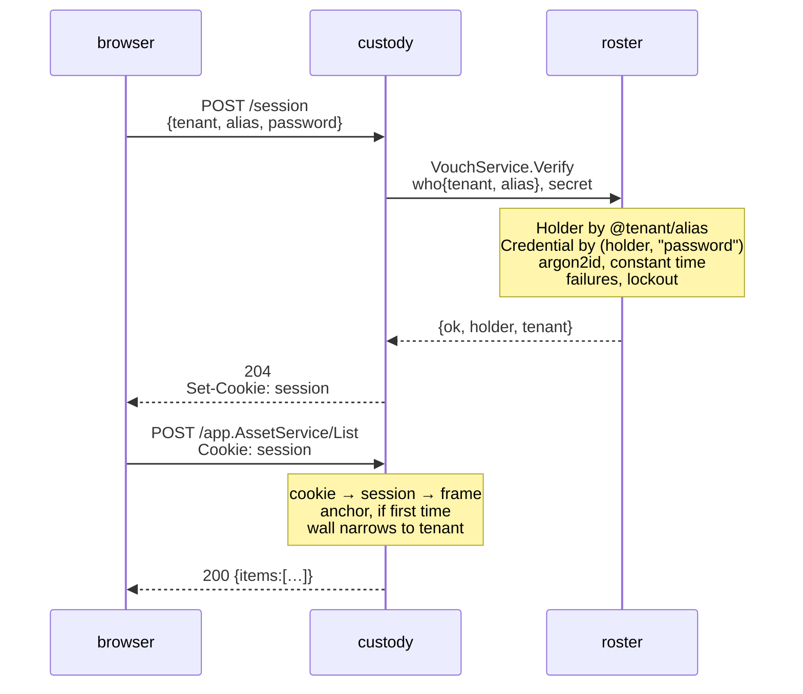
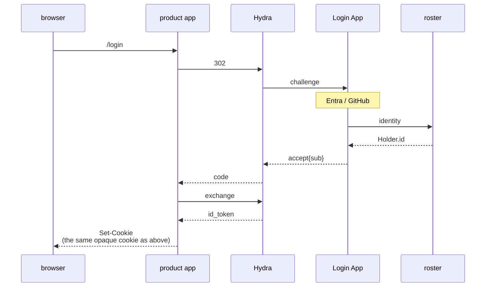
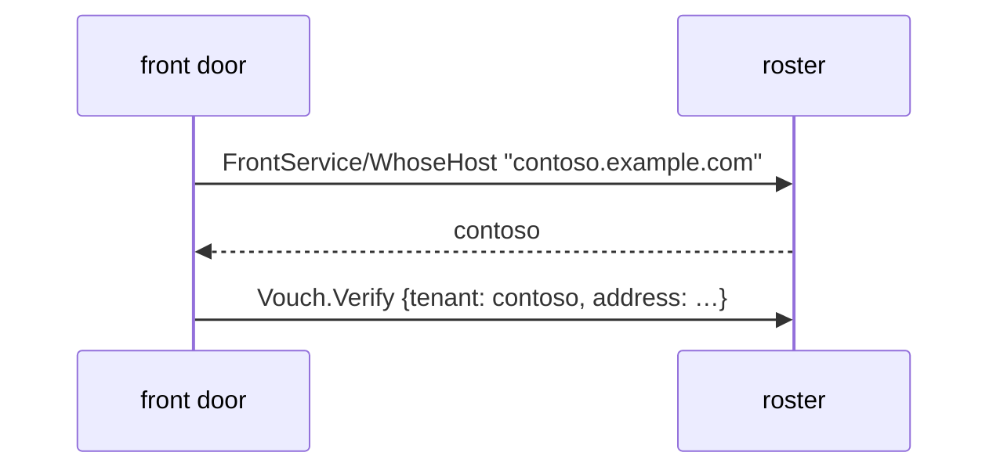
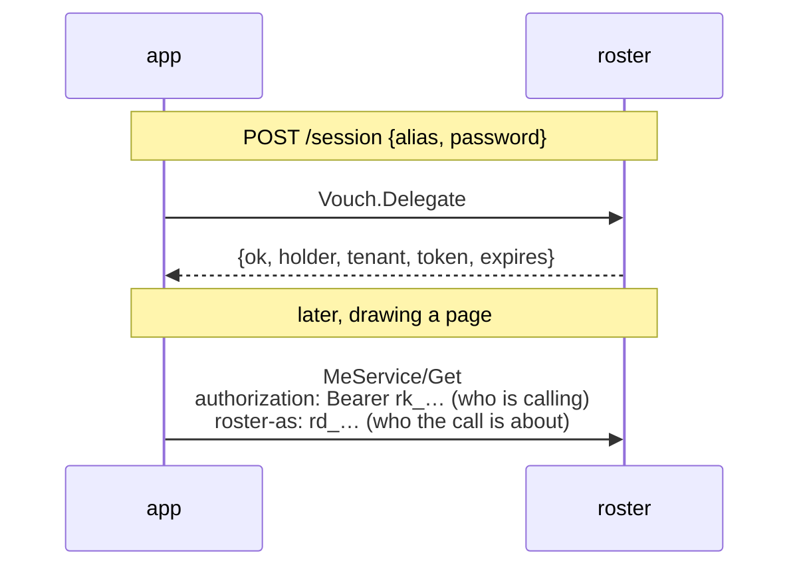

# Signing in

What happens when somebody types a password into a product app, end to end.
Every hop below is real: it is what `custody/cmd/login_test.go` runs, with roster
on a listener and custody dialling it.

## The path

**roster never sees the browser.** It is called by machines, has no cookie
domain and no CSRF story, and that is why the session is custody's.

## What each side answers

| | |
| --- | --- |
| `POST /session` → **204**, no body | The cookie is the answer. What a page needs *about the person* is a request it should make, against the same server and behind the same wall |
| `POST /session` → **401** | Wrong password, unknown person, no such tenant — one answer for all of them |
| `Vouch.Verify` → `{ok:false}` | Same, and it takes the same time; see below |
| `Vouch.Verify` → `{locked_until}` | Ten wrong answers in a row closed the account for fifteen minutes |
| `DELETE /session` → **204** | The row is deleted, so the key is dead in every browser at once |
| any RPC → **401** | No cookie, a cookie naming nothing, an expired session, or a session naming somebody who has since been erased |

## Why every refusal looks the same

An unknown person, a person with no password and a wrong password are **one
answer**, and the first two burn an argon2 comparison so that they take as long
as the third. Otherwise the response time answers "does this account exist",
which is the question somebody working through a list of addresses is asking.

The one refusal that is distinguishable is a lockout, and that is a deliberate
trade: it says the person exists. The alternative is somebody locked out being
told nothing and trying forever. See `server/vouch`'s package comment —
including what a lockout does **not** fix.

## What custody keeps, and what it does not

custody keeps **no password**. There is no column for one in its schema, which
is the strongest form of that guarantee. The plaintext passes through its
process on the way to roster and is written nowhere.

What it does keep is an **anchor**: a `Holder` row carrying the identifier and
the tenant, made on the first call after signing in — not at sign-in, so that
`date_created` there means *first seen in custody* rather than *signed in once*.
The alias on it is seven characters payday made up. roster's name for the same
person is deliberately not copied: that copy would be wrong the first time
somebody marries.

Everything else — the name, the photo, the department — is read from roster when
there is a screen to draw.

## What custody sees that an IdP would hide

The plaintext, in memory, on its way past. That is the cost of custody serving
the sign-in form itself.

With Hydra and a Login App in front, the Login App sees it and custody never
does. Whether that is worth the extra moving parts is a deployment's decision,
and both shapes work: `custody/cmd/config.go` takes either a `roster` or an
`auth.issuer`.

## What the cookie actually is

Worth being exact, because "session" is a word people fill in differently and
the mechanism decides what is possible afterwards.

The value in the cookie is **32 bytes from `crypto/rand`**, base64url. It is not
a token, not a hash of one, and not readable by anybody: it carries no claims,
no signature and no expiry a client can see. It is a **handle**.

What it handles is a row in custody's own store — `payday/auth/authsession` —
holding the actor, the tenant, a `frame.Grant`, an absolute expiry and an idle
one. On every later request custody looks the row up by that key. Nothing is
compared and nothing is decoded; a key naming no row is simply not a session.

Two consequences follow, and both are the point:

- **Signing somebody out is a delete**, and it is immediate everywhere that
  cookie was used. There is nothing to wait out.
- **The cookie is worthless to any other app.** It names a row in custody, and
  the next product has no such row. That is not a gap to patch — it is why the
  next section ends where it does.

Nothing about the person is copied into the row, so a session cannot be a stale
copy of somebody: the name, the teams and the permissions are read when there is
a screen to draw.

## Do I need Hydra?

**One app: no.** The picture above is complete, and nothing is signed.

**Several apps, one sign-in: yes.** custody's cookie means nothing to the next
product, and the thing that fixes it — a credential with an issuer, a JWKS
endpoint, expiry, refresh and revocation — *is* OIDC. Writing it yourself is
writing Hydra.

So the question is never "password or OIDC". It is **one relying party or
many**. An air-gapped single app needs neither.

### What changes when Hydra is in front

Less than it looks like, and **roster does not get smaller** — Hydra has no user
database and does not authenticate anybody. It hands a `login_challenge` to a
Login App and waits to be told a `subject`, and choosing that string is the
problem roster exists for.

Line by line, against the no-Hydra picture:

| | without Hydra | with Hydra |
| --- | --- | --- |
| who asks roster | the product app | the **Login App** |
| what it asks | `VouchService.Verify` | `Identity` → `Holder.id`, and `Vouch` only if there is a password |
| what the product app gets back | `{ok, holder, tenant}` | an `id_token` carrying the same `sub` |
| the cookie | custody's, opaque | **unchanged** — custody's, opaque |
| a second product | has to sign in again | is already signed in, at Hydra |

The token is used **once**, at the callback, to find out who this is. It is not
stored, not compared on later requests and not given to the browser — there is
nowhere safe in a browser to keep one, which is the argument `authsession` opens
with. After that, the picture is the one at the top of this document.

So the app-side code barely moves. `authsession` asks for a `Verify` either way;
what changes is what fills it — a call to roster, or the completion of an OIDC
callback.

One thing to add on the day you do this: **back-channel logout.** A session
ended at Hydra does not end custody's row by itself, and the OIDC logout
endpoints are how that propagates. Handling it is one `store.Del`.

## A second factor, and whose it is

roster holds it and checks it; the Login App decides when to ask.

The secret is a `Credential` row beside the password, verified here for the
reason the password is — a secret that leaves the store puts the comparison, the
counter and the lockout in two places. Replay is the same: a TOTP step that has
been spent must not work twice, and the row is where that is recorded.

What roster does not decide is whether one was required, whether this browser is
remembered, or what order the prompts come in. That is the flow, and the flow is
wherever the browser is — the Login App with Hydra in front, the product app
without.

payday already left the seam for the half-signed-in state: a `Verify` may set
`Session.Expires` itself, which is how an app gives a short session to somebody
who has not finished a second factor.

What the app does **not** have to keep is who passed the first step. `Vouch`
answers with an opaque `continuation` — short-lived, single-use, resolvable only
by the caller it was issued to — and the app hands it back with the second
secret. So the two forms are the app's and the fact that both were the same
person is roster's, which is the only half an app developer wanted.

Beside it come the two things needed to draw the second form: what is
`satisfied` so far, and what is `available` to this person — each of those a
kind, a name and a lockout, which are facts rather than instructions. A factor
whose method has a challenge to send would add a third field and none does yet.
What does **not** come is how many steps there are in total, which of the
available methods to offer, or what to call them. Those are the app's, and D21
says why.

See [position.md](position.md), § "Second factors".

## Signing in by address, and where the tenant comes from

The path above collects `@tenant/alias`. Most forms collect an email, and for a
long time this service could not serve one: `Email` is unique **per holder**, so
that a consultant can be one person in two tenants under one address, which
meant one address could name two people. F7 was that, open.

What closes it is not a change to `Email`'s rule but a second fact. A tenant is
the same service under a different operator's own domain, so the **name the
browser arrived at** says which operator — and roster holds that now:

Within one tenant an address is unique, so there is one row to find. The
consultant is untouched: that case is *across* tenants and this constrains
*within* one.

There is no form of this that takes an address alone. A lookup that could be
made without naming a tenant is a lookup a front door that forgot to think about
which one compiles a wrong answer for — which is the same reason the tenant is
in `Identity`'s key rather than checked afterwards.

## A person who uses two operators' services

They have two accounts, and that is the whole answer.

`Identity` is unique on `(tenant, provider, subject)`. The same Google account
signs up to contoso's service and to beta's, and those are two Holders with two
histories and two sets of permissions. Nothing here relates them, and nothing
should: a row that spanned tenants would have no owner, no answer to who may
erase it, and no tenant whose trail it belongs to. A tenant is the wall, and
something that crosses it is not a person any more.

The tenant is in the key rather than checked afterwards, which is the part worth
being exact about. It means a lookup **cannot** be made without naming a tenant,
so a front door that forgot to think about which one does not compile a wrong
answer -- it has nothing to look anybody up with.

Without it, one account at a provider would belong to exactly one tenant across
the whole deployment, and the second operator a person signed up to would be
told the identity was taken, by somebody they cannot see.

### What a front door has to know

Which tenant it is. That is what a tenant *is*: the same service under a
different operator's own domain, so the name the browser arrived at is the
operator whose service they are signing in to.

The email domain answers a different question -- where somebody
**authenticates**, often at another organisation entirely. One of contoso's people
can perfectly well have a personal Google account.

### And what its own credential has to reach

A login app that fronts **several** operators cannot authenticate as a Holder.
A Holder belongs to one tenant and the wall narrows what it may read to that, so
it would resolve its own tenant and get NotFound for every other. What such a
deployment needs is an API key, whose actor is not inside a tenant.

`examples/sso` runs as one operator's front door for exactly this reason, and
says so where it wires the credential.

### What roster does offer

Within one tenant, several ways in for the same person. `Identity` is
one-to-many by design -- the same human arrives through the company's Entra
tenant on Monday and through GitHub on Saturday, and both land on one Holder
with one history and one set of permissions. That is the convenience it is for,
and putting the tenant in the key does not touch it: two Holders of one tenant
claiming the same subject at the same provider is still refused.

## Asking roster as the person who just signed in

Every screen that shows somebody their own record needs it — my identities, my
addresses, sign me out everywhere — and the two obvious ways are both wrong. The
app's own key belongs to the deployment and sees every tenant it serves, and the
app filtering rows in its own code is the thing that leaks by being forgotten.

So `Vouch.Delegate` is `Verify` and one more thing: on a yes it answers with a
short-lived credential for the person it just proved.

**It is not a bearer credential on its own.** A delegation says who a call is
*about* while the caller goes on saying who they are, and both are on the
request — which is what makes "bound to the caller it was issued to" a rule
rather than a sentence. One that leaks is worth nothing without the key it was
minted for.

What it can do is the intersection: never wider than the person, and never wider
than the methods it was minted with. Signing out revokes it — `Vouch.Revoke` —
rather than leaving a live credential until its clock runs out.

`examples/sso` is the whole of it working, and it is honest about what it does
not reach: a sign-in through the provider never calls `Vouch`, so there is
nothing for a delegation to ride back on, and the page says so rather than
falling back to the app's own credential. `delegation.proto` is the why.

## What a calling machine is, and where it lives

This section used to say the question was open. It is not any more, and the
answer is D15's: **a machine is a `Holder` in the control plane.**

The question was real. A caller has to be a row, because roster answers nothing
anonymously — and every way of putting custody in the *data plane* was wrong:

- `Holder` is a person, and D1 makes `Holder.id` the `sub` of every token. A
  service in that table has a `sub`.
- A `Holder` belongs to **one tenant** and is walled by it. custody acts across
  every tenant it has users in.
- `grpcx.Limit` counts per tenant, off the frame, so all of custody's verifies
  would count against whichever tenant happened to hold it.

Every one of those is an argument against the *table*, not against the *schema*.
The control plane is the same schema on its own database with its own single
tenant, so a `Holder` there is a caller rather than a person, its `rk_` key
holds no tenant and sees every tenant there is, and none of the three objections
survives. `roster key add` mints it; `operating.md` is the operator's half.

What is left is deployment wiring rather than a decision: a deployment that
names no control plane still serves `auth.Plain`, which believes whatever a
caller writes. That is right for tests and a sandbox, and it is loud in the log
for the reason payday's other easy defaults are — an app nobody can start until
a control plane exists is an app nobody runs. Anything reachable by more than
the machine it runs on needs the control plane configured and TLS under it.

`examples/sso` shows the **other** shape, and it is worth being exact about
which: its machine is a `Holder` in the tenant it serves, with an `rt_` key, so
what it demonstrates is a per-tenant caller and not the control-plane one this
section is about. The paragraph above is the answer for a caller that acts
across every tenant — custody — and its own tests are where that is exercised.

## See also

- [`server/vouch`](../server/vouch) — the package comment is the detail
- [`examples/sso`](../examples/sso) — a relying party that signs somebody in
  with Google, Entra or GitHub and finds out who they are here. The package
  comment is the detail; the tests are the flow, run against a provider that
  answers over HTTP
- payday's [guide/signing-in.md](https://github.com/lesomnus/payday/blob/main/docs/guide/signing-in.md)
  — how to put one of these in front of any payday app
