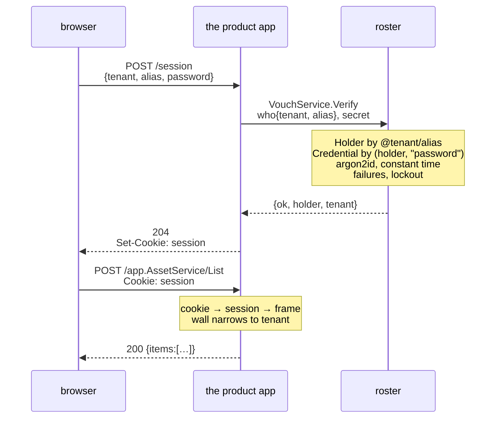
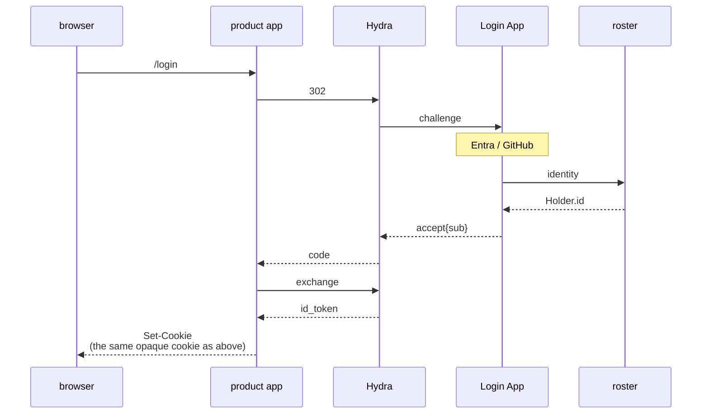
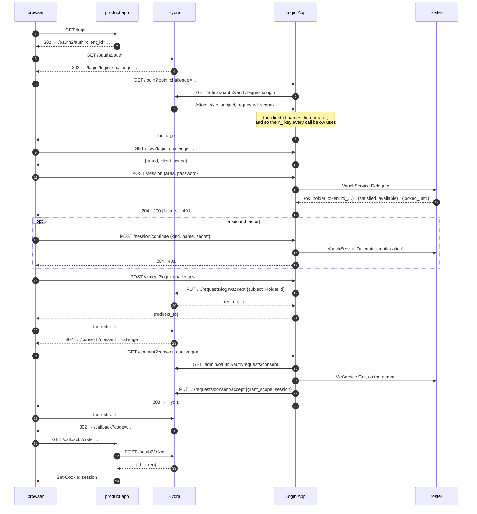
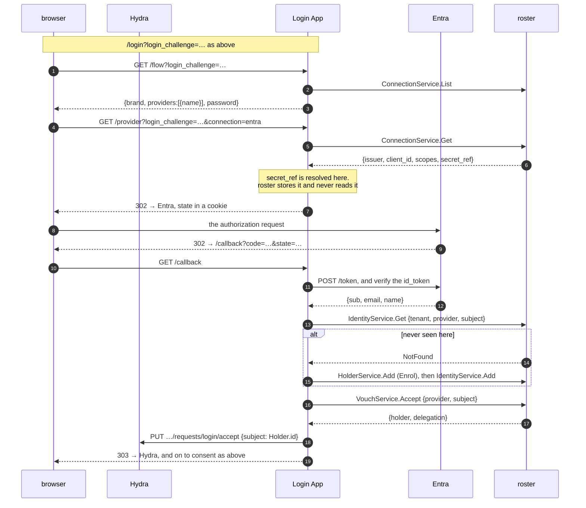
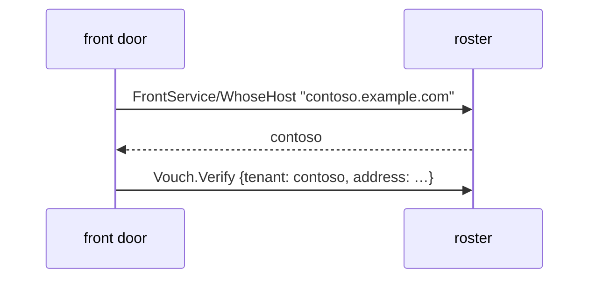
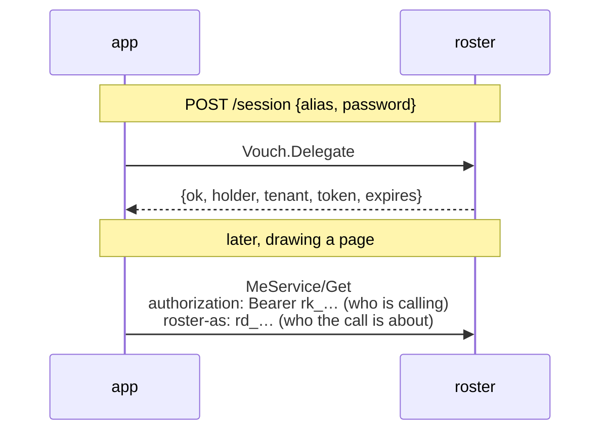

# Signing in

What happens when somebody types a password, end to end, and the HTTP contract a
sign-in page of your own is written against.

Four things in this repository do this for real, and they are the detail behind
every picture below: `login/` is the Login App (`roster login serve`), `account/`
is the front door a customer's own people arrive at, `examples/sso` is a product
app that signs somebody in and reads its own record back, and `examples/product`
is a product app in front of Hydra. `docker/flow.sh` walks the first through a
real Hydra; [relying-party.md](relying-party.md) is the last two.

## One app, or several

**One app: you do not need Hydra.** The picture below is complete, and nothing is
signed.

**Several apps, one sign-in: you do.** An app's cookie means nothing to the next
product, and the thing that fixes it -- a credential with an issuer, a JWKS
endpoint, expiry, refresh and revocation -- *is* OIDC. Writing it yourself is
writing Hydra.

So the question is never *password or OIDC*. It is **one relying party or many**,
and an air-gapped single app needs neither. [position.md](position.md) § "Single
sign-on does not make roster bigger" is the same decision from roster's side.

## The path, without Hydra



**roster never sees *this* browser.** The data plane is called by machines, and
the session is the app's, because a cookie belongs to the origin the browser is
actually talking to.

roster does serve one browser of its own -- the admin console, on the control
plane, on a cookie roster mints and checks (`AuthService.SignIn`). Different
plane, different people, and nothing about a customer's sign-in passes through it.

### What each side answers

| | |
| --- | --- |
| `POST /session` → **204**, no body | The cookie is the answer. What a page needs *about the person* is a request it should make, against the same server and behind the same wall |
| `POST /session` → **401** | Wrong password, unknown person, no such tenant -- one answer for all of them |
| `Vouch.Verify` → `{ok:false}` | Same, and it takes the same time |
| `Vouch.Verify` → `{locked_until}` | Too many wrong answers in a row closed the account for a while -- ten and fifteen minutes unless `vouch.lockout` says otherwise |
| `DELETE /session` → **204** | The row is deleted, so the key is dead in every browser at once |
| any RPC → **401** | No cookie, a cookie naming nothing, an expired session, or a session naming somebody since erased |

**Every refusal looks the same on purpose.** An unknown person, a person with no
password and a wrong password are one answer, and the first two burn an argon2
comparison so that they take as long as the third -- otherwise the response time
answers *does this account exist*, which is the question somebody working through
a list of addresses is asking. The one refusal that is distinguishable is a
lockout, which is a deliberate trade: it says the person exists, and the
alternative is somebody locked out being told nothing and trying forever.
`server/vouch`'s package comment has the rest, including what a lockout does
**not** fix.

### The app's session, and what is in it

Worth being exact, because *session* is a word people fill in differently and the
mechanism decides what is possible afterwards.

payday's answer is `auth/authsession`: the cookie's value is **32 bytes from
`crypto/rand`**, base64url, and it is a **handle** -- not a token, not a hash of
one, carrying no claims, no signature and no expiry a client can see. What it
handles is a row in the app's own store holding the actor, the tenant, a
`frame.Grant`, an absolute expiry and an idle one. A key naming no row is simply
not a session.

Two consequences follow, and both are the point:

- **Signing somebody out is a delete**, immediate everywhere that cookie was
  used. There is nothing to wait out.
- **The cookie is worthless to any other app.** It names a row in this app, and
  the next product has no such row -- which is exactly what Hydra is for, one
  section down.

Nothing about the person is copied into the row, so a session cannot be a stale
copy of somebody: the name, the teams and the permissions are read when there is
a screen to draw. And an app holding a session keeps **no password** -- the
plaintext passes through its process on the way to roster and is written nowhere.
An app that wants a row of its own for the people it has seen makes it on the
first call *after* signing in rather than at sign-in, so `date_created` there
means *first seen here* rather than *signed in once*; roster's name for the same
person is deliberately not copied, because that copy would be wrong the first
time somebody marries.

## What changes when Hydra is in front

Less than it looks like, and **roster does not get smaller** -- Hydra has no user
database and authenticates nobody. It hands a `login_challenge` to a Login App
and waits to be told a `subject`, and choosing that string is the problem roster
exists for.



Line by line, against the no-Hydra picture:

| | without Hydra | with Hydra |
| --- | --- | --- |
| who asks roster | the product app | the **Login App** |
| what it asks | `VouchService.Verify` | `Identity` → `Holder.id`, and `Vouch` only if there is a password |
| what the product app gets back | `{ok, holder, tenant}` | an `id_token` carrying the same `sub` |
| the cookie | the app's own, opaque | **unchanged** -- the app's own, opaque |
| a second product | has to sign in again | is already signed in, at Hydra |

The token is used **once**, at the callback, to find out who this is. It is not
stored, not compared on later requests and not given to the browser -- there is
nowhere safe in a browser to keep one. After that, the picture is the one at the
top of this page, so the app-side code barely moves: `authsession` asks for a
`Verify` either way, and what changes is what fills it.

**roster ships the Login App**: `login/`, run as `roster login serve`. It reads
the challenge, draws the same `frontdoor` forms **and the operator's providers**,
and answers `acceptLoginRequest{subject}` with a `Holder.id` either way. The
consent hop then reads the person once, *as them*, and puts `preferred_username`,
`name`, `groups` and a **verified** address into the `id_token`, each only if the
client asked for the scope that carries it. What it never puts there is `methods`
-- roster's answer about roster, which a product holding a copy of would hold a
stale one.

Which operator a flow belongs to comes from the **challenge**, not the hostname:
it names the OAuth client, and each operator's clients are written down
(`login.clients`) and read back over Hydra's admin API. So the tenant is Hydra's
word rather than a header a browser wrote, and the key each call goes out with
follows from it. Several clients per operator, because one sign-in across two
products is the case Hydra is for at all.

The consent hop **grants what the client asked for and draws nothing**, which is
`consent: skip`, the default and a decision: every client this app can have was
registered by the deployment for one of its own operators, and a screen for an app
the operator wrote is a dialog people learn to click through. `consent: ask` draws
one. Neither mode lets a person grant *less* than was asked -- an app that asked
for a scope generally stops working without it, so the choice would be between
*allow* and *allow, then find out something is broken*.

How a deployment turns it on is [operating.md](operating.md) § "One process, or
four"; `compose.yaml` runs the whole of it, Hydra included.

### Every hop, and the call it makes

The picture above is the shape. This is the wire: every redirect, every endpoint
and every RPC, in order, for the two routes that reach a `Holder.id`.

Both are the Login App's, and both are the account app's -- the two front doors
draw the same forms over `ts/lib/signin.tsx` and are the same relying party over
`arrives`. What differs is the ending: the account app finishes at its own cookie,
and this one finishes at `acceptLoginRequest{subject}`. What the two routes share
is the last fact and nothing else, which is the point: the `sub` a product sees
names the same person whichever door they came through. roster is the relying
party in neither -- `connection.proto` says why.

#### A password, with Hydra in front



| | the call | what it settles |
| --- | --- | --- |
| the challenge | `GET /admin/oauth2/auth/requests/login` | which **client**, and so which operator and which `rt_` key. Asked before a form is drawn, so a challenge this app fronts nobody for fails here rather than after somebody has typed a password |
| `skip` | none | Hydra already knows this browser, within `remember`. `acceptLogin(v.Subject)` straight away: the subject is Hydra's and this app must not second-guess it |
| the page | `GET /flow` | `{brand, client, scope}`. The page may not ask Hydra and this app may, so this is the one endpoint it has |
| the first form | `VouchService.Delegate` | 204 signed in · 200 one factor proved, another to prove · 401 everything else. `Delegate` and not `Verify` because a yes has to come back with the `rd_` the consent hop reads `Me.Get` with |
| the second form | `VouchService.Delegate` with the continuation | the app holds no half-signed-in state: the continuation is roster's, short-lived and single-use |
| the accept | `PUT …/login/accept` | **`subject` is the `Holder.id`.** Nobody is named until every form is answered -- accepting after the first would hand a product a token for somebody who proved half of what the deployment asked for |
| the claims | `MeService.Get`, as the person | `preferred_username`, `name`, `groups`, a **verified** address -- each only if the client asked for the scope that carries it. Never `methods` |
| the grant | `PUT …/consent/accept` | `consent: skip` grants and draws nothing; `ask` draws the screen and `POST /consent` is its answer |

The delegation this app minted is spent at the grant and the cookie is ended there
(`Door.End`): a credential that outlives its use is one somebody has to remember
to revoke.

#### An account at a provider, with Hydra in front

The same walk with the two forms replaced by a round trip. Everything after the
identity is the password path's last three hops, unchanged.



| | the call | what it settles |
| --- | --- | --- |
| the buttons | `ConnectionService.List` | what `/flow` answers beside the brand. The **name** and nothing else: the issuer is where the browser is about to go, `secret_ref` is the operator's, and what to call the button is the page's |
| the form | `TenantService.Get`, `config.password` | whether there is a password form at all. Not a screen setting: roster **refuses** a password for a tenant with this off (`vouch.Offers`), so the page draws what is already true. Unset is yes |
| which operator | the challenge, again | `/provider` is in a flow, so the `Connection` rows read are the ones that client's operator can see. fabrikam's challenge cannot reach contoso's directory |
| the redirect | `login.base` | **one URL for the whole app**, because Hydra sends every browser here under one name. Which operator a callback belongs to comes from the state, and the state is a nonce naming a row this app kept |
| the exchange | the provider's own | the Login App is the relying party, exactly as the account app is |
| who may sign in | `login.enrol` | `invited` admits only somebody already linked; `expected` admits somebody an operator entered, matched by the **address** on their row; `enrolling` admits a stranger too. `enrolling` needs `HolderService.Add`, which the provisioned key does not hold |
| the sign-in | `VouchService.Accept` | the claim this app verified, exchanged for a delegation. Not `Verify`: there is no password here to check |
| the session | `Door.Accept` | minted here for the same reason the password path has one -- the consent hop reads the person **as them** to fill the claims |
| the accept | `PUT …/login/accept` | the `Holder.id`. The same string a password would have produced for the same person, which is what makes Monday-Entra and Saturday-password one `sub` |

**The account app is the same walk with no Hydra**, and it is the shape a
deployment with one relying party should still take: same package, same policy,
two different ends -- the tenant comes from the **host**
(`FrontService.WhoseHost`, so there is a redirect per operator rather than one for
all of them), and it finishes at the app's own cookie.
`account/account.go`'s `login`/`callback` and `login/provider.go` are the two
endings; everything between them is `arrives`.

And the other direction is done: **signing somebody out in roster reaches
Hydra.** The Login App holds `SyncService` open, one stream per operator, and when
roster says somebody has been signed out everywhere, suspended or erased it tells
Hydra to forget them -- so the next product they open finds a form rather than a
fresh token. roster does not know Hydra exists and this does not change that: the
stream says what has stopped being good in roster's own vocabulary, to any app
holding a credential, and turning that into a `DELETE` is the Login App's.

### A page of your own, and the contract it writes against

The page in `ts/login/` is **one implementation** of the surface below, not the
surface. A deployment that wants its own sign-in screens builds them and points
`login.page.dir` at the result; one that serves them from its own static server
leaves the setting out and keeps the endpoints. Under one constraint that is not
negotiable: **this app sends no CORS headers**, so the page has to reach
`POST /session` and `POST /accept` as **same origin** -- in practice a proxy
putting the page and this listener under one name.

⚠️ **Empty means this binary serves no page at all**, and what a browser gets at
`/login` is a **404** with *this deployment serves no sign-in page*. It looks
exactly like the issuer being broken, and the two ways to arrive at it are
forgetting the setting and pointing it at a directory that was never built.

Which makes this a contract rather than an internal shape, and it is written down
because there are **four** implementations of it in this repository -- the real app
and the made-up server in `ts/vite.login.ts` on one side, `ts/lib/signin.tsx` and
`frontdoor/web/frontdoor.js` on the other -- and nothing had said what they were
all implementing. To write one against nothing, `npm --prefix ts run dev:login`.

Every pattern below is mounted by `App.Handler()` (`login/login.go`), except the
three marked `frontdoor`, which are `Door.Handler()`'s and are the same three the
account app serves. `login/contract_test.go` fails when this table and those two
functions stop agreeing, in either direction.

| mounted as | what it promises a page | pinned by |
| --- | --- | --- |
| `GET /login` | the first screen, as a document. Hydra's own `skip` is answered here instead, with a 303 and no page drawn | `TestALoginAppTellsHydraWhoSignedIn` · `TestASecondFlowCarriesTheClaimsToo` |
| `GET /flow` | `{brand, client, scope, providers, password}` for a login challenge, `{brand, logout}` for a logout one. **The only thing a page may ask**, because what a flow is about is Hydra's to say and only this app may ask Hydra | `TestATenantWithNoPasswordDrawsNoForm` · `ts/e2e/login.spec.ts` |
| `/session`, `/session/` | mounted so `frontdoor`'s three below see the whole path. One handler, three methods | `TestALoginAppTellsHydraWhoSignedIn` |
| `POST /session` | *frontdoor.* `{alias\|address, password}` → **204** signed in · **200** `{satisfied, available}` one factor proved and more to prove · **401** everything else | `TestALoginAppTellsHydraWhoSignedIn` · `TestASecondFactorIsAskedForAndTheFlowWaitsForIt` · `TestARosterThatIsDownIsNotAWrongPassword` |
| `POST /session/continue` | *frontdoor.* `{kind, name, secret}` → **204** · **401**. One attempt per first form: the half-session is spent whether the answer was right or not | `TestAWrongSecondFactorFinishesNothing` · `TestAHalfSessionIsOverWhenTheAppSaidItWas` · `TestASignedInBrowserSurvivesAStraySecondForm` |
| `DELETE /session` | *frontdoor.* Drops this app's session and revokes the delegation. Not part of the flow -- the flow's own ending is `POST /accept` -- and mounted because it is the same handler | `TestSigningOutRevokesEvenAWindowThatHasPassed` |
| `POST /accept` | `{redirect_to}`, and **the hop no other front door has**: it turns a finished sign-in into `acceptLoginRequest{subject}`. A page that leaves this out signs somebody in and never ends the flow. 401 when nobody is signed in, or is half way | `TestALoginAppTellsHydraWhoSignedIn` · `TestAFlowReachesOnlyItsOwnOperator` |
| `GET /provider` | 302 to the directory this operator's `Connection` names, with the state in a cookie | `TestSomebodyArrivesThroughAProvider` · `TestAProviderFlowReachesOnlyItsOwnOperator` |
| `GET /callback` | where a directory sends the browser back. **Not** in a flow: one URL for the whole app, and which flow it belongs to comes from the state | `TestACallbackWithoutItsOwnStateIsRefused` · `TestAStrangerIsRefusedUnlessTheDeploymentEnrols` |
| `GET /consent` | a screen when `login.consent` is `ask`, a 303 when it is `skip` or Hydra remembered | `TestTheConsentScreenIsDrawnWhenTheDeploymentAsksForOne` |
| `POST /consent` | the screen's answer. A no is `consent/reject` and the browser goes back to the client with a refusal | `TestTheConsentScreenIsDrawnWhenTheDeploymentAsksForOne` · `ts/e2e/login.spec.ts` |
| `GET /logout` | a screen only half the time: drawn when nothing proved a relying party started the sign-out, answered with a 303 when something did | `TestALogoutNobodyProvedAnAppAskedForIsConfirmed` · `TestSigningOutEndsWhatTheIssuerRemembers` · `docker/behind.sh` |
| `POST /logout` | `{logout_challenge, allow}` → `{signed_out, to}`, or `{signed_out: false}` and nowhere to go. **400 for a logout an app did prove it started**, because that one is never drawn | `TestTheConfirmedSignOutIsTheOneThatEnds` · `TestTheAnswerIsForTheScreenThatWasDrawn` · `TestALogoutChallengeIsAskedAbout` |
| `GET /signed-out` | the page a sign-out that asked to come back nowhere ends on. The one screen here with no challenge on it | `docker/behind.sh` · `ts/e2e/login.spec.ts` |
| `/` | the build, and its assets. `/login`, `/consent`, `/logout` and `/signed-out` are rewritten to `/` rather than redirected, so a page is **one document** that reads which screen it is from the challenge in its own URL | `docker/itself.sh` · `ts/e2e/login.spec.ts` |

And the rules, which are the part that is easy to get wrong and the reason
`frontdoor/web/frontdoor.js` exists at all:

- **Three answers where a page expects two.** 204, 200 and 401 -- and the 401 is
  one answer for a wrong password, an unknown person, somebody with no password
  and a tenant this deployment does not serve. roster took care to make those one
  answer; a page that tells them apart undoes it.
- **Never draw the second form from anything the server called it.** roster answers
  what is `satisfied` and what is `available`; what to call a factor and which to
  offer is the page's. The field that would decide it here is refused on purpose.
- **The challenge rides in the query, and nothing believes it without asking
  Hydra.** It was a cookie for half an hour and could not be: Hydra's challenge is
  about two kilobytes against a four-kilobyte cap.
- **Hold nothing.** No token, no continuation, no idea how many steps there are.
  The cookie the app set is the whole of the state, so script on the page has
  nothing to reach.
- **Nothing is cacheable.** `cache-control: no-store` is set for you on every
  screen; a stale copy is a browser posting to a challenge that has been spent.
- **An answer you do not recognise is a refusal, not a crash.** Two rows above
  gained a state after they were first written, and a page that draws *this did not
  work* for an unknown answer survives that. It is the one thing asked of a page in
  return for the table being a contract.
- **`POST /accept` may not be left out.** It is the hop that turns a finished
  sign-in into Hydra's answer; a page without it signs somebody in and leaves the
  flow hanging with nothing on screen to say so.

### The app's own session, and why it is not shorter

It lasts as long as `remember` -- the same clock Hydra skips the form on.

It was closed at the end of every flow, on a rule that is right in general: a
credential which outlives its use is one somebody has to remember to revoke. The
reading of *its use* was wrong. What the delegation in that session is for is the
**claims**, read as the person by `Me.Get` at the consent hop, and a browser Hydra
remembers comes back for those -- a second product, or the same one opened the next
morning. Closed at the redirect, every one of those flows found no session and
handed back a token carrying `sub` and nothing else.

⚠️ With `remember` set that is **most** of a deployment's tokens, and what it looks
like from a product is an opaque identifier where a name should be.

What makes the longer session affordable is what is in it. `login.Methods` is
`Me.Get` and nothing else, so the delegation reads that one person's own profile
and can do nothing else. It is revoked where every delegation is, by
`Holder.Invalidate`, which this app already hears through `Sync.Watch`. And it has
no idle window, because Hydra's `remember_for` has none -- a second clock under
Hydra's is what produced the hole in the first place.

The alternative was reading the person with the **operator's** key, which needs no
session at all. It was refused: it would widen this app's role to `Holder.Get`
across the tenant, and it would give up the property that a token's claims are
read *as* the person who just authenticated -- which is what makes it structurally
impossible for one person's claims to end up in another's token.

### Signing out reaches the issuer

`/logout` is the third thing Hydra redirects to, beside `/login` and `/consent`,
and half the time it draws nothing: a sign-out that proved a relying party asked is
accepted silently, and one that did not gets a confirmation screen.

Without it, *sign out* is a lie in the most convincing way a deployment can
produce one: the product's own session goes, the next page starts a flow, Hydra
still remembers the browser and answers it **without a form**, and the person who
clicked the button is looking at their name again. Nothing has leaked. They are
still right. So an app that means it sends the browser to the issuer's
`end_session_endpoint` -- `examples/product` reads it off discovery -- and Hydra
redirects here with a `logout_challenge`.

Three things about that are worth knowing before you deploy it, and each of them
cost a cluster run to find:

- ⚠️ **`rp_initiated` does not mean a relying party asked.** It means the request
  carried an `id_token_hint`. Hydra raises the challenge either way and asks this
  app about it, and `docker/flow.sh` walks both halves against the pinned
  version. Read as the wider thing, it
  refuses every sign-out from an app that does not keep its `id_token`, which is
  most of them -- so there is a **confirmation screen** instead. A third party can
  cause a question; the person who did click *sign out* answers it. It names no
  app, because a request that proved which one is a request this screen is never
  drawn for. And `POST /logout` asks Hydra about the challenge again rather than
  believing the form, so the confirmation cannot be skipped.
- ⚠️ **The redirect back needs `id_token_hint`**, and Hydra says so in as many
  words: *logout failed because query parameter post_logout_redirect_uri is set but
  id_token_hint is missing*. So an app that wants somebody to land back on its own
  page keeps the token for that and nothing else -- `examples/product` does, in its
  session, and pays for it in cookie -- and an app that cannot asks for no redirect
  and signs out onto the issuer's own page.
- ⚠️ **Set `urls.post_logout_redirect`.** That is the page the one that does not
  come back ends on, and left unset it is Hydra's own fallback, whose last line is
  *If you are a user, please contact the administrator.* Every word of it is true,
  and it is the last thing a person sees after clicking *sign out*. The Login App
  serves `/signed-out` for it.

**It does not reach the other products.** Somebody signed in to two apps who signs
out of one ends the issuer's memory and that app's session; the second app's cookie
is its own until it expires. Closing that is **back-channel logout**, one
`store.Del`, and it is the product app's half rather than roster's -- the hop above
is roster to Hydra, and this one is Hydra to whatever holds a session.

### Putting people in, and letting them arrive

An operator entering somebody in advance knows their **address**. They cannot know
the subject a directory will assert -- that is issued at the directory and does not
exist until the first sign-in -- so `invited`, which matches an `Identity` row, can
admit nobody through a directory unless somebody writes those rows by hand.

`expected` is the policy that means what *putting people in* sounds like: a
`Holder` with an `Email` row, matched on the first sign-in and linked to the
identity then, so every sign-in after it is the ordinary lookup. `enrolling` does
the same match first and creates only when there is none -- which is not an
optimisation but a **fix**: without it, entering somebody in advance broke their
sign-in, because the alias an operator chose is the alias `enrolling` derives and
`Holder.Add` answers AlreadyExists.

Matching adds exactly one condition over what an `Email` row already was: the
**directory** has to say the address is verified. One that let somebody type an
address into their own profile would hand out whichever account carries it.

What `enrolling` calls somebody is derived from the address and is **not** the
local part of it: an alias begins with a lowercase letter and holds lowercase
letters, digits and single hyphens, so `first.last` -- which is what a corporate
directory hands out -- is not one. Every run of anything else becomes a hyphen, so
`Seunghyun.Hwang@hday.dev` is `seunghyun-hwang`; two addresses that fold to the
same word both get in, and the second is the word plus four characters. An alias is
changed afterwards; a refused sign-in is not.

### Somebody with no account at the directory

An intern, a contractor, a robot: no Entra account, and they still have to sign in.
Nothing above applies to them, because `login.enrol` decides where somebody who
**arrived through a directory** lands.

```sh
roster holder add @hday/intern-kim
roster vouch reset @hday/intern-kim      # thirty-two bytes, printed once
```

and a role, the way [usage/permissions.md](usage/permissions.md) writes one. The
form takes an alias where it would take an address, and the rest is the password
path at the top of this page. No `Email` row is needed for the sign-in:
`preferred_username` is the alias, and the `email` claim is simply absent, because
`claimsOf` writes a **verified** address or nothing rather than a token that lies.

Two things to know before the first one of these exists.

**`config.password` locks them out.** The two features point opposite ways: an
operator whose people *mostly* arrive through a directory turns the password off,
and the people who cannot use the directory are exactly the ones that refuses.
roster enforces it, so this is not a form that disappears -- it is `Vouch.Verify`
saying no.

**Give them the address they will one day have.** This is the one that shows up
late and reads as a bug. The day the intern gets an Entra account, `expected` and
`enrolling` look for an `Email` row carrying the address the directory vouched for
-- and if the operator never wrote one, there is nothing to match and `enrolling`
makes a **second** `Holder`. One person, two `sub`s, and the first one holds their
history.

```sh
roster email add '{"holder":{"slug":{"alias":"intern-kim","tenant":{"alias":"hday"}}},
                   "address":"kim@hday.dev"}'
```

The first sign-in through the directory then finds that row, links the identity to
it, and every sign-in after that is the ordinary lookup. The other way round works
too and is the person's own: signed in with their password, they attach the
provider account from the account page (`Identity.Add` with their own reference).

### The address a directory hands over

It is written down, on that directory's word.

| the directory said | the row |
| --- | --- |
| `email_verified: true` | the address, the voucher, **and the stamp** -- so the token carries `email` |
| nothing, or false | the address and the voucher, **no stamp** -- the address is kept, and nothing claims a check that did not happen |

The second row is the common one and is why this is not a flag the app decides:
Microsoft's endpoint often sends no `email_verified` at all, and the right answer is
to keep the evidence rather than guess. `Email.vouched_by` is *which identity
vouched for it, if one did*, and `Email.Attest` is the second road to
`date_verified`.

What a magic link is still for is the other thing entirely: an address **nobody**
has vouched for, typed by a person, where the way to find out whether they hold
that mailbox is to send a nonce there and see it come back.

### A tenant with no passwords

An operator whose people all arrive through a directory turns the password off, and
it is **not** *do not draw the form*. `TenantConfig.password` is a fact roster
enforces: `Vouch.Verify` refuses the right password, and `Vouch.Link` mints no
recovery link -- which ends by handing somebody a password, so a link for such a
tenant is a mailbox full of dead ends. The two sign-in pages read the same field and
draw no form, and that is the **consequence** rather than the feature. A switch that
only hides a form is a lock somebody sets and does not get.

Three things it deliberately does not reach:

| | |
| --- | --- |
| `Credential.Set` | a tenant that turns it back on should find its people's passwords where they left them |
| a second factor | not a way in, so a tenant's answer about ways in does not touch it -- somebody who arrived through a directory still proves a TOTP step |
| another tenant | it is one row's setting, read through the wall on a call that was reading that row anyway |

**Unset is yes.** The field carries presence where everything around it does not,
for exactly that: a tenant written before it existed reads *false* for an implicit
bool, and every one of them would have lost the one credential roster holds itself.

## A second factor, and whose it is

roster holds it and checks it; the app with the browser decides when to ask.

The secret is a `Credential` row beside the password, verified here for the reason
the password is -- a secret that leaves the store puts the comparison, the counter
and the lockout in two places. Replay is the same: a TOTP step that has been spent
must not work twice, and the row is where that is recorded.

What roster does not decide is whether one was required, whether this browser is
remembered, or what order the prompts come in. The Login App's one decision is that
**Hydra is told nobody** until the second form is answered -- accepting after the
first would hand a product a token for somebody who proved half of what the
deployment asked for, which is worse than having no second factor, because the
operator believes they have one. `scripts/hydra.sh` walks it with an authenticator
in hand.

What the app does **not** have to keep is who passed the first step. `Vouch`
answers with an opaque `continuation` -- short-lived, single-use, resolvable only by
the caller it was issued to -- and the app hands it back with the second secret. So
the two forms are the app's and the fact that both were the same person is
roster's. Beside it come the two things needed to draw the second form: what is
`satisfied` so far and what is `available` to this person, each a kind, a name and a
lockout. What does not come is how many steps there are, which method to offer, or
what to call them.

## Signing in by address, and where the tenant comes from

Most forms collect an email, and `Email` is unique **per holder** -- so that a
consultant can be one person in two tenants under one address -- which means one
address can name two people. What closes that is not a change to `Email`'s rule but
a second fact: a tenant is the same service under a different operator's own
domain, so the name the browser arrived at says which operator.



Within one tenant an address is unique, so there is one row to find. There is no
form of this that takes an address **alone**: a lookup that could be made without
naming a tenant is one a front door that forgot to think about which one compiles a
wrong answer for -- which is the same reason the tenant is in `Identity`'s key
rather than checked afterwards.

## A person who uses two operators' services

They have two accounts, and that is the whole answer. `Identity` is unique on
`(tenant, provider, subject)`: the same Google account signs up to contoso's
service and to beta's, and those are two Holders with two histories and two sets of
permissions. Nothing here relates them, and nothing should -- a row that spanned
tenants would have no owner, no answer to who may erase it, and no tenant whose
trail it belongs to.

Within one tenant, the opposite is on purpose: `Identity` is one-to-many, so the
same human arriving through Entra on Monday and GitHub on Saturday lands on one
Holder with one history.

### What a front door needs

**Which tenant it is**, from the host the browser arrived at -- and **one `rt_` per
operator it fronts**, picked by the same fact.

Not one deployment key: an `rk_` resolves to a frame with no tenant and the policy
hands it `frame.Everything`, so on an internet-facing app the thing keeping
contoso's request out of fabrikam's rows would be the app's own code. A tenant key
resolves to a holder inside a tenant and the wall does the narrowing with no
discipline asked of the app. `roster key add --tenant contoso --holder account`
mints each one, and `cmd/accountkey_test.go` is that fact per call.

The tenant an app names is always the app's **assertion** -- roster never sees the
browser -- and the key is the only thing that assertion is held against.

### What its key has to be allowed

| | |
| --- | --- |
| `/roster.VouchService/Verify` | checking a password |
| `/roster.VouchService/Delegate` | checking one **and** getting a credential to act for that person. A separate grant on purpose: an app that only signs people in never needs it |
| `/roster.VouchService/Accept` | a front door that verified a provider's token, exchanging the claim for a delegation |
| `/roster.DelegationService/Revoke` | ending one when somebody signs out |
| `/roster.FrontService/WhoseHost` | which tenant serves the name a browser arrived at |
| `/roster.FrontService/WhereFrom` | where the people at an address authenticate |
| `/roster.MeService/Get` | somebody's own record, through a delegation |
| `/roster.HolderService/Get` | who somebody still is -- a name for a screen, and the periodic recheck that ends a session after somebody leaves |
| `/roster.SyncService/Watch` | one stream, held open, that says when somebody's sessions stopped being good, so the recheck above is a fallback rather than the mechanism |
| `/payday.TokenService/Introspect` | only if the app takes API tokens, or asks about a delegation it was given |

Not `CredentialService/Set` -- changing a password belongs to whatever account
portal owns the person -- and no `Holder` writes, since a product does not own the
people it serves. `roster login provision` mints exactly this set for the Login App,
which is what makes `enrolling` a deliberate extra rather than a default.

## Asking roster as the person who just signed in

Every screen that shows somebody their own record needs it -- my identities, my
addresses, sign me out everywhere -- and the two obvious ways are both wrong: the
app's own key belongs to the deployment and sees every tenant it serves, and the
app filtering rows in its own code is the thing that leaks by being forgotten.

So `Vouch.Delegate` is `Verify` and one more thing: on a yes it answers with a
short-lived credential for the person it just proved.



**It is not a bearer credential on its own.** A delegation says who a call is
*about* while the caller goes on saying who they are, and both are on the request --
which is what makes *bound to the caller it was issued to* a rule rather than a
sentence. One that leaks is worth nothing without the key it was minted for. What it
can do is the intersection: never wider than the person, and never wider than the
methods it was minted with. Signing out revokes it (`Delegation.Revoke`) rather than
leaving a live credential until its clock runs out.

`examples/sso` is the whole of it working, and it is honest about what it does not
reach: a sign-in through a provider never calls `Vouch`, so there is nothing for a
delegation to ride back on, and the page says so rather than falling back to the
app's own credential. `delegation.proto` is the why.

## What a calling machine is, and where it lives

**A machine is a `Holder` in the control plane.** A caller has to be a row,
because roster answers nothing anonymously -- and every way of putting one in the
*data plane* is wrong: `Holder.id` is the `sub` of every token, so a service there
has a `sub`; a `Holder` belongs to one tenant and is walled by it, while a front
door acts across every tenant it has users in; and `grpcx.Limit` counts per tenant
off the frame, so all of one app's verifies would count against whichever tenant
happened to hold it.

Every one of those is an argument against the *table*, not against the *schema*.
The control plane is the same schema on its own database with its own single
tenant, so a `Holder` there is a caller rather than a person, and its `rk_` holds
no tenant. `roster key add --service …` mints it;
[usage/ways-in.md](usage/ways-in.md) is what to type.

`examples/sso` shows the **other** shape on purpose: its machine is a `Holder` in
the tenant it serves, with an `rt_`, which is the per-tenant caller a front door
should be.

## See also

- [`server/vouch`](../server/vouch) -- the package comment is the detail
- [relying-party.md](relying-party.md) -- the two shapes an app in front takes,
  with a runnable example of each
- [`examples/sso`](../examples/sso) -- a relying party that signs somebody in with
  Google, Entra or GitHub and finds out who they are here
- [position.md](position.md) § "Second factors" -- why holding one is roster's and
  asking for it is not
- payday's [guide/signing-in.md](https://github.com/lesomnus/payday/blob/main/docs/guide/signing-in.md)
  -- how to put one of these in front of any payday app
