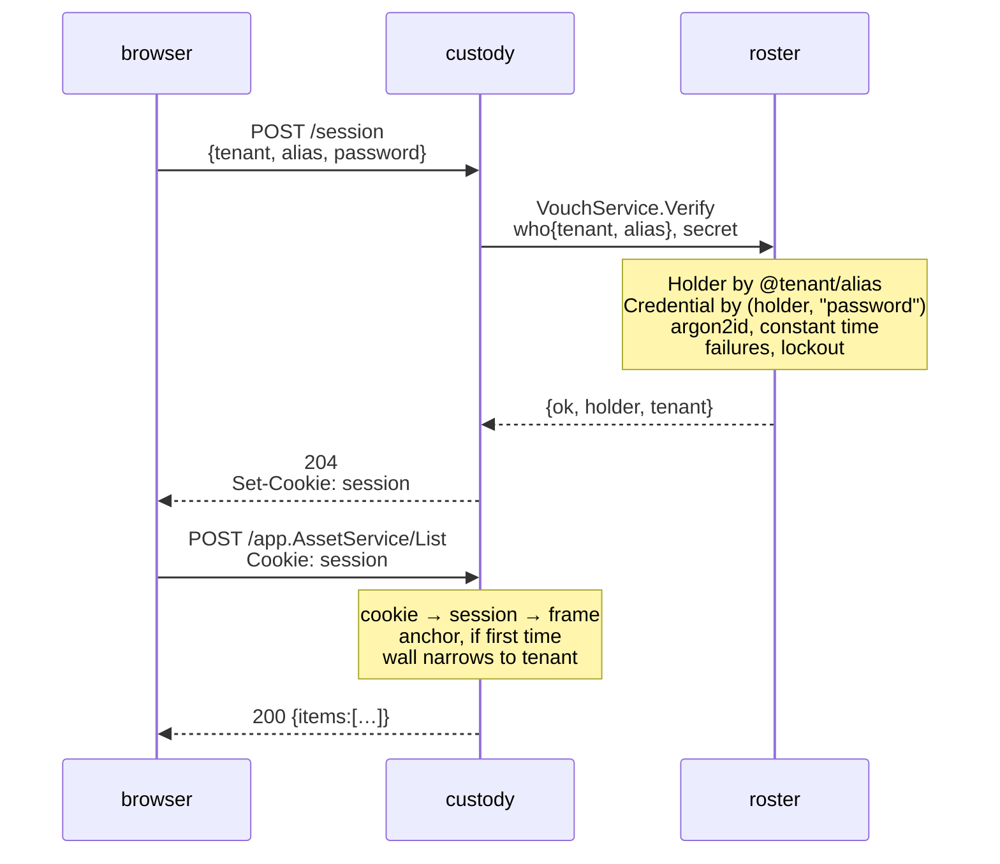
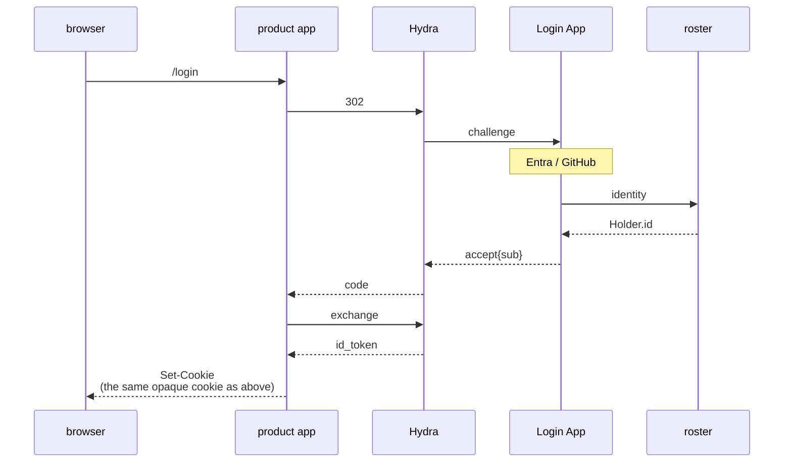
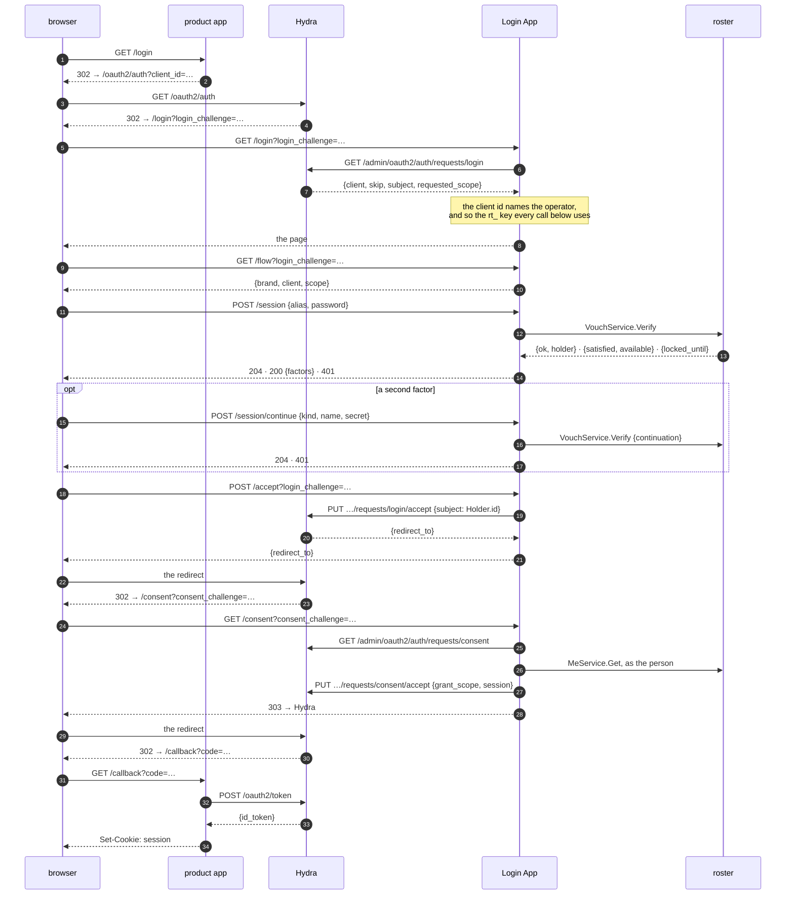
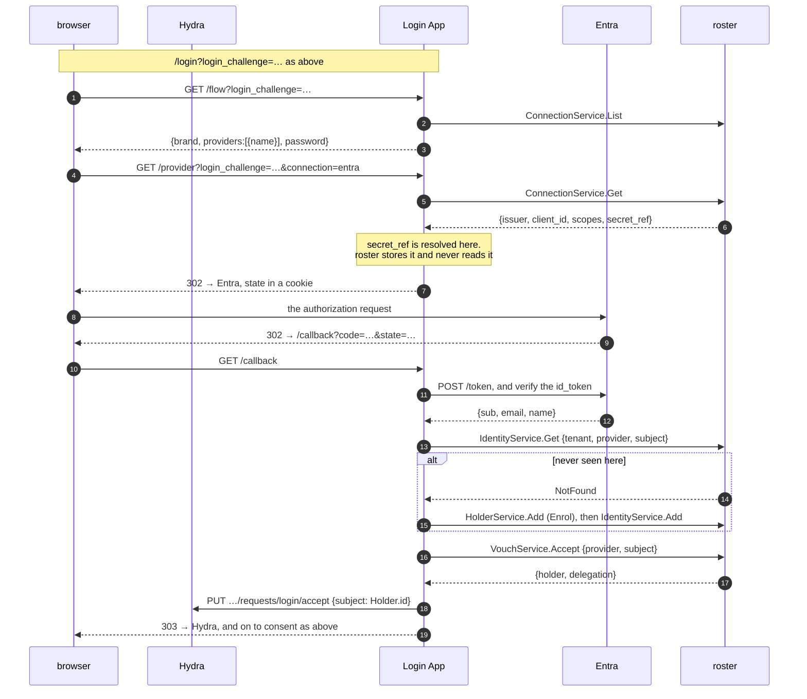
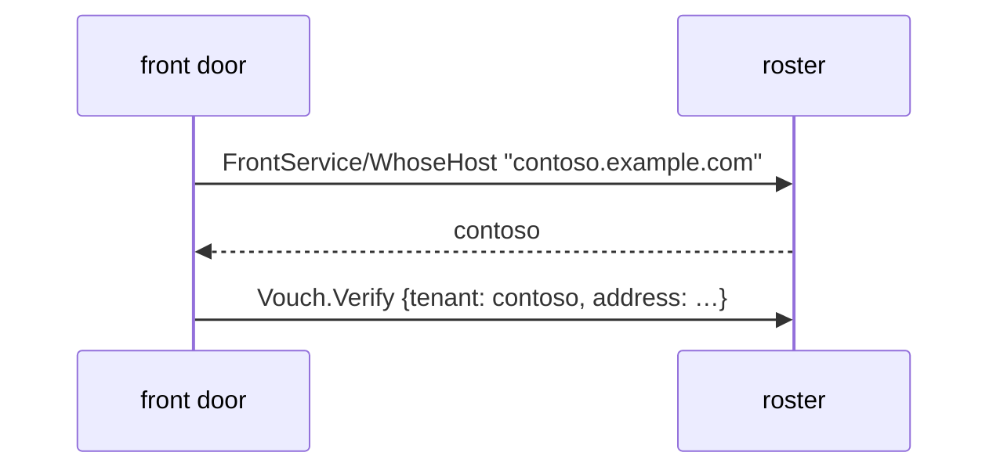
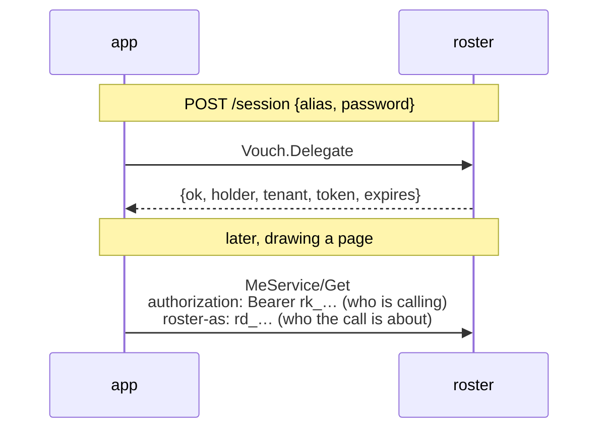

# Signing in

What happens when somebody types a password into a product app, end to end.
Every hop below is real: it is what `custody/cmd/login_test.go` runs, with roster
on a listener and custody dialling it.

## The path



**roster never sees *this* browser.** The data plane is called by machines, and
the session is custody's because a cookie belongs to the origin the browser is
actually talking to.

roster does serve one browser of its own -- the admin console, on the control
plane, on a cookie roster mints and checks (`AuthService.SignIn`, the one method
`cmd.Public` answers without a caller). Different plane, different people, and
nothing about a customer's sign-in passes through it.

## What each side answers

| | |
| --- | --- |
| `POST /session` → **204**, no body | The cookie is the answer. What a page needs *about the person* is a request it should make, against the same server and behind the same wall |
| `POST /session` → **401** | Wrong password, unknown person, no such tenant — one answer for all of them |
| `Vouch.Verify` → `{ok:false}` | Same, and it takes the same time; see below |
| `Vouch.Verify` → `{locked_until}` | Too many wrong answers in a row closed the account for a while — ten and fifteen minutes unless `vouch.lockout` says otherwise |
| `DELETE /session` → **204** | The row is deleted, so the key is dead in every browser at once |
| any RPC → **401** | No cookie, a cookie naming nothing, an expired session, or a session naming somebody who has since been erased |

## Why every refusal looks the same

An unknown person, a person with no password and a wrong password are **one
answer**, and the first two burn an argon2 comparison so that they take as long
as the third. Otherwise the response time answers "does this account exist",
which is the question somebody working through a list of addresses is asking.

The one refusal that is distinguishable is a lockout, and that is a deliberate
trade: it says the person exists. The alternative is somebody locked out being
told nothing and trying forever. See `server/vouch`'s package comment —
including what a lockout does **not** fix.

## What custody keeps, and what it does not

custody keeps **no password**. There is no column for one in its schema, which
is the strongest form of that guarantee. The plaintext passes through its
process on the way to roster and is written nowhere.

What it does keep is an **anchor**: a `Holder` row carrying the identifier and
the tenant, made on the first call after signing in — not at sign-in, so that
`date_created` there means *first seen in custody* rather than *signed in once*.
The alias on it is seven characters payday made up. roster's name for the same
person is deliberately not copied: that copy would be wrong the first time
somebody marries.

Everything else — the name, the photo, the department — is read from roster when
there is a screen to draw.

## What custody sees that an IdP would hide

The plaintext, in memory, on its way past. That is the cost of custody serving
the sign-in form itself.

With Hydra and a Login App in front, the Login App sees it and custody never
does. Whether that is worth the extra moving parts is a deployment's decision,
and both shapes work: `custody/cmd/config.go` takes either a `roster` or an
`auth.issuer`.

## What the cookie actually is

Worth being exact, because "session" is a word people fill in differently and
the mechanism decides what is possible afterwards.

The value in the cookie is **32 bytes from `crypto/rand`**, base64url. It is not
a token, not a hash of one, and not readable by anybody: it carries no claims,
no signature and no expiry a client can see. It is a **handle**.

What it handles is a row in custody's own store — `payday/auth/authsession` —
holding the actor, the tenant, a `frame.Grant`, an absolute expiry and an idle
one. On every later request custody looks the row up by that key. Nothing is
compared and nothing is decoded; a key naming no row is simply not a session.

Two consequences follow, and both are the point:

- **Signing somebody out is a delete**, and it is immediate everywhere that
  cookie was used. There is nothing to wait out.
- **The cookie is worthless to any other app.** It names a row in custody, and
  the next product has no such row. That is not a gap to patch — it is why the
  next section ends where it does.

Nothing about the person is copied into the row, so a session cannot be a stale
copy of somebody: the name, the teams and the permissions are read when there is
a screen to draw.

## Do I need Hydra?

**One app: no.** The picture above is complete, and nothing is signed.

**Several apps, one sign-in: yes.** custody's cookie means nothing to the next
product, and the thing that fixes it — a credential with an issuer, a JWKS
endpoint, expiry, refresh and revocation — *is* OIDC. Writing it yourself is
writing Hydra.

So the question is never "password or OIDC". It is **one relying party or
many**. An air-gapped single app needs neither.

### What changes when Hydra is in front

Less than it looks like, and **roster does not get smaller** — Hydra has no user
database and does not authenticate anybody. It hands a `login_challenge` to a
Login App and waits to be told a `subject`, and choosing that string is the
problem roster exists for.



Line by line, against the no-Hydra picture:

| | without Hydra | with Hydra |
| --- | --- | --- |
| who asks roster | the product app | the **Login App** |
| what it asks | `VouchService.Verify` | `Identity` → `Holder.id`, and `Vouch` only if there is a password |
| what the product app gets back | `{ok, holder, tenant}` | an `id_token` carrying the same `sub` |
| the cookie | custody's, opaque | **unchanged** — custody's, opaque |
| a second product | has to sign in again | is already signed in, at Hydra |

The token is used **once**, at the callback, to find out who this is. It is not
stored, not compared on later requests and not given to the browser — there is
nowhere safe in a browser to keep one, which is the argument `authsession` opens
with. After that, the picture is the one at the top of this document.

So the app-side code barely moves. `authsession` asks for a `Verify` either way;
what changes is what fills it — a call to roster, or the completion of an OIDC
callback.

**roster ships the Login App now**: `login/`, run as `roster login serve`, the
third consumer beside the account app and the directory. It reads the
challenge, draws the same `frontdoor` forms **and the operator's providers**,
and answers `acceptLoginRequest{subject}` with a `Holder.id` either way; the consent hop reads the
person once, as them, and puts `preferred_username`, `name`, `groups` and a
**verified** address into the `id_token`, each only if the client asked for the
scope that carries it. What it never puts there is `methods` -- roster's answer
about roster, which a product holding a copy of would hold a stale one.

Which operator a flow belongs to comes from the challenge, not the hostname: it
names the OAuth **client**, and each operator's clients are written down, read
back over Hydra's admin API. So the tenant is Hydra's word rather than a header
a browser wrote, and the key each call goes out with follows from it. Several
clients per operator, because one sign-in across two products is the case Hydra
is for at all.

The consent hop **grants what the client asked for and draws nothing**, and
that is `consent: skip`, the default and a decision: every client this app can
have was registered by the deployment for one of its own operators, and a
screen for an app the operator wrote is a dialog people learn to click through.
`consent: ask` draws one -- who is asking, for what, allow or no -- and grants
nothing until somebody says so. Neither mode lets a person grant *less* than
was asked: an app that asked for a scope generally stops working without it, so
the choice would be between "allow" and "allow, then find out something is
broken".

`compose.yaml` runs the whole of it -- Hydra, a client, the app -- and
`docs/operating.md` § "One process, or four" is how a deployment says so. To see
the **pages** without any of that, `npm run dev:login` serves them with a
made-up server behind them.

### Every hop, and the call it makes

The picture above is the shape. This is the wire: every redirect, every endpoint
and every RPC, in order, for the two routes that reach a `Holder.id`.

Both are the Login App's, and both are the account app's -- the two front doors
draw the same forms over `ts/lib/signin.tsx` and are the same relying party over
`arrives`. What differs is the ending: the account app finishes at its own
cookie, and this one finishes at `acceptLoginRequest{subject}`.

What the two routes share is the last fact and nothing else, which is the point:
the `sub` a product sees names the same person whichever door they came through.
roster is the relying party in neither -- `connection.proto` says why.

#### A password, with Hydra in front



| | the call | what it settles |
| --- | --- | --- |
| the challenge | `GET /admin/oauth2/auth/requests/login` | which **client**, and so which operator and which `rt_` key. Asked before a form is drawn, so a challenge this app fronts nobody for fails here rather than after somebody has typed a password |
| `skip` | none | Hydra already knows this browser, within `remember`. `acceptLogin(v.Subject)` straight away: the subject is Hydra's and this app must not second-guess it |
| the page | `GET /flow` | `{brand, client, scope}`. The page may not ask Hydra and this app may, so this is the one endpoint it has |
| the first form | `VouchService.Verify` | 204 signed in · 200 one factor proved, another to prove · 401 everything else, and a wrong password, an unknown person and no such tenant are all the third |
| the second form | `VouchService.Verify` with the continuation | the app holds no half-signed-in state: the continuation is roster's, short-lived and single-use |
| the accept | `PUT …/login/accept` | **`subject` is the `Holder.id`.** Nobody is named until every form is answered -- accepting after the first would hand a product a token for somebody who proved half of what the deployment asked for |
| the claims | `MeService.Get`, as the person | `preferred_username`, `name`, `groups`, a **verified** address -- each only if the client asked for the scope that carries it. Never `methods` |
| the grant | `PUT …/consent/accept` | `consent: skip` grants and draws nothing; `ask` draws the screen and `POST /consent` is its answer. `reject` is the other one |

The delegation this app minted is spent at the grant and the cookie is ended
there (`Door.End`): a credential that outlives its use is one somebody has to
remember to revoke.

#### An account at a provider, with Hydra in front

The same walk with the two forms replaced by a round trip. Everything after
`Known` is the password path's last three hops, unchanged.



| | the call | what it settles |
| --- | --- | --- |
| the buttons | `ConnectionService.List` | what `/flow` answers beside the brand. The **name** and nothing else: the issuer is where the browser is about to go, `secret_ref` is the operator's, and what to call the button is the page's -- D22 refuses the field that describes what to render |
| the form | `TenantService.Get`, `config.password` | whether there is a password form at all. Not a screen setting: roster **refuses** a password for a tenant with this off (`vouch.Offers`), so the page draws what is already true. Unset is yes |
| which operator | the challenge, again | `/provider` is in a flow, so the `Connection` rows read are the ones that client's operator can see. fabrikam's challenge cannot reach contoso's directory |
| the redirect | `login.base` | **one URL for the whole app**, because Hydra sends every browser here under one name. Which operator a callback belongs to comes from the state, and the state is a nonce that names a row this app kept |
| the exchange | the provider's own | the Login App is the relying party, exactly as the account app is |
| who may sign in | `login.enrol` | `invited` admits only somebody already linked; `expected` admits somebody an operator entered, matched by the **address** on their row; `enrolling` admits a stranger too. `enrolling` needs `HolderService.Add`, which the provisioned key does not hold |
| the sign-in | `VouchService.Accept` | the claim this app verified, exchanged for a delegation. Not `Verify`: there is no password here to check |
| the session | `Door.Accept` | minted here for the same reason the password path has one -- the consent hop reads the person **as them** to fill the claims, and there is no other credential that may |
| the accept | `PUT …/login/accept` | the `Holder.id`. The same string a password would have produced for the same person, which is what makes Monday-Entra and Saturday-password one `sub` |

#### The account app, which has no Hydra

Worth naming because it is the shape a deployment with **one** relying party
should still take. Same package, same policy, different two ends: the tenant
comes from the **host** (`FrontService.WhoseHost`, so there is a redirect per
operator rather than one for all of them), and the walk finishes at the app's
own cookie instead of at Hydra.

`account/account.go`'s `login`/`callback` and `login/provider.go` are the two
endings; everything between them is `arrives`.


The other direction is done: **signing somebody out in roster reaches Hydra.**
The Login App holds `SyncService` open, one stream per operator, and when roster
says somebody has been signed out everywhere, suspended or erased it tells Hydra
to forget them -- so the next product they open finds a form rather than a fresh
token. roster does not know Hydra exists and this does not change that: the
stream says what has stopped being good in roster's own vocabulary, to any app
holding a credential, and turning that into a `DELETE` is the Login App's,
because the Login App is what knows about Hydra.

One thing to add on the day you do this: **back-channel logout.** A session
ended at Hydra does not end custody's row by itself, and the OIDC logout
endpoints are how that propagates. Handling it is one `store.Del`, and it is the
product app's -- the hop above is roster to Hydra, and this one is Hydra to
whatever holds a session.

### Putting people in, and letting them arrive

An operator entering somebody in advance knows their **address**. They cannot
know the subject a directory will assert -- that is an identifier issued at the
directory, and it does not exist until the first sign-in. So `invited`, which
matches an `Identity` row, can admit nobody at all through a directory unless
somebody writes those rows by hand.

What `enrolling` calls somebody is derived from their address and is **not**
the local part of it: an alias begins with a lowercase letter and holds
lowercase letters, digits and single hyphens, so `first.last` -- which is what a
corporate directory hands out -- is not one. Every run of anything else becomes
a hyphen, so `Seunghyun.Hwang@hday.dev` is `seunghyun-hwang`; an address with no
name in it at all gets one nobody chose, which is payday's own answer to a row
that needs a name before anybody has an opinion about it. Two addresses that
fold to the same word both get in, and the second is the word plus four
characters. An alias is changed afterwards; a refused sign-in is not.

`expected` is the policy that means what *putting people in* sounds like: a
`Holder` with an `Email` row, matched on the first sign-in and linked to the
identity then, so every sign-in after it is the ordinary lookup. `enrolling`
does the same match first and creates only when there is none -- which is not an
optimisation but a **fix**: without it, entering somebody in advance broke their
sign-in, because the alias an operator chose is the alias `enrolling` derives
and `Holder.Add` answers AlreadyExists.

Matching adds exactly one condition over what an `Email` row already was.
`CLAUDE.md` says it: *`Identity.Add` and `Email.Add` sound like keeping a
directory tidy and each is a way to sign in as whoever the row is about.*
Writing one is gated where every grant is, and an address is unique within a
tenant so it cannot be claimed twice. The condition is that the **directory**
says the address is verified -- one that lets somebody type an address into
their own profile would otherwise hand out whichever account carries it.

### The address a directory hands over

It is written down, on that directory's word.

The address arrives inside a token the directory signed, and it names the person
-- `enrolling` derives an alias from it. It was then **thrown away**, and nothing
could put it back: the account page's own route mints a link and mails it, so a
deployment with no mail had no route at all. What that left was somebody roster
could not say the address of, and a token missing the claim a product asked for.

`Email.Attest` is the second road to `date_verified`, and the first was written
knowing there would be one: `Email.vouched_by` is *which identity vouched for
it, if one did*, and says an address in a provider's claims is *only as good as
that provider's own check*. Nothing had ever written it.

| the directory said | the row |
| --- | --- |
| `email_verified: true` | the address, the voucher, **and the stamp** — so the token carries `email` |
| nothing, or false | the address and the voucher, **no stamp** — the address is kept, and nothing claims a check that did not happen |

The second row is the common one and is why this is not a flag the app decides.
Microsoft's endpoint often sends no `email_verified` at all, and the right
answer to that is to keep the evidence rather than to guess.

What a link is still for is the other thing entirely: an address **nobody** has
vouched for, typed by a person, where the way to find out whether they hold that
mailbox is to send a nonce there and see it come back. There is nothing to prove
about an address an authority already asserted.

### Somebody with no account at the directory

An intern, a contractor, a robot: no Entra account, and they still have to sign
in. Nothing above applies to them, because `Enrol` decides where somebody who
**arrived through a directory** lands and they did not arrive through one.

They are three commands and no policy:

```sh
roster holder add @hday/intern-kim
roster vouch reset @hday/intern-kim      # thirty-two bytes, printed once
```

and a role, the way [usage/permissions.md](usage/permissions.md) writes one.

The form takes an alias where it would take an address, and the rest is the
password path at the top of this document. No `Email` row is needed anywhere:
`preferred_username` is the alias, and the `email` claim is simply absent --
`claimsOf` writes a **verified** address or nothing, so a client that asked for
the `email` scope gets a token without one rather than a token that lies.

Two things to know before the first one of these exists.

**`config.password` locks them out.** It is the switch two sections down, and
the two features point opposite ways: an operator whose people *mostly* arrive
through a directory turns the password off, and the people who cannot use the
directory are exactly the ones that refuses. roster enforces it, so this is not
a form that disappears -- it is `Vouch.Verify` saying no. A tenant with anybody
in this section keeps the password on, which is the default.

**Give them the address they will one day have.** This is the one that shows up
late and reads as a bug. The day the intern gets an Entra account, `expected`
and `enrolling` look for an `Email` row carrying the address the directory
vouched for -- and if the operator never wrote one, there is nothing to match
and `enrolling` makes a **second** `Holder`. One person, two `sub`s, and the
first one holds their history.

So write the row when the person is made, even though no mail will be sent to
it and nothing will verify it yet -- the other direction is `Email.Attest`
above, which writes it for somebody who arrives through the directory first:

```sh
roster email add '{"holder":{"slug":{"alias":"intern-kim","tenant":{"alias":"hday"}}},
                   "address":"kim@hday.dev"}'
```

The first sign-in through the directory then finds that row, links the identity
to it, and every sign-in after that is the ordinary `Identity` lookup. The other
way round works too and is the person's own: signed in with their password, they
attach the provider account from the account page (`Identity.Add` with their own
reference), which is the same link written from the other end.

### A tenant with no passwords

An operator whose people all arrive through a directory turns the password off,
and what that means is worth being exact about, because the first draft of it
meant something weaker.

It is **not** *do not draw the form*. `TenantConfig.password` is a fact roster
enforces: `Vouch.Verify` refuses the right password, and `Vouch.Link` mints no
recovery link -- which ends by handing somebody a password, so a link for such a
tenant is a mailbox full of dead ends. The two sign-in pages read the same field
and draw no form, and that is the **consequence** rather than the feature.

The difference is the one D43 already cost this repository once: there a TOTP
seed was a whole sign-in because `Verify` counted it, and a switch that only
hides a form is a lock somebody sets and does not get.

Three things it deliberately does not reach:

| | |
| --- | --- |
| `Credential.Set` | a tenant that turns it back on should find its people's passwords where they left them, and a refusal here would be a password screen that breaks with nothing saying why |
| a second factor | not a way in, so a tenant's answer about ways in does not touch it -- somebody who arrived through a directory still proves a TOTP step |
| another tenant | it is one row's setting, read through the wall on a call that was reading that row anyway |

**Unset is yes.** The field carries presence where everything around it does
not, for exactly that: a tenant written before it existed reads *false* for an
implicit bool, and every one of them would have lost the one credential roster
holds itself.

## A second factor, and whose it is

roster holds it and checks it; the Login App decides when to ask.

The secret is a `Credential` row beside the password, verified here for the
reason the password is — a secret that leaves the store puts the comparison, the
counter and the lockout in two places. Replay is the same: a TOTP step that has
been spent must not work twice, and the row is where that is recorded.

What roster does not decide is whether one was required, whether this browser is
remembered, or what order the prompts come in. That is the flow, and the flow is
wherever the browser is — the Login App with Hydra in front, the product app
without.

The Login App draws it: the password alone answers *there is more*, the page
offers what `available` names, and the one thing this app decides is that
**Hydra is told nobody** until the second form is answered. Accepting after the
first would hand a product a token for somebody who proved half of what the
deployment asked for — worse than having no second factor, because the operator
believes they have one. `scripts/hydra.sh` walks it with an authenticator in
hand.

payday already left the seam for the half-signed-in state: a `Verify` may set
`Session.Expires` itself, which is how an app gives a short session to somebody
who has not finished a second factor.

What the app does **not** have to keep is who passed the first step. `Vouch`
answers with an opaque `continuation` — short-lived, single-use, resolvable only
by the caller it was issued to — and the app hands it back with the second
secret. So the two forms are the app's and the fact that both were the same
person is roster's, which is the only half an app developer wanted.

Beside it come the two things needed to draw the second form: what is
`satisfied` so far, and what is `available` to this person — each of those a
kind, a name and a lockout, which are facts rather than instructions. A factor
whose method has a challenge to send would add a third field and none does yet.
What does **not** come is how many steps there are in total, which of the
available methods to offer, or what to call them. Those are the app's, and D21
says why.

See [position.md](position.md), § "Second factors".

## Signing in by address, and where the tenant comes from

The path above collects `@tenant/alias`. Most forms collect an email, and for a
long time this service could not serve one: `Email` is unique **per holder**, so
that a consultant can be one person in two tenants under one address, which
meant one address could name two people. F7 was that, open.

What closes it is not a change to `Email`'s rule but a second fact. A tenant is
the same service under a different operator's own domain, so the **name the
browser arrived at** says which operator — and roster holds that now:



Within one tenant an address is unique, so there is one row to find. The
consultant is untouched: that case is *across* tenants and this constrains
*within* one.

There is no form of this that takes an address alone. A lookup that could be
made without naming a tenant is a lookup a front door that forgot to think about
which one compiles a wrong answer for — which is the same reason the tenant is
in `Identity`'s key rather than checked afterwards.

## A person who uses two operators' services

They have two accounts, and that is the whole answer.

`Identity` is unique on `(tenant, provider, subject)`. The same Google account
signs up to contoso's service and to beta's, and those are two Holders with two
histories and two sets of permissions. Nothing here relates them, and nothing
should: a row that spanned tenants would have no owner, no answer to who may
erase it, and no tenant whose trail it belongs to. A tenant is the wall, and
something that crosses it is not a person any more.

The tenant is in the key rather than checked afterwards, which is the part worth
being exact about. It means a lookup **cannot** be made without naming a tenant,
so a front door that forgot to think about which one does not compile a wrong
answer -- it has nothing to look anybody up with.

Without it, one account at a provider would belong to exactly one tenant across
the whole deployment, and the second operator a person signed up to would be
told the identity was taken, by somebody they cannot see.

### What a front door has to know

Which tenant it is. That is what a tenant *is*: the same service under a
different operator's own domain, so the name the browser arrived at is the
operator whose service they are signing in to.

The email domain answers a different question -- where somebody
**authenticates**, often at another organisation entirely. One of contoso's people
can perfectly well have a personal Google account.

### And what its own credential has to reach

One `rt_` per operator it fronts, picked by the host the browser arrived at.

This said a deployment key instead -- an `rk_`, whose actor is not inside a
tenant -- because a Holder belongs to one tenant and the wall would answer
NotFound for every other. That reasoning is right about the wall and wrong about
what to do with it. `account/account.go` makes the argument this one missed: a
deployment key resolves to a frame with **no** tenant and the policy hands it
`frame.Everything`, so on an internet-facing app the thing keeping contoso's
request out of fabrikam's rows is the app's own code. A tenant key resolves to a
holder inside a tenant and the wall does the narrowing with no discipline asked
of the app. So the app holds several credentials rather than one wide one, and
`roster key add --tenant contoso --holder account` is how each is minted.

The tenant an app names is always the app's **assertion** -- roster never sees
the browser, so there is nothing else it could be -- and the key is the only
thing that assertion is held against. `cmd/accountkey_test.go` is that fact, per
call: look an identity up, enrol a stranger, accept a claim, read the row, check
a password.

`examples/sso` fronts one operator, so its map has one entry. That is the only
difference between the two shapes.

### What roster does offer

Within one tenant, several ways in for the same person. `Identity` is
one-to-many by design -- the same human arrives through the company's Entra
tenant on Monday and through GitHub on Saturday, and both land on one Holder
with one history and one set of permissions. That is the convenience it is for,
and putting the tenant in the key does not touch it: two Holders of one tenant
claiming the same subject at the same provider is still refused.

## Asking roster as the person who just signed in

Every screen that shows somebody their own record needs it — my identities, my
addresses, sign me out everywhere — and the two obvious ways are both wrong. The
app's own key belongs to the deployment and sees every tenant it serves, and the
app filtering rows in its own code is the thing that leaks by being forgotten.

So `Vouch.Delegate` is `Verify` and one more thing: on a yes it answers with a
short-lived credential for the person it just proved.



**It is not a bearer credential on its own.** A delegation says who a call is
*about* while the caller goes on saying who they are, and both are on the
request — which is what makes "bound to the caller it was issued to" a rule
rather than a sentence. One that leaks is worth nothing without the key it was
minted for.

What it can do is the intersection: never wider than the person, and never wider
than the methods it was minted with. Signing out revokes it — `Delegation.Revoke` —
rather than leaving a live credential until its clock runs out.

`examples/sso` is the whole of it working, and it is honest about what it does
not reach: a sign-in through the provider never calls `Vouch`, so there is
nothing for a delegation to ride back on, and the page says so rather than
falling back to the app's own credential. `delegation.proto` is the why.

## What a calling machine is, and where it lives

This section used to say the question was open. It is not any more, and the
answer is D15's: **a machine is a `Holder` in the control plane.**

The question was real. A caller has to be a row, because roster answers nothing
anonymously — and every way of putting custody in the *data plane* was wrong:

- `Holder` is a person, and D1 makes `Holder.id` the `sub` of every token. A
  service in that table has a `sub`.
- A `Holder` belongs to **one tenant** and is walled by it. custody acts across
  every tenant it has users in.
- `grpcx.Limit` counts per tenant, off the frame, so all of custody's verifies
  would count against whichever tenant happened to hold it.

Every one of those is an argument against the *table*, not against the *schema*.
The control plane is the same schema on its own database with its own single
tenant, so a `Holder` there is a caller rather than a person, its `rk_` key
holds no tenant and sees every tenant there is, and none of the three objections
survives. `roster key add` mints it; `operating.md` is the operator's half.

What is left is deployment wiring rather than a decision: a deployment that
names no control plane still serves `auth.Plain`, which believes whatever a
caller writes. That is right for tests and a sandbox, and it is loud in the log
for the reason payday's other easy defaults are — an app nobody can start until
a control plane exists is an app nobody runs. Anything reachable by more than
the machine it runs on needs the control plane configured and TLS under it.

`examples/sso` shows the **other** shape, and it is worth being exact about
which: its machine is a `Holder` in the tenant it serves, with an `rt_` key, so
what it demonstrates is a per-tenant caller and not the control-plane one this
section is about. The paragraph above is the answer for a caller that acts
across every tenant — custody — and its own tests are where that is exercised.

## Two demos, because the two shapes fail differently

`docs/position.md` says a deployment with several services should not replace
its reverse proxy but **change what the proxy points at**. That is one of the
two shapes an app can take, and there is a runnable example of each -- neither
covers the other, and a real deployment has both in it.

| | the app is | it proves |
| --- | --- | --- |
| a proxy in front | oblivious. It serves bytes and `oauth2-proxy` holds the session | the issuer is one a **standard, third-party** relying party accepts. Not our code being lenient about our own tokens |
| `examples/product` | the relying party. It exchanges, verifies, and keeps a session of its own | the pieces an app written against payday uses: `authoidc.Subject` reading `sub` alone, `authsession` holding an opaque cookie |

`examples/product` is not `examples/sso`, and the difference is which side
roster is on. There, a provider sits **above** roster -- somebody arrives from
Google or Entra and roster is asked who that is -- so pointing it at roster's
own Hydra would be circular, since the `sub` there is already the `Holder.id` it
would be looking an `Identity` up by. Here roster is **below** the issuer, which
is this section's picture from the product's side, and the app never calls
roster at all.

Its tests found the thing that reads as a bug and is not: signing out ends the
**app's** session and the issuer was not asked, so the next page starts a flow
that Hydra answers without a form. Nothing leaks, and a person who clicked
*sign out* and landed signed in would still say something is wrong -- which is
what the logout endpoints are for, and the paragraph above about back-channel
logout being the product app's half.

## See also

- [`server/vouch`](../server/vouch) — the package comment is the detail
- [`examples/sso`](../examples/sso) — a relying party that signs somebody in
  with Google, Entra or GitHub and finds out who they are here. The package
  comment is the detail; the tests are the flow, run against a provider that
  answers over HTTP
- payday's [guide/signing-in.md](https://github.com/lesomnus/payday/blob/main/docs/guide/signing-in.md)
  — how to put one of these in front of any payday app
