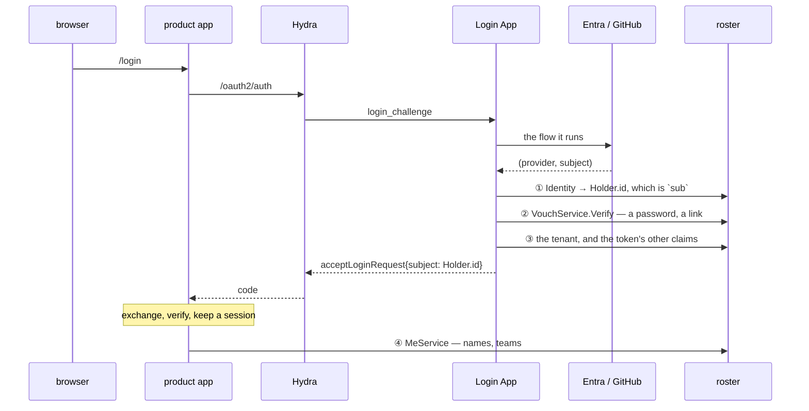

# What roster is, and where it stops

roster began as one thing: **an employee directory that does not depend on an
external identity provider.** People, the addresses they use, and the link
between them — held by us, in our schema, so that changing IdP is changing a
login screen rather than changing the record of who works here.

Everything since has been that sentence answering its own consequences. This
document is the boundary, so that the next good idea can be measured against it
rather than argued about.

## The line, in one sentence

> **roster stores facts and verifies claims about them. It never issues anything
> a third party verifies.**

Measure a proposal with one question: **who checks this?** If roster is the only
thing that can, roster may hold it. If anybody else has to be able to check it
without asking roster, it is not roster's to make.

That is the whole boundary, and the rest of this document is it applied. It
replaces an earlier version that listed things roster does not implement —
"providers, MFA, magic links" — which the code has always contradicted, since
verifying a password is precisely what a provider does. The list made roster
look as though it had already overrun itself and left every new feature to be
argued from nothing.

| inside | outside |
| --- | --- |
| verify a password | run a login flow |
| mint and check a magic link | send the mail |
| verify a TOTP code or a WebAuthn assertion | decide when a second factor is needed |
| an opaque API key a product app asks about | a signed token a product app verifies alone |
| the console's own cookie, where roster is the server the browser is talking to | a session cookie for somebody else's browser |

The two columns are not the same kind of thing, and that is the whole of it:
**verifying is a question answered in one place, now. Issuing is a credential
that outlives the answer and has to be believed by people who cannot ask.**

## What roster owns

| | |
| --- | --- |
| **A person** | `Holder`. Its identifier is the `sub` every product knows them by, which is why it is roster's and not a provider's |
| **How they sign in elsewhere** | `Identity` — `(tenant, provider, subject)`, unique, so Entra at work and GitHub for the same human is one person |
| **Addresses** | `Email`, several per person, each with whether anybody checked it |
| **How they sign in here** | `Credential` — a password when there is no provider in front, and the second factor beside it. Verified here, never handed out |
| **Where they belong** | `Tenant`, `Site`, `Team`, and the memberships between |
| **Who may call this** | `ApiKey` in both planes — `rk_` for the deployment's own services, `rt_` for a person's — and `Role`/`Group`/`Binding` in the data plane |
| **On whose behalf** | `Delegation` — a short-lived credential an app holds for somebody it just signed in. Never a bearer on its own, and never wider than the person |
| **Which name is whose** | `Host` — the name a front door answers at, and the tenant it belongs to — and `MailDomain`, where the people at an address authenticate |

The first four are the original sentence. The last two are what it costs to
serve the first four to more than one product.

## What roster is not

**Not an identity provider.** roster does not implement OIDC, does not issue
tokens anybody else verifies, and does not run a login flow. Ory Hydra is the
protocol and a Login App is the flow. roster answers the question they both ask
— *who is this?* — and owns the answer.

One qualification, because the earlier wording said "or hold a session" and the
code says otherwise: roster **does** hold a session for its own console, through
`payday/auth/authsession`. That is not an exception to anything. A cookie is set
by the server the browser is talking to, and for the console that server is
roster. What roster does not do is mint a session for **somebody else's**
browser — custody's cookie is custody's, and login.md draws where the split
falls.

**Not a product's own database.** custody keeps its own rows and anchors them to
roster's identifiers. What roster holds is what every product would otherwise
hold a stale copy of.

**Not a policy engine.** See below, which is the point of this document.

## Single sign-on does not make roster bigger

The request that tests the line hardest sounds like this: *somebody proven by
roster should be accepted by every internal system, without another call to
roster.* It is a fair requirement and it needs a signed token, since a verifier
that asks nobody has to be able to check the signature itself.

**The signature is Hydra's, not roster's.** What roster would take on by signing
is an issuer, a JWKS endpoint, key rotation, expiry weighed against revocation,
audience scoping, refresh, and front-channel logout. That is not a list of hard
parts; it is Ory's feature list, and building it is building Hydra.

And roster does not shrink when Hydra arrives — Hydra has **no user database and
does not authenticate anybody**. It waits to be told a `subject`, and choosing
that string is exactly the problem roster was built for: Entra's own subject
would make one human two the first time they arrive through GitHub. Drawn out:

- **① is the one that cannot be moved.** Use Entra's `oid` as `sub` and the
  same human arriving through GitHub is a second person to every system
  downstream.
- **② only if this deployment has a password or a magic link at all.** A
  provider-only deployment does not call it.
- **③** because Hydra does not know what a tenant is either.
- **④ is not sign-in.** It is the ordinary reading login.md describes — a
  product app anchors a row and reads names when there is a screen to draw.

**roster is in the flow once, at sign-in, and beside it afterwards — never in
the per-request path.** No session check and no token check reaches it, which is
the property the request was actually after, had without roster signing
anything. And the caller list is unchanged by any of it — the Login App and
admin consoles; a browser never sees roster — which is the sign it is the right
shape.

Worth knowing: this does not remove each app's own session. A browser has
nowhere safe to keep a token, so a product app exchanges what Hydra gave it for
an opaque cookie of its own. `payday/auth/authsession` is that, and the only
thing it asks the app for is a `Verify` — which with roster behind it is one
call.

### One relying party, or many

Since "after roster says yes" keeps coming up: roster answers whether a secret
is somebody's, and the session belongs to whatever the browser talks to. So the
boundary is not id/pw versus OIDC — it is **one relying party versus many**:

| | needs Hydra? |
| --- | --- |
| one app, its own login | **no.** The app calls `Vouch.Verify`, sets its own cookie, and its `auth.Resolver` reads it back |
| several apps, one sign-in | **yes.** App A's cookie means nothing to app B, and a signed credential with an issuer, a JWKS, expiry and revocation *is* OIDC |

The no-Hydra half is `payday/auth/authsession` — an opaque cookie, a `Session`
row the serving app owns, revocation as a delete — and roster's own console runs
on it. An opaque session key is worth nothing to a second app **by
construction**; that is not a shortcoming to fix, it is the reason the table
ends in Hydra, and the line at the top of this document is why roster does not
go there instead.

## Second factors

The same line, one factor along.

**roster's.** The secret is a `Credential` row and roster verifies it, because a
secret that leaves the store puts the comparison, the attempt counter and the
lockout in two places that will disagree. Replay is the same argument: a TOTP
step that has been spent must not work twice, and the row is the only place that
can be recorded.

WebAuthn is worth naming separately, because a public key **is not a secret** —
the reason a password hash must not travel does not apply to it. What keeps
verification here anyway is the **signature counter**, which is state that has
to advance exactly once per assertion. So roster verifies, and takes the
relying-party id, origin and challenge as arguments: those are the browser's
half and roster has no browser.

**Not roster's.** Whether this deployment requires a second factor, who is
exempt, whether to remember a browser, what order to prompt in, and what
`amr`/`acr` gets reported to Hydra. All flow, and flow is where the browser is.

roster answers **what factors somebody has**, which is a fact about a person and
therefore the kind of thing this app is for. It does not answer whether one was
enough.

**And one thing in between.** *Which browser* is mid-sign-in is the app's — it
is a cookie, and cookies are the app's. But *what has been proven so far about
this person* is roster's: an app showing a second form should not have to
remember who passed the first, since remembering it is the one part of the
process an app developer was trying not to have. So `Vouch` answers with an
opaque, short-lived `continuation` that only roster can resolve, and the app
passes it back. roster still never sees a browser.

Where that stops, in one line:

> roster answers **what has been satisfied, what this person has, and what it
> is waiting for.** It does not answer **how many are needed, which one to
> offer, or what to call them.**

So "step 2 of 2" is not something roster says — how many are enough is
sufficiency, and sufficiency was left to the caller. Kratos' flows carry the UI as
well, and that is why the shape of a Kratos login form belongs to Kratos.

## Authorization: what roster does

Three things, and they are chosen to be the ones an employee directory actually
needs.

**1. The tenant wall.** Every row belongs to a tenant and no read a caller
reaches crosses one. This is payday's and is not configurable — there is no rule
anybody can write that turns it off.

What it needs instead is wiring. The wall is a predicate on a server instance,
and roster deliberately runs one it was never installed on, for the work that
cannot be done from inside a tenant. Which of the two a hand-written service
reads is an ordinary line: `Vouch.Link` read the unwalled one and could mint a
spendable way into another organisation.

**2. Roles bound at a scope.** A `Role` is a list of RPCs. A `Binding` grants it
to a `Holder` or a `Group`, either across the tenant or within one `Site`. This
is Kubernetes' shape: `Site` is a namespace, a role with no site is a
`ClusterRole`, a binding with one is a `RoleBinding`.

**3. Built-in rules about roster's own entities.** "The administrator of a team
manages its members" is not configuration — it is true of every deployment there
will be, so it is roster's rule, in roster's layer, tested once. A configurable
invariant is one that every deployment configures identically until one of them
gets it wrong.

That is the whole of it. Union only, no deny rules, no conditions, no
inheritance.

## Where roster stops, exactly

The line is **transitivity**. roster answers questions of the form:

    does this subject hold a role that allows this method, here?

One lookup, a union, an answer. What it cannot answer, and will not grow to:

- **Permissions inherited through a graph.** "Alice may edit this document
  because it is in a folder owned by a team she is in." Every hop is a join, the
  hops are not known in advance, and the answer depends on the shape of data
  roster does not hold.
- **Permissions computed from other permissions.** `viewer = editor +
  parent.viewer` — a rewrite rule, evaluated recursively.
- **Permissions on arbitrary objects.** roster knows about people, teams, sites
  and its own rows. A product's documents, repositories and machines are the
  product's, and roster has no name for them.

**That is Zanzibar**, and it is solved: SpiceDB and OpenFGA are the open
implementations. They exist because of exactly those three things — relation
rewrites, graph traversal, and doing it consistently at a scale where the
consistency needs its own protocol.

So the rule is short:

> If the question needs a **graph**, it is not roster's. If it needs a **list**,
> it is.

A deployment that reaches the line runs an authorization service beside roster
and feeds it roster's memberships. That is the intended shape, not a defeat:
roster is where the memberships are true, and a relationship engine is where
they are traversed.

## What we deliberately do not have, and what it would take

| | why not | what it would cost |
| --- | --- | --- |
| deny rules | order stops mattering without them, and a precedence table is a thing nobody holds in their head | a decision about precedence, forever |
| `resourceNames` | `gate.Policy` cannot see what a call is **about**; only who is asking. So object rules are layers, and a declarative form needs a seam payday does not have | a payday change |
| nested groups | one join becomes a traversal, which is the line above | see Zanzibar |
| conditions / ABAC | "during working hours", "from this network" — an expression language, and then a debugger for it | a language |

Escalation prevention **is** here, and used to be the last row of that table.
`server/core/escalate.go` holds two rules, and it took three goes to state
either of them widely enough.

**Nobody hands out what they do not hold.** Which applies to every write that
changes what the gate will answer for somebody, and not only to the writes that
name a role: `Role.Add` and `Patch`, `Binding.Add`, `TeamMembership.Add` and
`Patch`, `GroupMembership.Add`, and the methods on an API key. The last two name
no role and hand over as much as one. Beside it sits the schema's own rule that
a role scoped to a site is bound only in that site.

**And nobody writes a way into an account wider than their own.** A password,
a second factor, an account at a provider, a mailbox a recovery link goes to,
or a key that acts as them -- all of them are ways to be that person, and all of
them are refused unless that person's permissions are a subset of the writer's.

The two rules read *held* differently, on purpose. What may be handed out is
what somebody holds through a binding; what counts as theirs for the second rule
is everything they hold by any path, a group and a team included. Missing a path
in the first refuses a grant somebody could have made, which is a conversation.
Missing one in the second is an administrator that reads as holding nothing, and
anybody who may reset a password can become them.

`operating.md` has the operator's half of both.

## Two planes, one schema

roster runs twice in one process — a data plane holding customers and their
people, a control plane holding the deployment's own services and their keys.
Same schema, different instance, and a `Holder` means a person in one and a
caller in the other.

That is not a trick. It is what the first sentence of this document implies once
more than one product asks the question: somebody has to say which products may
ask, and the thing that answers "who is this" is the thing that should answer it.

## See also

- [roadmap.md](roadmap.md) — the order it was built in, and what is open
- [login.md](login.md) — what happens when somebody signs in, end to end
