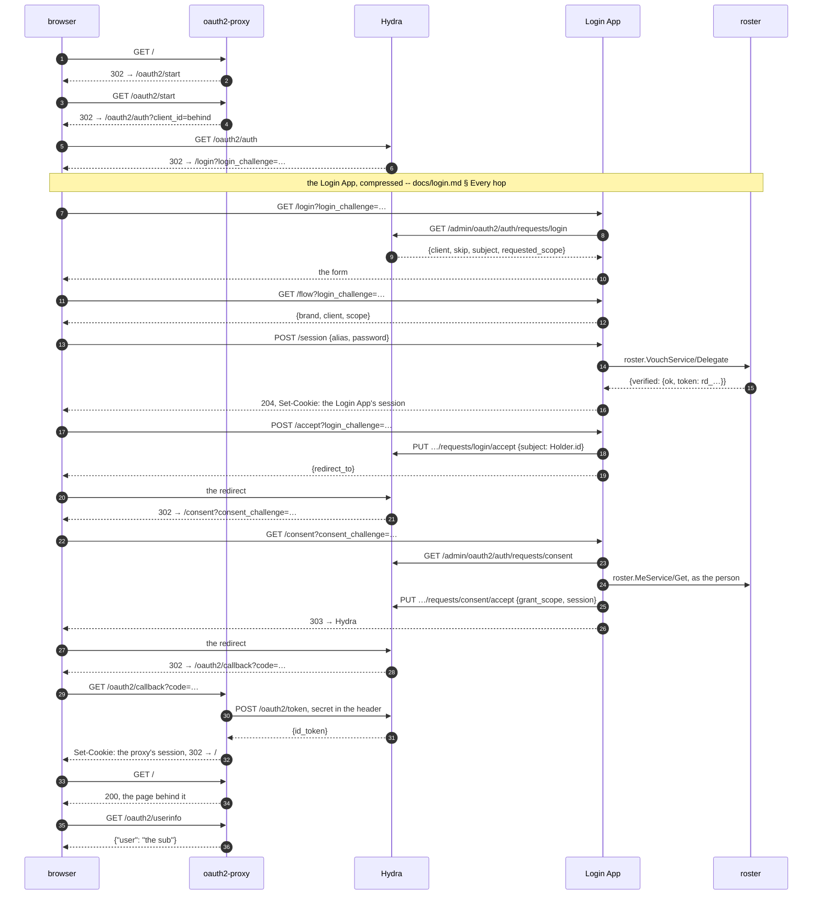
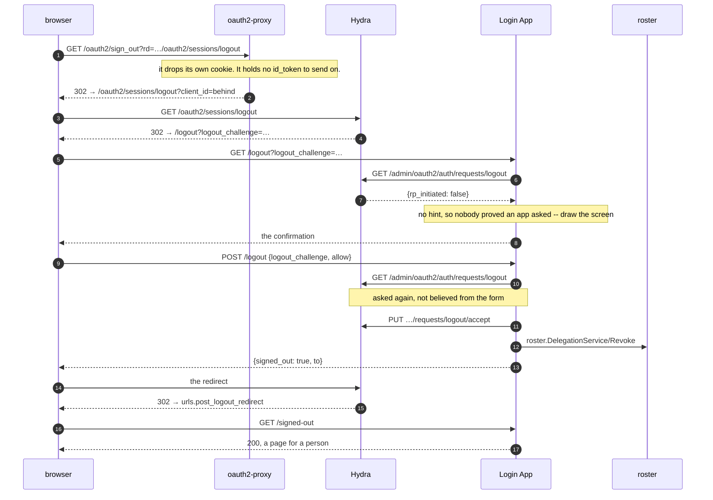
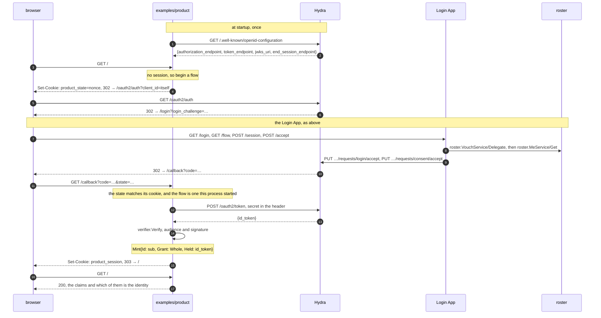
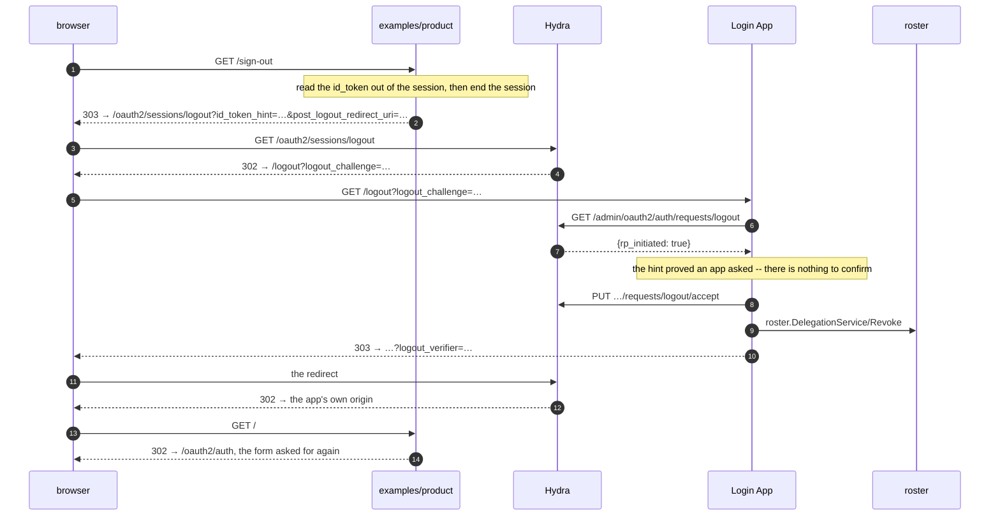

# A relying party, in two shapes

roster sits **below** an issuer, and the thing the three of them -- roster, Hydra
and the Login App -- exist for is a **product** going round the loop. Each of the
three is checked on its own, and that is not the same check.

So there are two runnable products, because an app takes one of two shapes in
front of an OIDC issuer, and the two fail differently. Neither covers the other
and a real deployment has both in it.

| | `behind` | `itself` |
| --- | --- | --- |
| the app is | **oblivious.** It serves bytes and a proxy holds the session | **the relying party.** It exchanges, verifies, and keeps a session of its own |
| what runs | `quay.io/oauth2-proxy/oauth2-proxy:v7.14.2` in front of a page (`static://200` in compose) | `examples/product`, ours |
| the OAuth client | `behind` | `itself` in compose, `product` in `deploy/` |
| the walk | `docker/behind.sh` | `docker/itself.sh` |
| in a real cluster | nowhere yet | `scripts/cluster.sh`, as a Job |
| deployed as | `behind.login-demo.hday.dev` | `itself.login-demo.hday.dev` |
| it proves | the issuer is one a **standard third party** accepts -- not our own code being lenient about our own tokens | the pieces an app written against payday actually uses |

`docs/position.md` § *It does not replace a reverse proxy* is why the first one
is the shape half the internal apps are already in: a deployment with several
services does not replace its proxy, it **changes what the proxy points at**.
`docs/login.md` § *What changes when Hydra is in front* is the same picture from
the issuer's side; this document is it from the product's.

## The files

| | |
| --- | --- |
| `examples/product/product.go` | the whole of the `itself` app, one file |
| `examples/product/product_test.go` | its flow against `internal/idptest`, a fake issuer |
| `docker/itself.sh` | the walk: sign in, read the page, sign out, and be asked for a form again |
| `docker/behind.sh` | the same walk for the proxy shape, plus the two asymmetries only it has |
| `compose.yaml` | both services, their clients, and Hydra's four `URLS_*` |
| `deploy/product.yaml`, `deploy/clients/product.json` | `itself` as a manifest and a declared client |
| `scripts/hydra.sh` | stands compose up and runs five walks |
| `scripts/cluster.sh` | k3d over `deploy/`, and `itself.sh` as a Job inside it |
| `login/doctor.go` | `roster login doctor`: whether the clients are registered in a way any of this works with |

## The loop, twice

Four diagrams, and every arrow is an endpoint or an RPC that exists. The Login
App's middle is the same in all four and is compressed here -- the hop-by-hop
version, including the second factor and what each answer settles, is
[`docs/login.md`](login.md) § *Every hop, and the call it makes*.

### Behind a proxy, signing in



The last two arrows are the half a page draws and the half that was empty in the
cluster: the proxy's own endpoint over the proxy's own cookie, answering `sub`
because `oidc_email_claim` says so.

### Behind a proxy, signing out



A **no** is `PUT …/requests/logout/reject` and nowhere to send the browser --
there is no relying party waiting, which is the whole reason the question was
asked.

### The app itself, signing in



Nothing after the callback asks Hydra or roster anything: `GET /` is the sealed
cookie read back, which is what the shape is for.

### The app itself, signing out



The last two arrows are the assertion, not a flourish: a sign-out that ended the
app's session and not the issuer's comes back here *signed in*, silently, and
that is what made *sign out* a lie.

### Every API in those four

| whose | the call | what it is for |
| --- | --- | --- |
| the product | `GET /`, `GET /callback`, `GET /sign-out`, `GET /healthz` | the whole of `examples/product` |
| `oauth2-proxy` | `GET /oauth2/start`, `/oauth2/callback`, `/oauth2/userinfo`, `/oauth2/sign_out?rd=`, `/ping` | the same four jobs, done by somebody else's code |
| Hydra, public | `GET /.well-known/openid-configuration` · `GET /oauth2/auth` · `POST /oauth2/token` · `GET /oauth2/sessions/logout` | the protocol. A relying party touches only these |
| Hydra, admin | `GET\|PUT /admin/oauth2/auth/requests/{login,consent,logout}[/accept\|/reject]` · `GET /admin/clients` · `DELETE /admin/oauth2/auth/sessions/login` | the Login App's side, and **private** -- `login/hydra.go` is all of it, in one file, with no SDK |
| the Login App | `GET /login` · `GET /consent` · `POST /consent` · `GET /logout` · `POST /logout` · `GET /signed-out` · `GET /flow` · `POST /session` · `POST /session/continue` · `DELETE /session` · `POST /accept` | the pages Hydra's four `URLS_*` point at, the one endpoint the page may ask (`/flow`), and `frontdoor`'s three (`POST /session` and after) |
| roster, gRPC | `roster.VouchService/Delegate` · `roster.DelegationService/Revoke` · `roster.MeService/Get` · `roster.TenantService/Get` · `roster.SyncService/Watch` | the whole of what roster is asked on this route. `Delegate` verifies the secret **and** mints the `rd_` that `Me.Get` is then made with; `Watch` is continuous and in none of the diagrams -- it is how somebody being disabled reaches the sessions already open |

Two things that table says better than prose. The product and the proxy never
reach roster -- **no roster key, no RPC, nothing but a token** -- and roster is
never told what a flow is: it is asked to prove a secret, to say who the caller
is, and to revoke a delegation.

What is not in those four is the **other way in**: `GET /provider` and
`GET /callback` on the Login App, where somebody arrives from Entra or GitHub.
That route reads `ConnectionService` for where to send them, `IdentityService`
(and `HolderService.Add`, for somebody new) for who came back, and
`VouchService/Accept` instead of `Delegate` -- and then ends identically, at
`acceptLoginRequest{subject}` with a `Holder.id`. Nothing in front of the issuer
can tell which route a person took, which is the point.
[`docs/login.md`](login.md) § *Every hop* draws it beside this one.

### Why those are HTTP and not RPCs

Every endpoint in the Login App row is **ours, hand-written**: `GET /login`,
`GET /consent`, `GET /flow`, `POST /accept` and the two `/logout`s are
`login/login.go`'s `Handler()`, and the `/session` family is
`frontdoor.Door.Handler()` -- roster's own package, the same three routes the
account app mounts, on the app's own mux. Neither consumer registers a gRPC or
Connect service at all.

So why is the sign-in not `AuthService`? Not because protobuf cannot answer with
a cookie. It can, and `proto/app/auth.proto` says so in as many words: a cookie
is a response header, `set-cookie` is response metadata, and `web.Transcode`
hands one to the browser as the other. `AuthService.SignIn` does exactly that,
and for a while the absence of it here read as *issuing is HTTP*, which is wrong.

The real line is **whose session it is**. `AuthService` mints roster's own
session for roster's own browser -- the admin console, on the control plane's
listener alone (`console.Auth(…, s.Sessions)` in `cmd/serve.go`), for operators,
in roster's session store. The Login App's cookie is the Login App's: its origin,
its store, its row, its lifetime. CLAUDE.md's second rule is what settles it --
*a session cookie for another app's browser is not roster's to make* -- and so
does the history: `POST /session` was once mounted on every listener that had
HTTP, a twin of `AuthService.SignIn`, and on the data plane it answered an
operator's password with 204 and a cookie that opened nothing. Deleting it is
why `cmd/serve.go` now carries the paragraph *no sign-in route here, and the
absence is the point*.

Which puts the line between the two halves of every diagram above:

| | |
| --- | --- |
| browser ↔ app | HTTP, each app's own. Redirects and `Set-Cookie`, which is what a browser is, and a challenge in a query string, which is what Hydra hands over |
| app ↔ roster | protobuf, generated, over gRPC. The five calls in the table, and nothing else |

And the Login App is the one front door with **no** Connect call from the browser
at all -- not even to ask what the flow is about, because that is Hydra's to say
and only this app may ask Hydra. `GET /flow` is that answer relayed, and it is
the only endpoint its page has.

## `behind`: a page with a proxy in front

Nothing of ours runs in this shape. `oauth2-proxy` holds the session and the
page behind it has never heard of OIDC -- a real one in the deployment, and
`static://200` here, since what is being checked is the proxy. What is worth
reading is the handful of configuration lines that are **decisions** rather than
defaults, from `compose.yaml`:

```yaml
  behind:
    image: quay.io/oauth2-proxy/oauth2-proxy:v7.14.2
    environment:
      OAUTH2_PROXY_OIDC_ISSUER_URL: http://${ISSUER_HOST:-${PUBLIC_HOST:-localhost}}:4444

      # The identity is `sub` and not an address.
      OAUTH2_PROXY_OIDC_EMAIL_CLAIM: sub
      OAUTH2_PROXY_EMAIL_DOMAINS: "*"

      OAUTH2_PROXY_UPSTREAMS: static://200
      OAUTH2_PROXY_WHITELIST_DOMAINS: "hydra.test:4444,login:8091"
```

**`oidc_email_claim = "sub"` is the line every relying party of roster will
want.** oauth2-proxy keys a session on an email by default and refuses a token
that carries none -- and roster puts `email` in a token only when the address is
**verified**, so somebody with no address at all is refused for a reason that is
not about them. It is in the deployment's config with the same paragraph.

**`whitelist_domains` carries the port**, and that is not a detail: a bare
`hydra` does not match `http://hydra.test:4444/...`, and what oauth2-proxy does
with an `rd` it will not follow is send the browser to `/` -- so the sign-out
silently becomes the proxy forgetting its own session and nothing else, which is
the exact lie the second hop exists to prevent.

### What this shape cannot do, and what the issuer does about it

`oauth2-proxy` has no way to put an `id_token` on the sign-out link. So the
logout arrives at Hydra with **no `id_token_hint`**, and two things follow:

- Hydra marks the request not `rp_initiated` -- which reads like *did an app ask*
  and reports something narrower -- and the Login App draws a **confirmation
  screen** rather than refusing. `docs/login.md` § *Signing out reaches the
  issuer* is that decision.
- Hydra refuses a `post_logout_redirect_uri` without a hint, so the app has no
  say in the last page. It is whatever `urls.post_logout_redirect` names, and
  unset that is Hydra's own fallback, whose text tells the person who clicked
  *sign out* to contact an administrator.

`docker/behind.sh` asserts the landing page rather than printing it, because
printing it is how that one shipped:

```sh
case "${l}" in
*/signed-out*) ;;
*fallback*) die "a finished sign-out ends on hydra's fallback page: ${l}" ;;
*) die "a finished sign-out did not end anywhere this deployment named: ${l}" ;;
esac
```

### The asymmetry a page in front of this has to cope with

The same proxy answers a browser with no session two different ways, and the
walk pins both:

```sh
got=$(curl ... -w '%{http_code}' "http://behind:4180/oauth2/userinfo")
[ "${got}" = "401" ] || die "a fetch with no session answered ${got}, not 401"
l=$(curl ... -D - "http://behind:4180/" | loc)
case "${l}" in
*/oauth2/*) ;;
*) die "a page with no session was not sent to sign in: ${l}" ;;
esac
```

A **page** is a redirect, and since the issuer remembers the browser the whole
chain is silent and the page comes back looking as it did -- while a **fetch**
for the session is a bare 401. So a page that outlives its session, from the
cache or the back button, draws *signed in* over an empty answer, and the only
thing that looks broken is the part that is working. That was reported as *signed
in, but the session shows nothing*. The fix lives in whatever page is in front,
which is why the rule is written down where a page's author can find it.

## `itself`: the app is the relying party

`examples/product/product.go` is one file and does the whole flow. The APIs it
uses, in the order it uses them.

### Discovery, and the one field the library did not model

```go
p, err := oidc.NewProvider(ctx, *issuer)
...
// `end_session_endpoint` is not in `oidc.Provider`'s struct, so it is read
// off the raw discovery document.
var discovered struct {
	EndSession string `json:"end_session_endpoint"`
}
_ = p.Claims(&discovered)
```

Empty is an issuer that publishes no such endpoint, and signing out is then this
app's half alone -- which is a real deployment and not an error, so the code has
a branch for it (`TestAnIssuerWithNoEndSessionEndpointStillSignsOutHere`).

### How the secret is sent, **said** rather than discovered

```go
endpoint := p.Endpoint()
endpoint.AuthStyle = oauth2.AuthStyleInHeader
```

Two lines, and they are the most expensive two in the file. `p.Endpoint()`
leaves `AuthStyle` unset, which means `golang.org/x/oauth2` **probes**: HTTP
Basic first, the body if the issuer refuses -- then **caches the answer for the
life of the process**.

The cache is the problem. A client registered for one method and later changed to
the other is one this process keeps addressing the old way, with no second try.
It signed nobody in for an hour, hours after the change that caused it, and every
gate was green -- because a gate starts a fresh process and the probe finds the
right answer on its first go.

So the method is in the code, `client_secret_basic` is what every client is
registered with, and `login.AuthMethod` is the same constant on the checking
side:

```go
// login/doctor.go
const AuthMethod = "client_secret_basic"
```

A mismatch now fails the **first** exchange, locally, in `docker/itself.sh`.

### The audience, which is not optional

```go
if _, err := authoidc.New(ctx, authoidc.Config{Issuer: *issuer, Audience: *clientId}); err != nil {
	return err
}
```

Built and thrown away, deliberately. `authoidc` is payday's handler for a
**server** reading a token as a credential on an RPC, and this app is a browser
app with no RPCs -- but `authoidc.New` refuses a configuration with no audience
(`authoidc.ErrNoAudience`), and a verifier that skips the audience accepts a
token minted for **any** relying party of the same issuer. So the demo asserts
the thing it would have to get right anyway, and then verifies the browser's
token with the verifier `authoidc.New` would have built internally:

```go
verifier: p.Verifier(&oidc.Config{ClientID: *clientId}),
```

An app with an API behind it keeps the handler instead and hands it to the
interceptor, which is the example in `authoidc.New`'s own doc comment.

### The session, which is payday's and opaque

```go
key := make([]byte, authsession.KeySize)
if _, err := rand.Read(key); err != nil { ... }
sealed, err := authsession.NewSealed(key)
...
opts := []authsession.Option{
	authsession.WithCookie("product_session"),
	authsession.WithLifetime(8 * time.Hour),
}
if *insecure {
	opts = append(opts, authsession.Insecure())
}
```

The key is generated per process here, which is a demo saying so: a restart is
everybody signed out, and a second replica is a cookie neither of them can read.
A product keeps the key.

`Insecure()` drops `Secure` from the cookie, for plain http in development. The
`deploy/` manifests do **not** pass it, because that cluster serves the app over
TLS -- see below.

### Beginning: a nonce in a cookie, not in the state

```go
state := base64.RawURLEncoding.EncodeToString(b)
a.flows[state] = flow{expires: now.Add(10 * time.Minute)}
http.SetCookie(w, &http.Cookie{
	Name: "product_state", Value: state, Path: "/",
	HttpOnly: true, Secure: r.TLS != nil, SameSite: http.SameSiteLaxMode, MaxAge: 600,
})
http.Redirect(w, r, a.cfg.AuthCodeURL(state), http.StatusFound)
```

The state is a nonce and nothing else; the cookie is what binds one browser to
one trip. `a.flows` is in memory, so a restart refuses a flow in progress and so
does a second replica -- `no flow here started with that state`, which the log
says and the browser does not.

### The callback: exchange, verify, then this app's own session

```go
tok, err := a.cfg.Exchange(ctx, r.URL.Query().Get("code"))
raw, ok := tok.Extra("id_token").(string)
id, err := a.verifier.Verify(ctx, raw)
...
_, cookie, err := a.sessions.Mint(ctx, authsession.Session{
	Id:    id.Subject,
	Grant: frame.Whole(),
	Held:  held,
})
```

**`Id: id.Subject` and nothing else** is the point of the demo. It is
`authoidc.Subject`'s whole body:

```go
// payday/auth/authoidc
func Subject(_ context.Context, t *oidc.IDToken) (auth.Identity, error) {
	if t.Subject == "" {
		return auth.Identity{}, fmt.Errorf("%w: the token names nobody", auth.ErrNoCredential)
	}

	return auth.Identity{Id: t.Subject, Grant: frame.Whole(), Expires: t.Expiry}, nil
}
```

`sub` is a `Holder.id`, globally unique, and the same one whatever was typed at
the sign-in -- which is what makes keying on it **alone** correct. A relying
party that keyed on `(iss, sub)`, which the spec permits, would make everybody a
new person the day the issuer's hostname changes. One that keyed on
`preferred_username` would lose somebody who is renamed, and one that keyed on
`email` would lose an intern who has none. The claims this app reads after that
are for the page and are not the identity.

`Grant: frame.Whole()` is everything this app lets somebody do, which is read one
page. A product with rows of its own puts its own answer there.

### And the one thing it keeps the token for

```go
held := map[string]string{
	// **Kept, and only for signing out.**
	hint: raw,
}
```

The token is used once as a credential and never read again -- every later
request is answered from the session. What it is kept for is `id_token_hint`,
which the issuer requires before it will send a browser back here after a logout.
It costs cookie: the session is sealed into one, so the token's bytes ride in
every request. A product with a session **store** puts it there and pays nothing.

### Reading it back

```go
v, err := a.sessions.Read(r.Context(), a.sessions.KeyOf(cookiesOf(r)))
...
func cookiesOf(r *http.Request) []string { return r.Header.Values("cookie") }
```

Nothing is asked of the issuer here and nothing of roster. After the callback the
token is spent and this app knows what it wrote down -- which is the whole claim
of the shape: **it never calls roster and holds no roster key.**

### Signing out, which is two halves

```go
held := ""
if v, err := a.sessions.Read(...); err == nil {
	held = v.Held[hint]
}
http.SetCookie(w, a.sessions.End(r.Context(), a.sessions.KeyOf(cookiesOf(r))))

if a.endSession == "" {
	http.Redirect(w, r, "/", http.StatusSeeOther)
	return
}
...
q.Set("client_id", a.cfg.ClientID)
if held != "" {
	q.Set("id_token_hint", held)
	q.Set("post_logout_redirect_uri", a.base)
}
```

Read **before** ending, because the hint is in the session that is about to go.

The second half is the one that was missing, and its absence is the most
convincing bug report a deployment can produce: the cookie is gone, the next page
starts a flow, the issuer still remembers the browser and answers it without a
form, and the person who clicked *sign out* is looking at their name again.
Nothing leaked. It is still wrong to them, and they are right.
`TestSigningOutEndsThisAppsSessionAndNotTheIssuers` pins this app's half -- the
cookie is gone and the next page is a redirect rather than a page, so what
happens next is the issuer's answer. `TestSigningOutAsksTheIssuerToForgetToo`
pins the other: the redirect reaches `end_session_endpoint`, with the hint and
the way back.

**The redirect back is asked for only with the hint**, because Hydra refuses it
without one -- `TestASignOutWithNoSessionAsksForNoRedirect` is that side of the
rule, and a person then gets a sign-out that works and a page that is the
issuer's. Asking anyway was the shape this had for an afternoon, and it turned a
sign-out that quietly did half the job into one that errored.

### What the walk asserts that no test can

`docker/itself.sh` exists because nothing ran this app. Its own tests use a fake
IdP, and `docker/flow.sh` walks the protocol with `curl` -- building the
end-session URL by hand out of the same values it registered the client with, so
it agrees with itself by construction. What was never checked is **the URLs this
app builds**, and the first one that was wrong was found by a person clicking
sign out in a cluster:

```
Logout failed because query parameter post_logout_redirect_uri is not a
whitelisted as a post_logout_redirect_uri for the client.
```

The walk also carries one rule that is easy to get wrong in a shell:

```sh
case "${l}" in
*error=*)
	die "the issuer refused the flow: ..." ;;
"${BASE}"*code=*) ;;
*) die "the code did not come back to the app: ${l}" ;;
esac
```

**The issuer's refusals come back to the app's own callback**, so matching the
host is not enough to say a flow worked. Checked for the host alone, an `?error=`
read as a success and what surfaced was the app refusing a code the issuer had
never issued.

## What the issuer has to be told

Two sides, and neither is in this repository's gift: the **clients** are
registered at Hydra by whoever owns the product, and Hydra's own **settings** are
a file on the other side of a network.

The client, from `deploy/clients/product.json`:

```json
{
  "client_id": "product",
  "grant_types": ["authorization_code", "refresh_token"],
  "response_types": ["code"],
  "scope": "openid offline profile email",
  "token_endpoint_auth_method": "client_secret_basic",
  "redirect_uris": ["https://roster-product.roster.svc.cluster.local:5555/callback"],
  "post_logout_redirect_uris": ["https://roster-product.roster.svc.cluster.local:5555"]
}
```

`post_logout_redirect_uris` is the field the `itself` shape needs and the `behind`
shape has no use for -- the app asks to come back to **its own origin**, which is
not its callback, and a registration with only the callback in it is the defect
quoted above. A proxy that cannot send a hint cannot ask, so it registers none.

And Hydra, four variables of it (`compose.yaml`, and the same four in
`deploy/hydra.yaml`):

| | |
| --- | --- |
| `URLS_SELF_ISSUER` | every URL in the discovery document is built from this, so it has to be a name the **relying party** resolves |
| `URLS_LOGIN`, `URLS_CONSENT` | the Login App's pages |
| `URLS_LOGOUT` | where it asks whether somebody meant to sign out. Missing, Hydra ends the session itself and the app is never asked |
| `URLS_POST_LOGOUT_REDIRECT` | where a hintless sign-out lands. Unset, that is Hydra's administrator-facing fallback |

## The gates, and what each can see

```sh
roster login doctor --hydra … --client contoso=demo,behind,itself
./scripts/hydra.sh      # compose: doctor, then five walks
./scripts/cluster.sh    # k3d over deploy/, and itself.sh as a Job inside it
```

| | what it answers | in |
| --- | --- | --- |
| `roster login doctor` | are the clients registered in a way this stack works with, and what was Hydra **told** | a second |
| `docker/flow.sh` | does a real Hydra's protocol fit the Login App | compose |
| `docker/behind.sh` | does a **standard third party** accept this issuer, and what does its session say | compose |
| `docker/itself.sh` | do the URLs **our app builds** work | compose, and a cluster |
| `scripts/cluster.sh` | does any of it work over the real manifests, with no `--dev` | k3d |

`login/doctor.go` is the cheapest of them and the one that would have caught
three of the four defects a person found in a browser: a missing
`post_logout_redirect_uris`, a `token_endpoint_auth_method` nothing here sends, a
client named in `login.clients` that Hydra has never heard of. It reports and
changes nothing -- the fix is in a declaration this app cannot reach.

`compose.yaml` runs Hydra with `--dev`, which **disables critical security
checks** in Hydra's own words, and that is on purpose: taking it out is a
TLS-terminating proxy, a certificate authority every container trusts, and every
URL in every walk. `scripts/cluster.sh` is where that is paid, and three rules
`--dev` was hiding cost a run each:

- a relying party's callback **must be https** -- *http is only allowed for hosts
  with suffix 'localhost'* -- so `examples/product` grew `--tls-cert`/`--tls-key`
  and the rig issues it a certificate from the same CA
- `serve.public.tls.enabled` is **not** implied by setting a certificate path,
  and without it Hydra serves plain http silently while the relying party fails
  with *server gave HTTP response to HTTPS client*
- the Login App answers **404** at `/login` unless `login.page.dir` says where
  the page is, which from a browser looks like the issuer is broken

What none of them see yet is in roster issue #12: being **behind a proxy**, since
Hydra terminates TLS itself in the rig, so `X-Forwarded-Proto` and `r.TLS` are
exercised nowhere -- and a **registration changed under a running pod**, which is
the `AuthStyle` story above and is invisible to any gate that starts a fresh
process.

## See also

- [`docs/login.md`](login.md) § *What changes when Hydra is in front* — the same
  loop from the issuer's side, hop by hop
- [`docs/position.md`](position.md) § *It does not replace a reverse proxy* — why
  the proxy shape is the one most services are already in
- [`examples/sso`](../examples/sso) — the **other** direction: a provider above
  roster, somebody arriving from Google or Entra and roster asked who that is.
  Pointing it at roster's own Hydra would be circular
- [`deploy/README.md`](../deploy/README.md) — the manifests these run over
